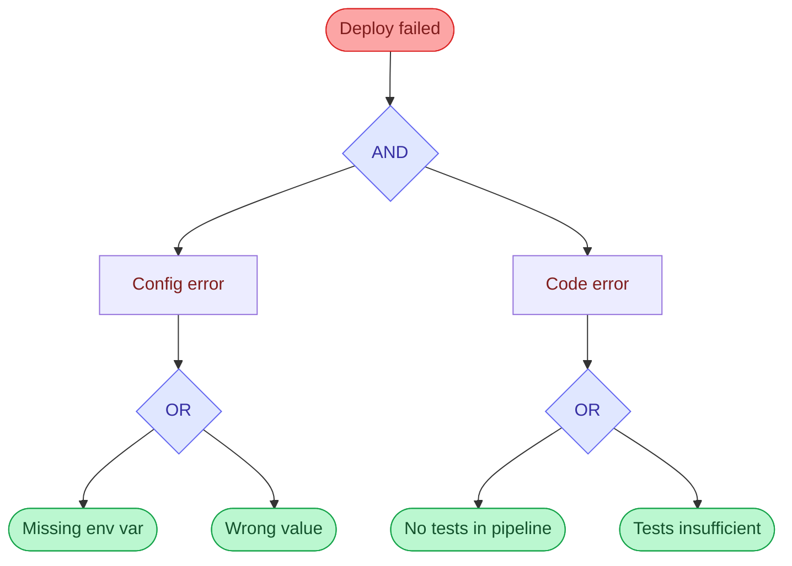

# Fault Tree Analysis

Top-down, deductive technique. Start with the failure event, then decompose into contributing conditions using AND/OR
logic gates.

## How it works

AND gate: **all** child conditions must be true for the parent to occur. OR gate: **any** child condition alone is
sufficient.

**Reading the tree:** red = top-level failure; blue = logic gates; green = leaf nodes (atomic, observable conditions —
these are the potential root causes).

This structure makes gaps in monitoring and control visible — each leaf node either _is_ a root cause or maps to a
control that should have prevented it.

## How to apply

1. State the failure event at the top.
2. Ask: "What conditions could cause this?" Decompose into immediate sub-causes.
3. For each sub-cause, classify the relationship: AND (all required) or OR (any sufficient).
4. Repeat decomposition until you reach atomic, observable leaf conditions.
5. Identify which leaf nodes represent systemic gaps (missing controls, absent ownership, outdated processes) — those
   are the candidates for root causes and action items.

## When to use

- Engineering or system failures with clear component boundaries
- When you need to communicate the failure logic to a technical audience
- When building preventive controls — the tree maps directly to monitoring and alerting rules
- Infrastructure or deployment incidents in a Kubernetes/cloud context

## See also

- `five-whys.md` — simpler first pass for linear cause chains
- `swiss-cheese-model.md` — when the focus is on which defensive layers failed
- `../SKILL.md` — technique selection table and full workflow
