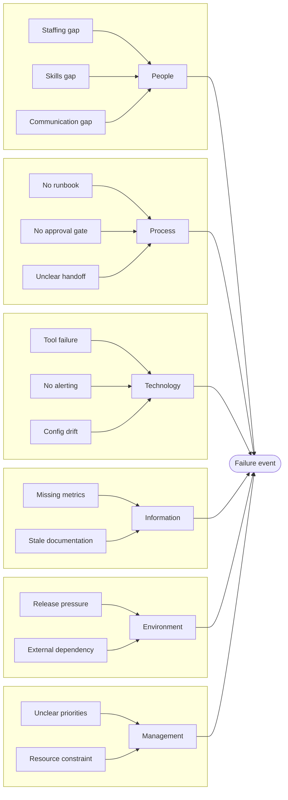

# Ishikawa (Fishbone) Diagram

When the failure has multiple potential cause categories. Map causes under six standard categories, then drill into the
most plausible ones.

## The six categories

- **People** — staffing, skills, training, communication gaps
- **Process** — procedures, workflows, handoffs, approvals
- **Technology** — tools, systems, integrations, infrastructure
- **Information** — data availability, metrics, visibility
- **Environment** — market conditions, timing, dependencies
- **Management** — decisions, priorities, resource allocation, incentives

## Structure

Each sub-cause branches off a category spine; all spines converge on the failure event (the "fish head"). Replace the
placeholder causes above with the candidates you discover during the post-mortem.

## How to apply

1. For each category, ask: "What in this category could have contributed to the failure?"
2. List every candidate cause under its category.
3. Cross out causes that clearly don't apply.
4. For the remaining plausible causes, drill deeper with 5 Whys.
5. The root causes emerge from the intersection of categories.

The structure forces breadth and prevents premature narrowing — especially useful when a team is stuck in blame mode,
because it distributes attention across the whole system rather than fixating on one person or component.

## When to use

- Multiple teams or organizations were involved
- The cause isn't obvious from a single chain
- You want to ensure you're not missing a category
- The team is fixating on blame — the structure redirects to systemic factors

## See also

- `five-whys.md` — drill deeper into the most plausible causes after mapping categories
- `pareto-analysis.md` — rank the categories by frequency if this is a recurring failure
- `../SKILL.md` — technique selection table and full workflow
