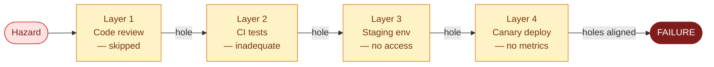

# Swiss Cheese Model

Focuses on how multiple defensive layers all failed simultaneously. Each "slice of cheese" is a control that should have
caught the problem but didn't — because its holes (gaps) lined up.

## How it works

A failure occurs when a hazard passes through the hole in _every_ defensive layer:

No single hole is the root cause — it's the _alignment_ of holes across layers that matters.

## How to apply

1. List every defensive layer that should have prevented the failure.
2. For each layer, identify why it didn't catch the problem (the "hole").
3. Ask: was this hole **random** (bad luck, one-off) or **systemic** (process gap, missing tooling)?
4. Focus remediation on systemic holes — random holes don't justify restructuring, but systemic ones do.
5. Ask the deeper question: is there a structural reason multiple layers had gaps at the _same time_? (e.g., a release
   deadline that pressured all teams to skip checks simultaneously)

## When to use

- Near-misses where the failure _almost_ didn't happen
- Safety-critical incidents
- When explaining to a non-technical audience why redundancy didn't prevent failure
- When organizational culture around raising concerns is relevant (the "no one felt safe stopping the release" pattern)
- Multi-layer system failures (Kubernetes + CI/CD + monitoring + runbook)

## See also

- `fault-tree-analysis.md` — when you need to map the logic of failure precisely
- `five-whys.md` — drill deeper into why each individual layer had its hole
- `../SKILL.md` — technique selection table and full workflow
