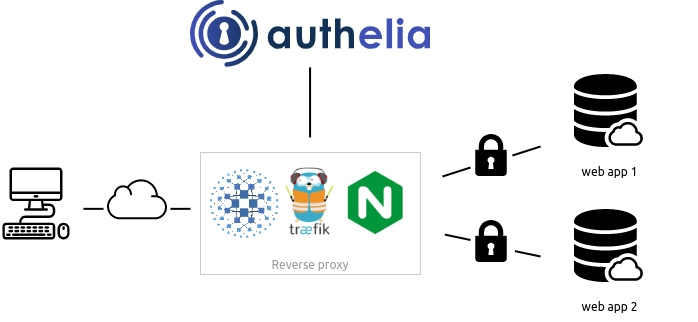

<!-- markdownlint-disable MD033 -->
<h1 align="center">
  Security · Authelia
  <br/>
  
</h1>

<h3 align="center">Authelia - The Single Sign-On Multi-Factor portal for web apps</h3>

<div align="center">

[](https://github.com/authelia/authelia/releases/tag/v4.38.9)
[](../)
[](../../../../LICENSE)
<br>
[]()
[](https://www.authelia.com/configuration/prologue/introduction/)

<a href="#about">About</a> ·
<a href="#getting-started">Getting Started</a> ·
<a href="#security-concerns">Security concerns</a> ·
<a href="#license">License</a>

</div>

---

<!-- markdownlint-enable MD033 -->

## About

**Authelia** is an open-source authentication and authorization server providing two-factor authentication and single
sign-on (SSO) for your applications via a web portal. It acts as a companion for reverse proxies by
allowing, denying, or redirecting requests.

Documentation is available at [https://www.authelia.com/](https://www.authelia.com/).

The following is a simple diagram of the architecture:

<!-- markdownlint-disable MD033 -->
<p align="center" style="margin:50px">
  
</p>
<!-- markdownlint-enable MD033 -->

**Authelia** can be installed as a standalone service from the [AUR](https://aur.archlinux.org/packages/authelia/),
[APT](https://apt.authelia.com/stable/debian/packages/authelia/),
[FreeBSD Ports](https://svnweb.freebsd.org/ports/head/www/authelia/), or using a
[static binary](https://github.com/authelia/authelia/releases/tag/v4.38.9),
[.deb package](https://github.com/authelia/authelia/releases/tag/v4.38.9), as a container on Docker or Kubernetes.

### Features summary

This is a list of the key features of Authelia:

-   Several second factor methods:
    -   **[Security Keys](https://www.authelia.com/overview/authentication/security-key/)** that support
        [FIDO2]&nbsp;[WebAuthn] with devices like a [YubiKey].
    -   **[Time-based One-Time password](https://www.authelia.com/overview/authentication/one-time-password/)**
        with compatible authenticator applications.
    -   **[Mobile Push Notifications](https://www.authelia.com/overview/authentication/push-notification/)**
        with [Duo](https://duo.com/).
-   Password reset with identity verification using email confirmation.
-   Access restriction after too many invalid authentication attempts.
-   Fine-grained access control using rules which match criteria like subdomain, user, user group membership, request uri,
    request method, and network.
-   Choice between one-factor and two-factor policies per-rule.
-   Support of basic authentication for endpoints protected by the one-factor policy.
-   Highly available using a remote database and Redis as a highly available KV store.
-   Compatible with [Traefik](https://doc.traefik.io/traefik) out of the box using the
    [ForwardAuth](https://doc.traefik.io/traefik/middlewares/http/forwardauth/) middleware.
-   Curated configuration from [LinuxServer](https://www.linuxserver.io/) via their
    [SWAG](https://docs.linuxserver.io/general/swag) container as well as a
    [guide](https://blog.linuxserver.io/2020/08/26/setting-up-authelia/).
-   Compatible with [Caddy] using the [forward_auth](https://caddyserver.com/docs/caddyfile/directives/forward_auth)
    directive.
-   Kubernetes Support:
    -   Compatible with several Kubernetes ingress controllers:
        -   [ingress-nginx](https://www.authelia.com/integration/kubernetes/nginx-ingress/)
        -   [Traefik Kubernetes CRD](https://www.authelia.com/integration/kubernetes/traefik-ingress/#ingressroute)
        -   [Traefik Kubernetes Ingress](https://www.authelia.com/integration/kubernetes/traefik-ingress/#ingress)
        -   [Istio](https://www.authelia.com/integration/kubernetes/istio/)
    -   Beta support for installing via Helm using our [Charts](https://charts.authelia.com).
-   Beta support for [OAuth 2.0 and OpenID Connect 1.0](https://www.authelia.com/roadmap/active/openid-connect/).

For more details take a look at the [Overview](https://www.authelia.com/overview/prologue/introduction/).

If you want to know more about the roadmap, follow [Roadmap](https://www.authelia.com/roadmap).

## Getting Started

This project wraps the Authelia application in a Docker container, making it easy to deploy and run with Pulumi.
In order to keep consistency over all other applications and to follow some best practices, this project builds its
own Docker image.

> [!NOTE]
> This "Pulumi application" was created with a specific vision in mind, so customization is not a strength of this
> project and only certain options (mainly runtime-related) are accessible.

### How to use this application

#### - as Docker container

> [!WARNING]
> The Docker image will embed all configuration files to package everything together ; _following my vision_, an
> OCI image should be immutable and contain everything it needs to run. **This means that all configuration files will
> be embedded in the image, including sensitive information like API keys**. This is not a security best practice, but
> it is a trade-off I made to simplify the deployment process.

```typescript
import { asset } as pulumi from "@pulumi/pulumi";
import { AlpineImage, Version as AlpineVersion } from "@catalog.chezmoi.sh/os~alpine-3.19";
import { Authelia, Version } from "@catalog.chezmoi.sh/security~authelia";
import { SecretAsset } from "@chezmoi.sh/core/utils";

const alpine = new AlpineImage("alpine", { push: true, tags: [`my.oci.registry/alpine:${AlpineVersion}`] });
const authelia = new Authelia("authelia", {
    configuration: new SecretAsset(new asset.FileAsset("configuration.yaml")),
    userDatabase: {
        source: new SecretAsset(new asset.FileAsset("/users_database.yaml")),
        destination: "/etc/authelia/users_database.yml",
    },

    imageArgs: { from: alpine, push: true, tags: [`my.oci.registry/authelia:${Version}`] },
    containerArgs: {
        ports: [{ internal: 9091, external: 80, protocol: "tcp" }],
        wait: true,
    }
});
```

## Security concerns

One of my visions is to provide a secure environment for all applications that I run at home. This is why all images are
built locally, why all dependencies, when it make sense, are pinned, and why all images are scanned for vulnerabilities
before running them (see [my Pulumi policy packs](../../../../lib/policy-pack/)).
However, even with all these precautions, I'm not a security expert, so I can't guarantee that this project is 100%
secure.

Futhermore, as stated in the [Getting Started](#--as-docker-container) section for the Docker container, all <!-- trunk-ignore(markdown-link-check/404): False positive on the anchor -->
configuration files are embedded in the image, including sensitive information like API keys. Take this into account
when using this project.

## License

This project is licensed under the Apache 2.0 License - see the [LICENSE](../../../../LICENSE) file for details.

> [!NOTE]
> This project is not affiliated with the Authelia project, which can be viewed on
> [their website](https://www.authelia.com/).
> However, if you are a maintainer of the Authelia project and would like to authorize the distribution of
> Authelia through this project, you are welcome to do so by creating a Pull Request.
