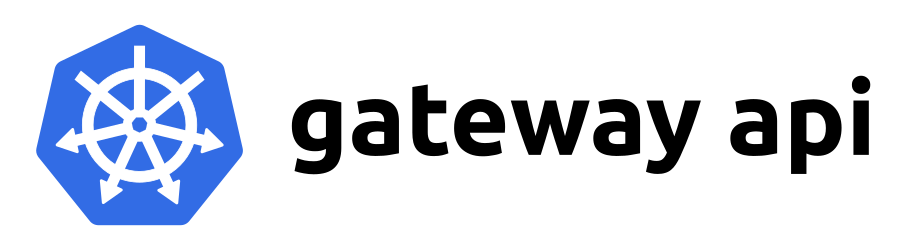
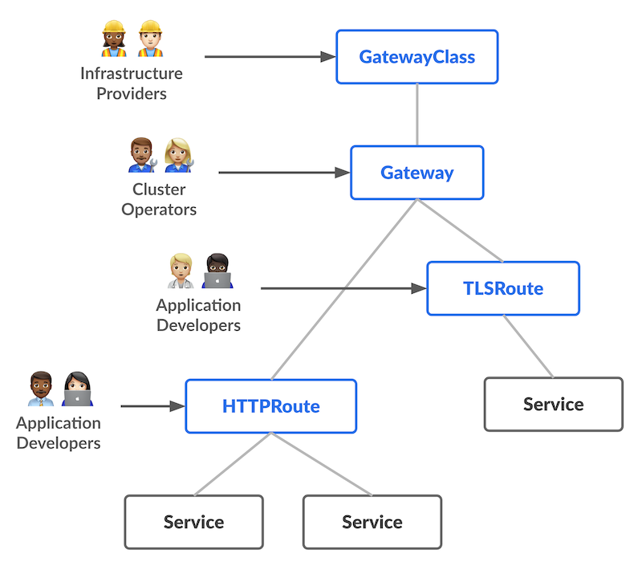

<!-- markdownlint-disable MD033 -->
<h1 align="center">
  System/Network · Gateway API
  <br/>
  
</h1>

<h3 align="center">Kubernetes Gateway API</h3>

<div align="center">

[](https://github.com/kubernetes-sigs/gateway-api/releases/tag/v1.1.0)
[](../)
[](../../../../LICENSE)
<br>
[]()
[](https://gateway-api.sigs.k8s.io/)

<a href="#about">About</a> ·
<a href="#getting-started">Getting Started</a> ·
<a href="#license">License</a>

</div>

---

<!-- markdownlint-enable MD033 -->

## About

Gateway API is an official Kubernetes project focused on L4 and L7 routing in Kubernetes. This project represents the
next generation of Kubernetes Ingress, Load Balancing, and Service Mesh APIs. From the outset, it has been designed to
be generic, expressive, and role-oriented.

The overall resource model focuses on 3 separate personas and corresponding resources that they are expected to manage:

<!-- markdownlint-disable MD033 -->
<p align="center">
  
</p>
<!-- markdownlint-enable MD033 -->

Most of the configuration in this API is contained in the Routing layer. These protocol-specific resources
([HTTPRoute](https://gateway-api.sigs.k8s.io/api-types/httproute),
[GRPCRoute](https://gateway-api.sigs.k8s.io/api-types/grpcroute), etc) enable advanced routing capabilities for both
Ingress and Mesh.

The Gateway API Logo helps illustrate the dual purpose of this API, enabling routing for both North-South (Ingress) and
East-West (Mesh) traffic to share the same configuration.

## Getting Started

This project wraps all Gateway CRDs API, making it easy to deploy and run with Pulumi.

> [!NOTE]
> This "Pulumi application" was created with a specific vision in mind, so customization is not a strength of this
> project and only certain options (mainly runtime-related) are accessible.

### How to use install Gateway API

```typescript
import { GatewayAPICRDs } from "@catalog.chezmoi.sh/system.network~gateway.networking.k8s.io";

new GatewayAPICRDs();
```

## License

This project is licensed under the Apache 2.0 License - see the [LICENSE](../../../../LICENSE) file for details.
