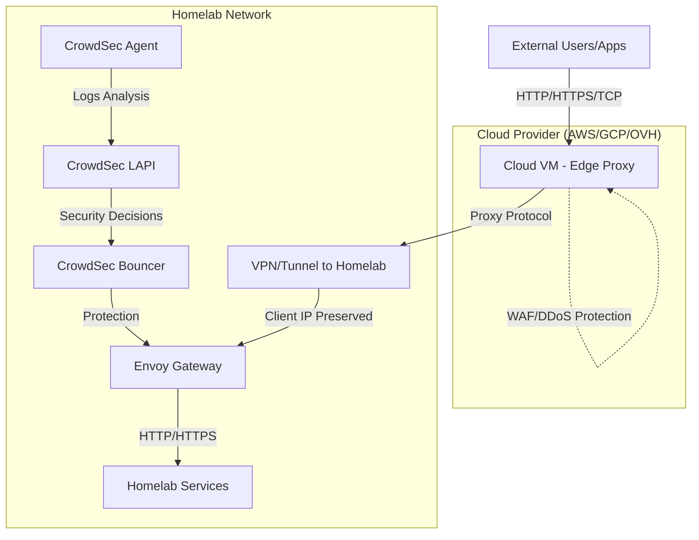

<!--
status: "accepted"
date: 2025-08-09
decision-makers: ["Alexandre"]
consulted: ["ai/gpt-5"]
informed: []
-->

# Homelab External Services Access Strategy: Zero-Trust Service Exposure

## Context and Problem Statement

### Homelab Infrastructure Context

The homelab infrastructure consists of multiple clusters (`amiya.akn`, `lungmen.akn`, `maison`) hosting various services that require external access. Currently, all services are only accessible within the Tailscale mesh network, limiting external user access, integrations, and use cases.

### The External Access Challenge

External users, applications, and integrations must access homelab services without requiring VPN access. This architectural decision impacts the entire homelab ecosystem, enabling:

* **Authentication Services**: External user authentication and OIDC flows (Authelia)
* **Administrative Interfaces**: Remote management of homelab infrastructure
* **Application Services**: Selective exposure of self-hosted applications
* **API Endpoints**: Third-party integrations and webhooks
* **Monitoring & Observability**: External access to dashboards and alerting systems

### Service Categorization Framework

Different service types require different exposure patterns and security considerations:

1. **Authentication Services** (High Security): SSO, OIDC providers, user directories
2. **Administrative Services** (Restricted Access): Management interfaces, configuration tools
3. **Application Services** (User-Facing): Self-hosted applications, content delivery
4. **Integration Services** (API-First): Webhooks, API endpoints, automation triggers

### Strategic Requirements

* **Security First**: Avoid third-party TLS termination (no MITM by provider)
* **Privacy Protection**: Hide the home public IP address from external exposure
* **Abuse Mitigation**: Implement robust protection against automated abuse (bots, brute-force, DoS)
* **Zero-Trust Principles**: Maintain security even with internet-facing exposure
* **Service-Specific Policies**: Different protection levels based on service criticality and exposure requirements

## Decision Drivers

### Security Requirements

* **End-to-End Encryption**: Preserve TLS termination at the homelab edge without third-party MITM
* **Zero-Trust Principles**: Implement defense-in-depth even for internet-facing services
* **Service-Specific Protection**: Tailored security policies based on service criticality and exposure patterns
* **Abuse Protection**: Comprehensive rate limiting and protection against automated attacks

### Operational Requirements

* **Homelab Compatibility**: Simple, maintainable approach suitable for solo operator
* **Infrastructure Integration**: Seamless integration with existing Envoy Gateway, cert-manager, and Kubernetes patterns
* **Cost Effectiveness**: Minimize recurring costs and operational complexity
* **Scalability**: Solution must support multiple services with varying exposure requirements

### Architectural Constraints

* **Privacy First**: Hide home public IP address from external exposure
* **Self-Hosting Principles**: Maintain control over critical infrastructure components
* **Existing Investment**: Leverage current Envoy Gateway, cert-manager, and authentication architecture
* **Service Diversity**: Support different service types (authentication, admin, application, API) with appropriate protection levels

## Considered Options

1. **Cloudflare Tunnel (+ WAF/Access)**: Managed tunnel with Cloudflare edge protection - ❌ **REJECTED**
2. **Tailscale Funnel (+ gateway/app-side protections)**: Zero-trust mesh network approach - ❌ **REJECTED**
3. **Dedicated edge proxy**: Self-hosted cloud VM with reverse proxy + security stack - ✅ **VIABLE**
4. **Cloudflare Tunnel (Proxy L4) + Traefik/CrowdSec**: L4 tunnel with local gateway protection - ❌ **REJECTED**
5. **Cloudflare Tunnel (Proxy L4) + CrowdSec Worker**: L4 tunnel with edge worker protection - ❌ **REJECTED**

## Decision History

**2025-08-09**: Initial decision for Option 2 "Tailscale Funnel + Hybrid Gateway Strategy (Traefik + CrowdSec → Envoy Gateway)" providing immediate mature anti-bot protection with planned migration to unified Envoy Gateway architecture.

**2025-08-10**: Option 2 limitations discovered (HTTP/HTTPS only, WAF integration complexity). Shifted focus to Cloudflare Tunnel variants (Options 4 & 5) for comprehensive protocol support. Identified Option 5 as most promising, initiated POC development.

**2025-08-10 (evening)**: Completed comprehensive POC implementation with full technical documentation, Kubernetes manifests, and testing framework for Option 5 validation.

**2025-08-11**: POC execution revealed critical limitation - Cloudflare Tunnel lacks Proxy Protocol support, preventing client IP preservation essential for CrowdSec functionality.

**2025-08-11 (analysis)**: Extended architectural analysis led to systematic rejection of all cloud-based tunnel solutions:

* Option 1: TLS termination at Cloudflare violates "Security First" requirement
* Option 2: Protocol limitations and DNS restrictions
* Option 4 & 5: No Proxy Protocol support breaks security model

**Current Status**: Only Option 3 (Dedicated edge proxy) remains architecturally viable

## Decision Outcome

**Status**: Pending final evaluation of Option 3 (Dedicated edge proxy)

**Decision**: All cloud-based tunnel solutions have been systematically eliminated due to fundamental architectural incompatibilities with homelab security requirements. The comprehensive evaluation process revealed that external tunnel providers cannot satisfy the combination of:

* End-to-end TLS without third-party termination
* Client IP preservation for security controls
* Custom domain support without vendor lock-in
* Comprehensive protocol support (HTTP/HTTPS + TCP)

**Remaining Path**: Option 3 (Dedicated edge proxy) represents the only approach that maintains full control over security boundaries while meeting all functional requirements. This requires:

* Self-hosted cloud VM (\~€8/month operational cost)
* Custom security stack implementation and maintenance
* Enhanced operational complexity for DIY edge protection

**Next Phase**: Detailed evaluation of Option 3 implementation strategies, cost-benefit analysis, and potential hybrid approaches to minimize operational overhead while preserving security requirements.

### Target Architecture (Option 3: Dedicated Edge Proxy)

**Key Components**:

* **Edge Proxy**: Self-hosted reverse proxy with full TLS control
* **Proxy Protocol**: Preserves client IPs for security enforcement
* **Secure Tunnel**: WireGuard/IPSec connection to homelab
* **Local Security**: CrowdSec with full client visibility
* **Protocol Support**: Complete HTTP/HTTPS/TCP coverage

### Key Implementation Components

**Implementation Components (Option 3)**:

* **Edge Proxy VM**: Self-hosted cloud instance with Traefik/Envoy + CrowdSec
* **Secure Connectivity**: WireGuard tunnel or IPSec VPN to homelab
* **Certificate Management**: Let's Encrypt with DNS-01 validation
* **Client IP Preservation**: Proxy Protocol v2 for full security visibility
* **Custom Domain Support**: Full DNS control without vendor restrictions

**Service-Specific Protection Patterns**:

* **Authentication Services** (Authelia): Enhanced regulation with strict rate limiting and geographic restrictions
* **Administrative Services**: VPN-only access via Tailscale mesh (no external exposure)
* **Application Services**: Balanced protection with CrowdSec community intelligence
* **Integration Services**: API-focused protection with token validation and endpoint-specific policies

**Operational Considerations**:

* **Monthly Cost**: €8-15/month for cloud VM (varies by provider/region)
* **Maintenance**: Security updates, monitoring, backup management
* **Scalability**: Manual scaling vs managed services trade-off
* **Reliability**: Single point of failure requires monitoring and failover planning

## Potential Consequences

**NOTE: Full impact assessment pending proof of concept results**

The following are anticipated benefits and limitations that will be validated through the proof of concept evaluation:

### Potential Benefits

* **Enhanced Protocol Support**: Ability to handle both HTTP/HTTPS and TCP protocols
* **Privacy Protection**: Hiding origin IP address from external exposure
* **Service-Agnostic Design**: Supporting various homelab services with appropriate protection patterns
* **Community Threat Intelligence**: Leveraging CrowdSec's security capabilities
* **Cost-Effective Security**: Minimizing additional infrastructure costs
* **Scalability**: Supporting multiple services with different security requirements

### Potential Limitations

* **Client Software Requirements**: Need for client-side cloudflared for TCP access
* **Integration Complexity**: Ensuring proper integration between security components
* **Service Dependencies**: Reliance on third-party service availability
* **Configuration Tuning**: Need for careful threshold configuration to avoid legitimate user impact

A comprehensive assessment of benefits and limitations will be conducted after the proof of concept for Option 5 is completed.

### Validation Plan

**NOTE: Detailed validation criteria to be defined after POC**

**Proof of Concept Validation Focus**:

* Effectiveness of CrowdSec integration with Cloudflare
* TCP protocol support and client experience
* Security boundary integrity and protection capabilities
* Operational complexity and maintenance requirements

**Planned Validation Patterns**:

* **Authentication Services**: OIDC flows, rate limiting, and protection effectiveness
* **Application Services**: Protocol support, response validation, and security controls
* **Integration Services**: API accessibility, webhook delivery, and authentication mechanisms

Detailed validation criteria will be established after the proof of concept implementation.

## Options Analysis Summary

| Option                                            | Status     | Primary Limitation            | Impact                                                 |
| ------------------------------------------------- | ---------- | ----------------------------- | ------------------------------------------------------ |
| **Option 1: Cloudflare Tunnel + WAF**             | ❌ Rejected | Mandatory TLS termination     | MITM by provider violates security requirements        |
| **Option 2: Tailscale Funnel + Gateway**          | ❌ Rejected | HTTP/HTTPS only + DNS lock-in | Cannot support TCP services or custom domains          |
| **Option 3: Dedicated Edge Proxy**                | ✅ Viable   | Operational cost/complexity   | €8-15/month + maintenance overhead                     |
| **Option 4: Cloudflare Tunnel + Traefik**         | ❌ Rejected | No Proxy Protocol support     | CrowdSec cannot identify client IPs                    |
| **Option 5: Cloudflare Tunnel + CrowdSec Worker** | ❌ Rejected | No Proxy Protocol support     | Security controls impossible without client visibility |

## Detailed Analysis of Remaining Option

### Option 3: Dedicated Edge Proxy (Only Viable Solution)

**Architecture**: Self-hosted cloud VM running reverse proxy (Traefik/Envoy) with security stack (CrowdSec, WAF) connected to homelab via secure tunnel (WireGuard/IPSec).

**Advantages**:

* Full control over TLS termination and certificate management
* Complete protocol support (HTTP/HTTPS/TCP/UDP)
* Client IP preservation via Proxy Protocol for security enforcement
* Custom domain support without vendor restrictions
* Flexible security stack (CrowdSec, WAF, DDoS protection)
* No third-party traffic inspection or vendor lock-in

**Disadvantages**:

* Monthly operational cost (€8-15/month depending on provider/region)
* Manual security management and maintenance responsibility
* Single point of failure requiring monitoring and backup strategies
* Higher implementation complexity compared to managed solutions
* DIY DDoS/WAF protection less sophisticated than cloud providers

**Cost-Benefit Analysis**:

* **Annual Cost**: €96-180/year operational expense
* **Value**: Complete architectural control meeting all security requirements
* **Alternative**: Compromising security requirements (unacceptable)
* **Mitigation**: Automated deployment, monitoring, and failover procedures

### Rejected Options Summary

**All cloud-based tunnel solutions eliminated due to fundamental incompatibilities**:

* **Options 1, 4 & 5 (Cloudflare variants)**: Either mandatory TLS termination (Option 1) or no Proxy Protocol support (Options 4 & 5), both breaking security requirements
* **Option 2 (Tailscale Funnel)**: HTTP/HTTPS protocol limitation and DNS vendor lock-in preventing comprehensive service exposure

**Key Finding**: No external tunnel provider can simultaneously satisfy:

* End-to-end TLS without third-party termination
* Client IP preservation for security controls
* Custom domain support without vendor lock-in
* Comprehensive protocol support (HTTP/HTTPS + TCP)

**Failed POC**: Comprehensive implementation documented in [experiments/cloudflare-tunnel-with-crowdsec](../experiments/cloudflare-tunnel-with-crowdsec/README.md) confirming architectural limitations.

## Implementation Strategy

**NOTE: Implementation strategy pending proof of concept results for Option 5**

The specific implementation strategy will be defined after the proof of concept for Option 5 (Cloudflare Tunnel with CrowdSec Worker + GW) is completed and evaluated.

### Potential Implementation Components

Depending on the selected approach, implementation may include some of the following components:

* **Cloudflare Tunnel Deployment**: cloudflared daemon in Kubernetes for secure L4 proxying
* **CrowdSec Integration**: Either via Cloudflare Worker/Bouncer or Gateway plugin
* **Client Access Configuration**: For TCP services requiring client-side cloudflared
* **Certificate Management**: Using existing cert-manager DNS-01 automation
* **Protection Layer Configuration**: Based on service type and criticality

### Security Architecture Considerations

**NOTE: Final security architecture pending proof of concept results**

The envisioned security architecture will include multiple protection layers, but specific implementation details will be determined after POC evaluation. Key security components under consideration:

1. **Network Layer**: L4 proxying and IP masking mechanisms
2. **Edge Protection**: Integration options between CrowdSec and selected proxy solution
3. **Gateway Protection**: Community threat intelligence capabilities
4. **Protocol Support**: Both HTTP/HTTPS and TCP protocol handling
5. **Service-Specific Protection**: Authentication regulation and rate limiting
6. **Internal Traffic Handling**: Maintaining separation between external and internal traffic

### Transition Considerations

**NOTE: Transition strategy to be determined after proof of concept**

**Transition Rationale (from Tailscale to Cloudflare)**:

* Tailscale Funnel's limitation to HTTP/HTTPS traffic only (no raw TCP support)
* WAF integration complexity with Tailscale Funnel
* Need for comprehensive protocol support beyond HTTP/HTTPS
* Edge security requirements and integration options

The specific implementation phases, migration criteria, and migration process will be defined after evaluating the proof of concept for Option 5, determining its viability, and comparing it with other options.

## Risk Considerations

**NOTE: Comprehensive risk assessment pending proof of concept results**

### Security Risk Factors

* **Client IP Propagation**: Impact on rate limiting and attack detection effectiveness
* **Authentication Security**: Potential vulnerabilities in authentication flows
* **Protocol Security**: Differences in security posture between HTTP/HTTPS and TCP traffic
* **Edge Protection Effectiveness**: Real-world effectiveness of selected protection mechanisms

### Operational Risk Factors

* **False Positive Management**: Balancing security with legitimate access
* **Service Dependencies**: External service reliability and availability
* **Certificate Management**: Certificate lifecycle and renewal processes
* **Integration Complexity**: Long-term maintenance considerations

Detailed risk assessment and specific mitigation strategies will be developed following proof of concept evaluation.

## References

* [ADR-005: Envoy Gateway OIDC Authentication](./005-envoy-gateway-oidc-authentication.md)
* [Authelia – Regulation](https://www.authelia.com/configuration/security/regulation/)
* [CrowdSec – Envoy Bouncer](https://github.com/crowdsecurity/cs-envoy-bouncer) *(Note: Repository in early development stage - no releases or comprehensive documentation as of 2025-08-09)*
* [CrowdSec – Traefik Plugin](https://plugins.traefik.io/plugins/6335346ca4caa9ddeffda116/crowdsec-bouncer-traefik-plugin)
* [CrowdSec – Cloudflare Bouncer](https://doc.crowdsec.net/u/bouncers/cloudflare/)
* [CrowdSec – Cloudflare Worker Bouncer](https://docs.crowdsec.net/u/bouncers/cloudflare-workers/)

## Changelog

* **2025-08-11**: **MULTIPLE OPTION REJECTIONS**:
  * **REJECTED** Option 1: TLS termination at Cloudflare violates "Security First" requirement
  * **REJECTED** Option 2: HTTP/HTTPS only limitation and forced Tailscale DNS usage
  * **REJECTED** Option 4: No Proxy Protocol support prevents CrowdSec functionality
  * **REJECTED** Option 5: No Proxy Protocol support prevents CrowdSec functionality (POC confirmed)
  * Updated decision status to "Only Option 3 (Dedicated edge proxy) remains viable"
  * Documented failed POC in experiments/cloudflare-tunnel-with-crowdsec/README.md
  * Comprehensive architectural analysis eliminates all cloud-based tunnel solutions
* **2025-08-10**: **MAJOR REVISION**:
  * Switched from Tailscale Funnel to Cloudflare Tunnel due to Tailscale's HTTP-only limitation
  * Added two new L4 proxy options: Cloudflare Tunnel + Gateway with CrowdSec (Option 4) and Cloudflare Tunnel with CrowdSec Worker (Option 5)
  * Identified Option 5 as most promising but requiring proof of concept
  * Changed decision status to "pending POC results"
  * Updated diagrams to Mermaid format with proper cloudflared proxy flow representation
  * Revised implementation sections to indicate dependency on POC results
* **2025-08-09**: **SCOPE CLARIFICATION**: This ADR defines the generic external access strategy for ALL homelab services requiring public exposure, with Authelia (SSO) as the primary implementation example. The architectural patterns and security decisions apply to any service needing external access (monitoring, administration interfaces, applications, etc.).
* **2025-08-09**: **UPDATED**: Revised to hybrid approach (Traefik Gateway API + CrowdSec → Envoy Gateway) based on cs-envoy-bouncer immaturity analysis
* **2025-08-09**: **ENHANCED**: Improved document structure and repositioned as homelab-wide architectural decision
* **2025-08-09**: **ACCEPTED**: Homelab SSO external access strategy using Tailscale Funnel + IP rate limiting + Authelia regulation
* **2025-08-09**: **INITIALIZATION**: Creation of the ADR for exposing Authelia as a zero-trust service
