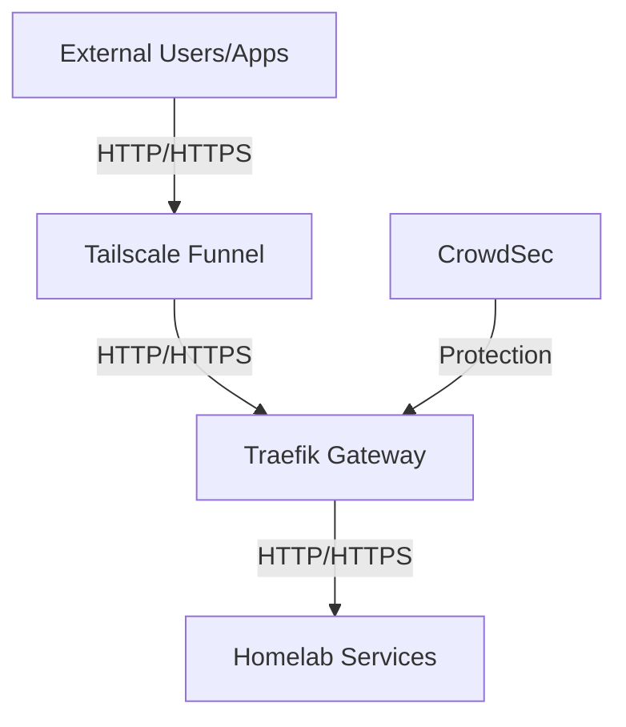
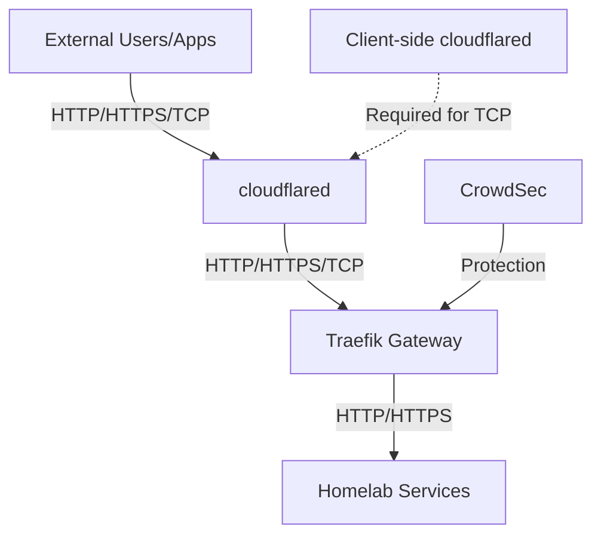
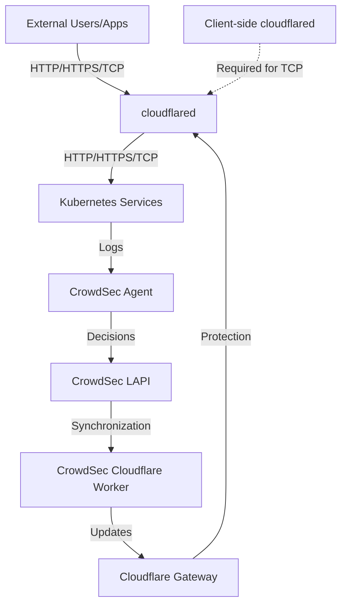

<!--
status: "accepted"
date: 2025-08-09
decision-makers: ["Alexandre"]
consulted: ["ai/gpt-5"]
informed: []
-->

# Homelab External Services Access Strategy: Zero-Trust Service Exposure

## Context and Problem Statement

### Homelab Infrastructure Context

The homelab infrastructure consists of multiple clusters (`amiya.akn`, `lungmen.akn`, `maison`) hosting various services that require external access. Currently, all services are only accessible within the Tailscale mesh network, limiting external user access, integrations, and use cases.

### The External Access Challenge

External users, applications, and integrations must access homelab services without requiring VPN access. This architectural decision impacts the entire homelab ecosystem, enabling:

* **Authentication Services**: External user authentication and OIDC flows (Authelia)
* **Administrative Interfaces**: Remote management of homelab infrastructure
* **Application Services**: Selective exposure of self-hosted applications
* **API Endpoints**: Third-party integrations and webhooks
* **Monitoring & Observability**: External access to dashboards and alerting systems

### Service Categorization Framework

Different service types require different exposure patterns and security considerations:

1. **Authentication Services** (High Security): SSO, OIDC providers, user directories
2. **Administrative Services** (Restricted Access): Management interfaces, configuration tools
3. **Application Services** (User-Facing): Self-hosted applications, content delivery
4. **Integration Services** (API-First): Webhooks, API endpoints, automation triggers

### Strategic Requirements

* **Security First**: Avoid third-party TLS termination (no MITM by provider)
* **Privacy Protection**: Hide the home public IP address from external exposure
* **Abuse Mitigation**: Implement robust protection against automated abuse (bots, brute-force, DoS)
* **Zero-Trust Principles**: Maintain security even with internet-facing exposure
* **Service-Specific Policies**: Different protection levels based on service criticality and exposure requirements

## Decision Drivers

### Security Requirements

* **End-to-End Encryption**: Preserve TLS termination at the homelab edge without third-party MITM
* **Zero-Trust Principles**: Implement defense-in-depth even for internet-facing services
* **Service-Specific Protection**: Tailored security policies based on service criticality and exposure patterns
* **Abuse Protection**: Comprehensive rate limiting and protection against automated attacks

### Operational Requirements

* **Homelab Compatibility**: Simple, maintainable approach suitable for solo operator
* **Infrastructure Integration**: Seamless integration with existing Envoy Gateway, cert-manager, and Kubernetes patterns
* **Cost Effectiveness**: Minimize recurring costs and operational complexity
* **Scalability**: Solution must support multiple services with varying exposure requirements

### Architectural Constraints

* **Privacy First**: Hide home public IP address from external exposure
* **Self-Hosting Principles**: Maintain control over critical infrastructure components
* **Existing Investment**: Leverage current Envoy Gateway, cert-manager, and authentication architecture
* **Service Diversity**: Support different service types (authentication, admin, application, API) with appropriate protection levels

## Considered Options

1. **Cloudflare Tunnel (+ WAF/Access)**: Original Cloudflare Tunnel option with WAF capabilities
2. **Tailscale Funnel (+ gateway/app-side protections)**: Zero-trust approach with Tailscale
3. **Dedicated edge proxy**: Self-hosted cloud VM with Traefik/Envoy Gateway + optional WAF
4. **Cloudflare Tunnel (Proxy L4) + GW with CrowdSec**: Cloudflare L4 proxy with Traefik/Envoy Gateway and CrowdSec
5. **Cloudflare Tunnel (Proxy L4) with CrowdSec Worker + GW**: Cloudflare L4 proxy with CrowdSec worker and Envoy Gateway, most promising option eliminating Traefik dependency

## Decision History

**Original Decision (2025-08-09)**: "Tailscale Funnel + Hybrid Gateway Strategy (Traefik + CrowdSec → Envoy Gateway)" providing immediate mature anti-bot protection with planned migration to unified Envoy Gateway architecture for all external homelab service exposure.

**First Update (2025-08-10)**: After discovering Tailscale Funnel's limitation to HTTP/HTTPS traffic and challenges with WAF integration, consideration shifted to "Cloudflare Tunnel Proxy L4 + GW protection" for comprehensive protocol support.

**Current Status (2025-08-10)**: The fifth option "Cloudflare Tunnel (Proxy L4) with CrowdSec Worker + GW" has emerged as most promising due to eliminating Traefik dependency, but requires further proof-of-concept testing before final decision.

## Decision Outcome

**Status**: Proof of concept in progress for Option 5 (Cloudflare Tunnel with CrowdSec Worker + GW)

**No final decision has been made.** Currently evaluating the most promising approach that would eliminate Traefik dependency while providing comprehensive protocol support and robust security capabilities.

The final architecture will be selected based on POC results.

### Architectural Solution

#### Option 2: Tailscale Funnel + Traefik Gateway (Original Plan)

#### Option 4: Cloudflare Tunnel + Traefik Gateway

#### Option 5: Cloudflare Tunnel with CrowdSec Worker (Promising Approach)

### Key Implementation Components

**Current Implementation Components**:

* **Cloudflare Tunnel**: Provides secure L4 proxying for both HTTP and TCP traffic (without WAF capabilities)
* **CrowdSec Cloudflare Integration**: Potential integration via Cloudflare Bouncer or Cloudflare Worker Bouncer to add security capabilities
* **Client-side cloudflared**: Required for accessing TCP services through the tunnel
* **DNS-01 Certificates**: Automated certificate management without domain validation exposure

**Service-Specific Protection Patterns**:

* **Authentication Services** (Initial use case: Authelia): Enhanced regulation with strict rate limiting and multi-layer abuse protection
* **Administrative Services**: No external exposure; internal access via Tailscale mesh
* **Application Services**: Balanced protection suitable for user-facing applications with reasonable rate limits
* **Integration Services**: API-focused protection with token-based authentication and endpoint-specific policies

**Original Migration Plan (Historical)**:

* ~~cs-envoy-bouncer reaches production maturity (documentation, stable releases)~~
* ~~Community adoption and validation~~
* ~~Feature parity with Traefik CrowdSec plugin~~

This hybrid approach enables immediate deployment with mature anti-bot protection while preserving the path to unified Envoy Gateway architecture when the ecosystem matures.

## Potential Consequences

**NOTE: Full impact assessment pending proof of concept results**

The following are anticipated benefits and limitations that will be validated through the proof of concept evaluation:

### Potential Benefits

* **Enhanced Protocol Support**: Ability to handle both HTTP/HTTPS and TCP protocols
* **Privacy Protection**: Hiding origin IP address from external exposure
* **Service-Agnostic Design**: Supporting various homelab services with appropriate protection patterns
* **Community Threat Intelligence**: Leveraging CrowdSec's security capabilities
* **Cost-Effective Security**: Minimizing additional infrastructure costs
* **Scalability**: Supporting multiple services with different security requirements

### Potential Limitations

* **Client Software Requirements**: Need for client-side cloudflared for TCP access
* **Integration Complexity**: Ensuring proper integration between security components
* **Service Dependencies**: Reliance on third-party service availability
* **Configuration Tuning**: Need for careful threshold configuration to avoid legitimate user impact

A comprehensive assessment of benefits and limitations will be conducted after the proof of concept for Option 5 is completed.

### Validation Plan

**NOTE: Detailed validation criteria to be defined after POC**

**Proof of Concept Validation Focus**:

* Effectiveness of CrowdSec integration with Cloudflare
* TCP protocol support and client experience
* Security boundary integrity and protection capabilities
* Operational complexity and maintenance requirements

**Planned Validation Patterns**:

* **Authentication Services**: OIDC flows, rate limiting, and protection effectiveness
* **Application Services**: Protocol support, response validation, and security controls
* **Integration Services**: API accessibility, webhook delivery, and authentication mechanisms

Detailed validation criteria will be established after the proof of concept implementation.

## Pros and Cons of the Options

### Tailscale Funnel (+ gateway/app-side protections)

* Advantages:
  * End-to-end encryption without third-party TLS termination (no MITM by provider)
  * No router port forwarding; origin IP is not publicly disclosed
  * Integrates well in homelab contexts; straightforward rollout
  * Low recurring cost; minimal operational overhead
* Disadvantages:
  * Limited to HTTP/HTTPS traffic only; does not support proxying raw TCP traffic
  * No managed WAF/DDoS; protections must be implemented at the gateway/app layer
  * WAF Kubernetes integration complexity due to HTTP-only traffic support (not supported on Kubernetes Services)
  * Fewer anti-bot features than large cloud edges; rate limiting and app hardening are essential
  * Ensure client IP propagation to avoid ineffective IP-based limits

### Cloudflare Tunnel (+ WAF/Access)

* Advantages:
  * Powerful edge protections: DDoS/WAF/rate limiting/bot management
  * No router port forwarding; origin IP is hidden; strong operational maturity
  * Extensive ecosystem and Kubernetes integration
* Disadvantages:
  * TLS is terminated at Cloudflare (trust in provider; not compatible with the strict no-MITM constraint)
  * Vendor lock-in; DNS delegation to Cloudflare often required

### Dedicated edge proxy (cloud VM + Envoy/Traefik + optional WAF)

* Advantages:
  * Full control of the edge; can preserve strict end-to-end TLS
  * Flexible architecture; can layer custom protections and policies
* Disadvantages:
  * Monthly cost (≈ €8/month minimum) and ongoing maintenance burden
  * Not necessarily more secure than managed/peer approaches; DIY DDoS/WAF is non-trivial
  * Higher operational complexity and time to implement

### Option 4: Cloudflare Tunnel (Proxy L4) + GW with CrowdSec

* Advantages:
  * Supports TCP proxying at L4 for non-HTTP protocols in Kubernetes environments
  * Basic DDoS protection at network level (not WAF capabilities)
  * No router port forwarding; origin IP is hidden with strong operational security
  * Extensive Kubernetes integration via `cloudflared` daemon
  * CrowdSec integration via Traefik plugin providing threat intelligence
* Disadvantages:
  * Clients must run `cloudflared` locally to access non-HTTP services (SSH, RDP, etc.)
  * No native WAF capabilities (L7 inspection) for TCP traffic
  * Requires Traefik installation and maintenance until cs-envoy-bouncer reaches production maturity
  * Vendor lock-in; DNS delegation to Cloudflare typically required

### Option 5: Cloudflare Tunnel (Proxy L4) with CrowdSec Worker + GW

* Advantages:
  * Eliminates Traefik dependency - direct integration with Kubernetes services
  * CrowdSec Worker provides protection at the Cloudflare edge
  * Supports TCP proxying at L4 for non-HTTP protocols in Kubernetes environments
  * Simpler architecture with fewer components to maintain
  * No router port forwarding; origin IP is hidden with strong operational security
* Disadvantages:
  * Clients must run `cloudflared` locally to access non-HTTP services (SSH, RDP, etc.)
  * Requires Cloudflare Workers subscription (not available on free plan)
  * Less mature integration - requires proof of concept testing
  * TLS is still terminated at Cloudflare for HTTP/HTTPS traffic (conflicts with no-MITM requirement)
  * Vendor lock-in; DNS delegation to Cloudflare typically required

## Implementation Strategy

**NOTE: Implementation strategy pending proof of concept results for Option 5**

The specific implementation strategy will be defined after the proof of concept for Option 5 (Cloudflare Tunnel with CrowdSec Worker + GW) is completed and evaluated.

### Potential Implementation Components

Depending on the selected approach, implementation may include some of the following components:

* **Cloudflare Tunnel Deployment**: cloudflared daemon in Kubernetes for secure L4 proxying
* **CrowdSec Integration**: Either via Cloudflare Worker/Bouncer or Gateway plugin
* **Client Access Configuration**: For TCP services requiring client-side cloudflared
* **Certificate Management**: Using existing cert-manager DNS-01 automation
* **Protection Layer Configuration**: Based on service type and criticality

### Security Architecture Considerations

**NOTE: Final security architecture pending proof of concept results**

The envisioned security architecture will include multiple protection layers, but specific implementation details will be determined after POC evaluation. Key security components under consideration:

1. **Network Layer**: L4 proxying and IP masking mechanisms
2. **Edge Protection**: Integration options between CrowdSec and selected proxy solution
3. **Gateway Protection**: Community threat intelligence capabilities
4. **Protocol Support**: Both HTTP/HTTPS and TCP protocol handling
5. **Service-Specific Protection**: Authentication regulation and rate limiting
6. **Internal Traffic Handling**: Maintaining separation between external and internal traffic

### Transition Considerations

**NOTE: Transition strategy to be determined after proof of concept**

**Transition Rationale (from Tailscale to Cloudflare)**:

* Tailscale Funnel's limitation to HTTP/HTTPS traffic only (no raw TCP support)
* WAF integration complexity with Tailscale Funnel
* Need for comprehensive protocol support beyond HTTP/HTTPS
* Edge security requirements and integration options

The specific implementation phases, migration criteria, and migration process will be defined after evaluating the proof of concept for Option 5, determining its viability, and comparing it with other options.

## Risk Considerations

**NOTE: Comprehensive risk assessment pending proof of concept results**

### Security Risk Factors

* **Client IP Propagation**: Impact on rate limiting and attack detection effectiveness
* **Authentication Security**: Potential vulnerabilities in authentication flows
* **Protocol Security**: Differences in security posture between HTTP/HTTPS and TCP traffic
* **Edge Protection Effectiveness**: Real-world effectiveness of selected protection mechanisms

### Operational Risk Factors

* **False Positive Management**: Balancing security with legitimate access
* **Service Dependencies**: External service reliability and availability
* **Certificate Management**: Certificate lifecycle and renewal processes
* **Integration Complexity**: Long-term maintenance considerations

Detailed risk assessment and specific mitigation strategies will be developed following proof of concept evaluation.

## References

* [ADR-005: Envoy Gateway OIDC Authentication](./005-envoy-gateway-oidc-authentication.md)
* [Authelia – Regulation](https://www.authelia.com/configuration/security/regulation/)
* [CrowdSec – Envoy Bouncer](https://github.com/crowdsecurity/cs-envoy-bouncer) *(Note: Repository in early development stage - no releases or comprehensive documentation as of 2025-08-09)*
* [CrowdSec – Traefik Plugin](https://plugins.traefik.io/plugins/6335346ca4caa9ddeffda116/crowdsec-bouncer-traefik-plugin)
* [CrowdSec – Cloudflare Bouncer](https://doc.crowdsec.net/u/bouncers/cloudflare/)
* [CrowdSec – Cloudflare Worker Bouncer](https://docs.crowdsec.net/u/bouncers/cloudflare-workers/)

## Changelog

* **2025-08-10**: **MAJOR REVISION**:
  * Switched from Tailscale Funnel to Cloudflare Tunnel due to Tailscale's HTTP-only limitation
  * Added two new L4 proxy options: Cloudflare Tunnel + Gateway with CrowdSec (Option 4) and Cloudflare Tunnel with CrowdSec Worker (Option 5)
  * Identified Option 5 as most promising but requiring proof of concept
  * Changed decision status to "pending POC results"
  * Updated diagrams to Mermaid format with proper cloudflared proxy flow representation
  * Revised implementation sections to indicate dependency on POC results
* **2025-08-09**: **SCOPE CLARIFICATION**: This ADR defines the generic external access strategy for ALL homelab services requiring public exposure, with Authelia (SSO) as the primary implementation example. The architectural patterns and security decisions apply to any service needing external access (monitoring, administration interfaces, applications, etc.).
* **2025-08-09**: **UPDATED**: Revised to hybrid approach (Traefik Gateway API + CrowdSec → Envoy Gateway) based on cs-envoy-bouncer immaturity analysis
* **2025-08-09**: **ENHANCED**: Improved document structure and repositioned as homelab-wide architectural decision
* **2025-08-09**: **ACCEPTED**: Homelab SSO external access strategy using Tailscale Funnel + IP rate limiting + Authelia regulation
* **2025-08-09**: **INITIALIZATION**: Creation of the ADR for exposing Authelia as a zero-trust service
