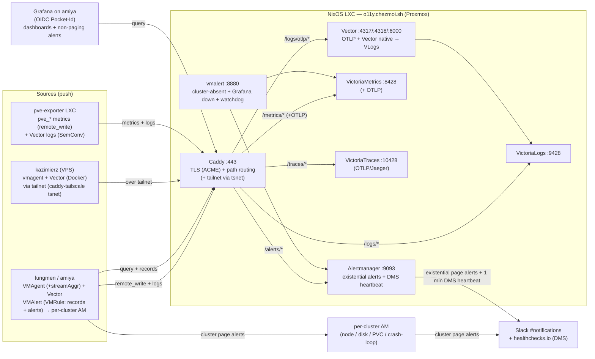

# Centralized observability stack on a NixOS LXC (VictoriaMetrics)

## Table of Contents

- [Context and Problem Statement](#context-and-problem-statement)
- [Decision Drivers](#decision-drivers)
  - [Functional Requirements](#functional-requirements)
  - [Non-Functional Requirements](#non-functional-requirements)
  - [Constraints](#constraints)
- [Considered Options](#considered-options)
  - [Storage backend](#storage-backend)
    - [Option A: VictoriaMetrics stack](#option-a-victoriametrics-stack)
    - [Option B: ClickHouse stack](#option-b-clickhouse-stack)
  - [Deployment topology](#deployment-topology)
    - [Option 1: In-cluster, per-cluster](#option-1-in-cluster-per-cluster)
    - [Option 2: Per-cluster collection, federated read](#option-2-per-cluster-collection-federated-read)
    - [Option 3: Centralized NixOS LXC on Proxmox](#option-3-centralized-nixos-lxc-on-proxmox)
- [Decision Outcome](#decision-outcome)
  - [Rationale](#rationale)
    - [1. Independence from the observed failure domain](#1-independence-from-the-observed-failure-domain)
    - [2. ServiceMonitor support without operating Prometheus](#2-servicemonitor-support-without-operating-prometheus)
    - [3. Multi-cluster from day one, correlation for free](#3-multi-cluster-from-day-one-correlation-for-free)
    - [4. Declarative as-code without Kubernetes](#4-declarative-as-code-without-kubernetes)
- [Consequences](#consequences)
  - [Positive](#positive)
  - [Negative](#negative)
  - [Neutral](#neutral)
- [Implementation Details / Status](#implementation-details--status)
  - [Architecture](#architecture)
  - [Supporting design decisions](#supporting-design-decisions)
  - [Status](#status)
- [References and Related Decisions](#references-and-related-decisions)
- [Changelog](#changelog)

## Context and Problem Statement

The Arcane homelab runs multiple Kubernetes clusters (`amiya.akn`, `lungmen.akn`), a VPS gateway (`kazimierz.akn`), and
a growing set of standalone Proxmox LXCs (e.g. the `oci.chezmoi.sh` registry). **No observability stack exists on any of
them.** There are no centralized metrics, no log aggregation, and no alerting. Detection of failure relies entirely on a
human noticing that a service is unavailable.

This gap is not theoretical. Every recent post-mortem converges on the same root cause — the absence of signal:

- **[#1013][]**: the `apps-secured` CloudNative-PG WAL volume filled to 100% and the cluster was down for **four days**
  before anyone noticed. Immich and Paperless were unavailable the entire time. WAL archiving had been failing silently
  since the cluster was created 25 days earlier. A single "disk > 85%" alert, or a "ContinuousArchiving = false" alert,
  would have caught it within minutes.
- Other incidents (commit-validator regression, ArgoCD sync churn) repeat the pattern: the failure was diagnosable only
  after the fact, because no metrics or logs were retained.

The naive fix — deploy Prometheus/Grafana inside `lungmen.akn` — carries a structural flaw specific to observability:
**a monitoring system that lives inside the thing it monitors goes blind exactly when it is needed most.** Had the stack
been inside `lungmen` during a node or etcd incident, it would have failed alongside the workloads it was meant to
observe. The [#1013][] scenario is the canonical case: the cluster itself was the patient.

The deployment must also be **multi-cluster from day one**. `amiya.akn`, `kazimierz.akn`, and any future cluster
(`shodan.akn`) need the same coverage, and adding them must not require re-architecting the stack. It must integrate
with existing infrastructure (OpenBao for credentials, Pocket-Id for Grafana OIDC, Longhorn, Cilium NetworkPolicies) and
respect the project's two non-negotiable GitOps rules: **declarative and versioned**.

The strategic question this ADR answers is: **how do we deploy homelab-wide observability that survives the failure of
the very clusters it monitors, stays fully declarative and version-controlled, supports every cluster from day one, and
remains operationally light enough for a single maintainer?**

## Decision Drivers

### Functional Requirements

- **Metrics, logs, and alerting** across every cluster and standalone host.
- **`ServiceMonitor` / `PodMonitor` discovery** — apps (ArgoCD, CNPG, Longhorn, …) already ship these CRDs; the stack
  must consume them without bespoke scrape configuration.
- **End-to-end alerting** for real conditions: node down, disk > 85% (the [#1013][] class), `CrashLoopBackOff` > 5 min.
- **Grafana dashboards** for visualization and non-paging alerts (SLOs, warnings).
- **Vector as the log transfer/conversion pipeline** — a stated objective: pod logs flow through Vector to the storage
  backend.

### Non-Functional Requirements

- **Failure-domain independence** — the stack must keep collecting and alerting when a monitored cluster (or its node)
  is down.
- **Multi-cluster without redesign** — adding a cluster is a collection-agent deployment, not an architecture change.
- **Cross-cluster correlation** — compare and join signals across clusters.
- **Declarative + versioned** — GitOps rules #1 and #2 are non-negotiable.
- **Operational lightness** — single maintainer; stable components, infrequent updates, minimal moving parts.
- **Proportionate access control** — keep unauthorized hosts off the ingest/query surface without imposing credential
  management that outweighs the benefit for a single-owner homelab.

### Constraints

- **Existing skill stack is Prometheus-shaped** — zero prior ClickHouse experience (per [#1018][]).
- **Proxmox is the substrate** — clusters run as VMs; standalone services already run as NixOS LXCs (the
  `oci.chezmoi.sh` precedent, see ADR-008's sibling reasoning).
- **`kazimierz.akn` is not Kubernetes** — it is an Ansible + Docker Compose VPS (ADR-008), reachable only over
  Tailscale. Any "agent per cluster" model must accommodate a non-K8s, remote target.
- **Single-maintainer resource budget** — no appetite for operating a multi-node storage cluster for a homelab.

## Considered Options

The decision splits along two independent axes: the **storage backend** and the **deployment topology**.

### Storage backend

#### Option A: VictoriaMetrics stack

> **Status: ACCEPTED**

A suite of single-purpose Go binaries: VictoriaMetrics (metrics TSDB), VictoriaLogs (log store), vmagent
(Prometheus-compatible scraper / remote-write agent), vmalert (rule evaluation), and vmauth (auth/routing proxy). The
VictoriaMetrics Operator natively reads Prometheus Operator CRDs (`ServiceMonitor`, `PodMonitor`, `PrometheusRule`) and
translates them — so the existing Prometheus-shaped ecosystem works unchanged, **without operating Prometheus itself**.
Each binary is small, file-backed, and low on memory.

- `+` Prometheus-compatible — no new query language for metrics, minimal skill delta.
- `+` Native `ServiceMonitor`/`PodMonitor` support via the operator.
- `+` Resource-light — the single-node binary covers homelab scale in well under 1.5 GB.
- `+` Mature, well-documented, packaged in nixpkgs.
- `+` Logs and metrics use separate, purpose-built stores — one slow path cannot stall the other.
- `-` Three-to-five components to wire up (mitigated: they are single binaries with trivial config).

#### Option B: ClickHouse stack

> **Status: REJECTED**

A columnar OLAP database receiving logs/metrics/traces via OpenTelemetry or Vector, queried through Grafana. The appeal
is a _single_ store unifying all signal types with fast analytical queries.

- `+` Unified storage for logs, metrics, and traces.
- `+` Excellent analytical query performance over very large datasets.
- `-` **Zero prior experience** — a SQL/OLAP paradigm shift for operational monitoring, directly against the
  single-maintainer constraint.
- `-` No native `ServiceMonitor` support — would still require Prometheus or a bespoke adapter, _adding_ a component to
  solve a problem Option A solves natively.
- `-` Heavy — ClickHouse alone wants 2–4 GB; multiples of Option A's footprint.
- `-` Immature Kubernetes/standalone tooling compared to the VictoriaMetrics operator.
- `-` Unified storage couples failure modes: a degraded ClickHouse takes out logs _and_ metrics simultaneously.

### Deployment topology

#### Option 1: In-cluster, per-cluster

> **Status: REJECTED**

Deploy the full stack inside each cluster (e.g. inside `lungmen.akn`), storing data on Longhorn PVCs.

- `+` Simplest GitOps integration — just more ArgoCD applications.
- `+` Native in-cluster service discovery.
- `-` **Fatal flaw: the monitor shares the failure domain of the monitored.** A node/etcd/Longhorn incident blinds
  observability precisely when it is needed — the [#1013][] scenario.
- `-` No single pane of glass; correlation across clusters is manual.
- `-` `kazimierz` (non-K8s) cannot host it this way at all.

#### Option 2: Per-cluster collection, federated read

> **Status: REJECTED**

Each cluster keeps a local store; a central Grafana federates reads across them.

- `+` No cross-cluster dependency for collection; each cluster is self-contained.
- `-` Still places storage inside each observed failure domain (partial [#1013][] exposure).
- `-` Cross-cluster correlation is hard — federated queries fan out to N stores with no shared index.
- `-` N stores to operate, back up, and tune — the opposite of operational lightness.

#### Option 3: Centralized NixOS LXC on Proxmox

> **Status: ACCEPTED**

A single unprivileged NixOS LXC on the Proxmox host runs the entire storage and alerting backend (VictoriaMetrics,
VictoriaLogs, vmalert, Alertmanager), fronted by Caddy (TLS + path routing). Every cluster runs only lightweight
_collection agents_ (vmagent for metrics, Vector for logs) that push to the LXC. The image is built declaratively from a
Nix flake — identical as-code rigor to a Kubernetes manifest — reusing the proven `oci.chezmoi.sh` LXC pattern.

- `+` **Independent failure domain** — survives any single cluster's outage and keeps alerting. Also positioned to
  monitor the Proxmox host and other LXCs.
- `+` **Multi-cluster day one** — adding a cluster = deploying agents pointed at the LXC; no redesign.
- `+` **Centralized correlation** — one flat store, trivial cross-cluster joins.
- `+` **Declarative + versioned** via Nix flake; GPG-signed, code-reviewed.
- `+` **Operationally light** — one appliance to back up and upgrade.
- `-` Single point of failure for the _backend_ (mitigated: agents buffer on disk and backfill on reconnect; an external
  Dead-Man's-Switch detects appliance death).
- `-` Stateful, unlike the stateless registry LXC — requires a real data volume and backups.
- `-` Ingest ports must be exposed (vs the registry's loopback-only binding) — raises auth from optional to mandatory.

## Decision Outcome

**Chosen: the VictoriaMetrics stack (Option A) on a centralized NixOS LXC (Option 3).**

The two choices reinforce each other: VictoriaMetrics' single-binary, file-backed components are exactly what makes a
single-LXC appliance viable, and the centralized topology is exactly where Prometheus-compatible remote-write shines.

### Rationale

#### 1. Independence from the observed failure domain

This is the decisive driver. The recurring post-mortem finding is not "we lacked a dashboard" — it is "we had no signal
during the incident". An in-cluster stack (Options 1 and 2) reproduces the original failure: it can go down with the
thing it watches. The centralized LXC sits in a separate failure domain on the Proxmox substrate, so a `lungmen` node
failure does not stop collection or alerting from the other clusters, and the appliance can observe the host and sibling
LXCs that no in-cluster stack ever could. The residual risk — the appliance itself dying — is covered by an external
Dead-Man's-Switch (see [Supporting design decisions](#supporting-design-decisions)), turning a silent blind spot into an
active page.

#### 2. ServiceMonitor support without operating Prometheus

The fleet already emits `ServiceMonitor`/`PodMonitor` CRDs. VictoriaMetrics' operator consumes them natively and
configures a per-cluster `VMAgent` that remote-writes to the appliance. ClickHouse would have required standing up
Prometheus _anyway_ to bridge those CRDs — adding the very component its "unified store" pitch claims to remove. Option
A removes a component; Option B adds one.

#### 3. Multi-cluster from day one, correlation for free

A [#1018][] acceptance criterion is that adding `amiya` and `kazimierz` requires "no redesign — only collection agents".
The centralized model satisfies this literally: a new cluster deploys a `VMAgent` + `VMAlert` + Vector (or, for
`kazimierz`, the Docker equivalents over Tailscale) pointed at `o11y.chezmoi.sh`, with its rules as `VMRule` CRDs in its
own repo. Because the backend is a single-node store keyed by a `cluster` external label (rather than hard
multi-tenancy), cross-cluster correlation is a label-free query, not a fan-out across federated stores. Hard tenancy
would have required the heavier `vmcluster` and made correlation _harder_ — the wrong trade for a homelab.

#### 4. Declarative as-code without Kubernetes

The initial objection to a non-Kubernetes deployment was "it violates GitOps". It does not: a NixOS flake is declarative
and versioned — GitOps rules #1 and #2 — and the `oci.chezmoi.sh` LXC already proves the pattern (GPG-signed,
code-reviewed, reproducible images). Kubernetes is not the requirement; _declarative + versioned_ is. Hosting the
backend outside Kubernetes is what buys driver #1 (failure-domain independence) at no cost to the GitOps principles.
This mirrors the reasoning in ADR-008, where leaving Kubernetes was the right call for a workload Kubernetes did not
serve well.

## Consequences

### Positive

- ✅ **Resilient signal** — observability survives the outage of any monitored cluster.
- ✅ **Fleet-wide coverage** — clusters, the Proxmox host, and standalone LXCs in one place.
- ✅ **[#1013][] class caught** — disk > 85%, `predict_linear` 24 h projection, and PVC < 15 % rules fire within minutes
  instead of days.
- ✅ **Low ingest friction** — existing `ServiceMonitor`s are scraped automatically.
- ✅ **Cheap multi-cluster growth** — onboarding a cluster is an agent deployment.
- ✅ **Light to operate** — one appliance; single-binary components; nixpkgs-tracked upgrades.

### Negative

- ⚠️ **Backend SPOF** — a Proxmox-host or LXC failure halts central collection (mitigated by agent-side disk buffering +
  external Dead-Man's-Switch; no HA by design).
- ⚠️ **Stateful appliance** — unlike the registry LXC, the data volume must be backed up (daily Proxmox snapshot of the
  `mp0` dataset).
- ⚠️ **Exposed ingest, no auth** — :443 accepts traffic from the allow-listed subnet with no credential check, so any
  host on that subnet can read and write all data. The Proxmox firewall source-CIDR rule is the sole boundary and must
  be kept tight; exposure beyond the trusted network requires re-adding `vmauth` first.
- ⚠️ **Per-cluster rule evaluation depends on the central store** — a cluster's vmalert queries the central VM, so a
  cluster↔LXC partition pauses that cluster's app-rule evaluation (mitigated: the LXC's existential rules and the two
  heartbeats still catch the cases that matter; notification stays central/independent).
- ⚙️ **Alertmanager must be exposed** — `/alerts` is reachable through Caddy (CIDR-restricted, no auth) so cluster
  vmalerts can notify it; one more surface to keep behind the firewall.
- ⚙️ **Tailscale via caddy-tailscale (tsnet, no kernel TUN)** — Tailscale is embedded in the Caddy process using
  userspace networking; no `/dev/net/tun` passthrough and no `tailscaled` daemon required. tsnet state persists on the
  mp0 data volume (`/persistent/caddy`), so image rebuilds do not re-register the tailnet node.
- ⚠️ **Tooling split** — observability backend lives outside the Kubernetes/ArgoCD workflow (consistent with the
  `oci.chezmoi.sh` and `kazimierz` precedents).

### Neutral

- ⚖️ **`cluster` label instead of tenancy** — sufficient isolation for a single-owner homelab; data separation was not a
  goal given a single operator.
- ⚖️ **Grafana outside the appliance** — visualization and rich alerting live where iteration is cheap (as-code, no LXC
  rebuild); the existential alerting path stays decoupled in the LXC.
- ⚖️ **`kazimierz` uses Docker agents over Tailscale** — a documented special case, not a second architecture.

## Implementation Details / Status

### Architecture

### Supporting design decisions

These follow directly from the two primary choices and are recorded here because they shape the security and reliability
posture:

- **Single-node VM + `cluster` external label, not multi-tenancy.** Single-node VictoriaMetrics has no tenants; hard
  tenancy would mean `vmcluster` (3+ components) — overkill for a homelab and _worse_ for correlation. Every series
  carries a `cluster` label set by the sender; one Alertmanager routes on it.
- **No ingest/query auth — Proxmox host firewall by source CIDR.** The access boundary is the PVE firewall (homelab +
  Tailscale CIDRs); every backend binds loopback behind Caddy. For a single-owner homelab the subnet boundary is
  sufficient, and it removes an entire component (vmauth) plus the credential generation/distribution/rotation chain
  through OpenBao. The accepted trade-off is that any host on the allow-listed subnet can read _and_ write;
  re-introducing per-credential auth is a drop-in `vmauth` in front of the backends if the appliance is ever exposed
  beyond the trusted network.
- **Clean, versioned, signal-typed paths.** Caddy owns ACME DNS-01 and routes a `/<signal>/*` scheme: `/metrics/*` →
  VictoriaMetrics, `/logs/*` → VictoriaLogs, `/traces/*` → VictoriaTraces, `/alerts/*` → Alertmanager. Within `/logs/*`,
  the more-specific `/logs/otlp/*` sub-route is intercepted by the appliance-side Vector (OTLP HTTP ingest on `:4318`)
  before the generic `/logs/*` path reaches VictoriaLogs. VM/VLogs/VTraces prefixes are stripped (they serve at root);
  Alertmanager keeps its prefix via `--web.route-prefix`. Same Caddy module as the `oci.chezmoi.sh` LXC.
- **Three signals from day one (metrics, logs, traces).** VictoriaTraces is deployed alongside VM/VLogs now rather than
  deferred — the marginal cost on the appliance is one more single-binary service, and shipping all three avoids a later
  re-touch of the path scheme, firewall, and Grafana datasources.
- **Proxmox host and guest metrics via the `pve-exporter` LXC.** A dedicated `pve-exporter` LXC runs
  prometheus-pve-exporter, scraping the Proxmox API for `pve_*` metrics (host/guest disk, CPU, availability) and
  remote-writing them to the appliance with `cluster=pve`. The same LXC handles syslog ingest (see the Vector bullet).
  Proxmox OTEL push is not yet active; if enabled later it would send OTLP to `…/metrics/opentelemetry/v1/metrics` with
  no further change needed.
- **Routing rule: page → Alertmanager (two tiers); else → Grafana.** Each cluster runs its **own** Alertmanager,
  receiving page-tier alerts from its vmalert (node/disk/PVC/crash-loop etc.). The **LXC Alertmanager** is reserved for
  what only the central vantage point can detect — **cluster absent, Grafana down, and the watchdog/DMS** — so paging
  survives a cluster outage. Everything non-paging (warnings, FYI, per-app SLOs) is evaluated and routed by **Grafana**,
  whose contact points / notification policies are far simpler to operate than Alertmanager receivers.
- **Recording rules + page-tier cluster alerts → per-cluster vmalert + per-cluster AM.** Each cluster runs a vmalert
  (VictoriaMetrics Operator, reading `VMRule`/`PrometheusRule`) that evaluates the cluster's **recording rules**
  (Grafana cannot persist these) and its **page-worthy** alerts against the central VM, writes records back, and
  notifies its **own Alertmanager** (not the central LXC one). Rules live in the cluster's ArgoCD repo — a change is a
  normal GitOps commit, no LXC rebuild. Edge cardinality reduction is `vmagent` stream aggregation, per cluster. The
  LXC's own vmalert is kept _minimal_ — only what requires the central vantage point and must page even when the
  observed thing is gone: **cluster absent, Grafana down, and the watchdog/DMS**. Node/disk/PVC/crash- loop guards
  (incl. the [#1013][] disk guard) are per-cluster `VMRule`, evaluated cluster-side and paged via the cluster's own
  Alertmanager. _Residual trade-off: a cluster's vmalert queries the central VM, so a cluster↔LXC partition pauses that
  cluster's rule evaluation — but the LXC's "cluster absent" rule still pages._
- **Tailscale membership via caddy-tailscale (OAuth, `tag:o11y`).** The LXC joins the tailnet so off-LAN sources —
  notably the `kazimierz.akn` VPS — push metrics/logs and notify Alertmanager over the encrypted tailnet rather than a
  public endpoint. Tailscale is embedded directly in Caddy using **caddy-tailscale** (tsnet, userspace networking): no
  separate `tailscaled` daemon and no kernel `/dev/net/tun` passthrough required. The tsnet listener runs inside the
  Caddy process; the loopback backends remain unreachable over the tailnet. tsnet state is stored at `/persistent/caddy`
  (the mp0 data volume) and survives image rebuilds — the node does not re-register on a rebuild. The OAuth client
  secret is a baked secret, mirroring the Cloudflare-token pattern.
- **Two Alertmanager tiers: one per cluster + one on the LXC.** Each cluster runs its own Alertmanager for
  cluster-specific page-tier alerts (routed by the cluster's vmalert). The LXC Alertmanager handles only what survives a
  cluster outage: cluster-absent, Grafana down, and the watchdog DMS. It is exposed via Caddy under `/alerts`
  (CIDR-restricted, no auth); the LXC's own vmalert reaches it over loopback. Grafana auth remains Pocket-Id OIDC
  (ADR-005) with a local admin fallback.
- **Vector for logs, vmagent for metrics.** Vector operates at two levels: (1) an **edge agent** (DaemonSet on
  Kubernetes clusters, Docker on kazimierz) forwards logs to the appliance via the Vector native protocol (`:6000`); (2)
  an **appliance-side Vector** receives structured events (OTLP HTTP/gRPC and Vector native from cluster agents and the
  `pve-exporter` LXC), runs SemConv validation, converts to a loki-like format, and pushes to VictoriaLogs. The
  appliance does not run a syslog listener — that role belongs to the dedicated `pve-exporter` LXC, which parses RFC
  5424 into SemConv fields and forwards events here over Vector native. Metrics deliberately stay on vmagent (not routed
  through Vector) to preserve native `ServiceMonitor` discovery.
- **Dead-Man's-Switch: LXC Alertmanager → healthchecks.io.** The Watchdog alert always fires; the LXC Alertmanager
  routes it to the `deadman` receiver which pings healthchecks.io every minute. If the appliance, vmalert, or
  Alertmanager dies, the heartbeat stops and healthchecks.io pages the operator. This is the only DMS path — Grafana is
  not involved. The heartbeat URL is `ALERTMANAGER_DEADMAN_URL` (baked at build time from `observability.sops.env`).

A terse normative checklist (the _why_ is in Supporting design decisions above):

- **`cluster` label** — every source MUST set `cluster=<name>` (metrics external label / logs stream field). The
  self-scrape uses the reserved `cluster=o11y-appliance`.
- **Entry paths** — `/metrics/*`, `/logs/*`, `/traces/*`, `/alerts/*`. One scheme, versioned, signal-typed.
- **Alert routing** — _cluster page alerts → per-cluster AM (via cluster vmalert / `VMRule`); existential alerts
  (cluster absent, Grafana down, watchdog) → LXC AM → healthchecks.io + Slack; non-paging → Grafana._ Recording rules
  are always `VMRule`, never Grafana. Grafana plays no role in the DMS path.
- **Tags** — the Tailscale node is `tag:o11y`.

### Status

- **Completed (scaffolded, not yet deployed):** NixOS flake, service modules (VictoriaMetrics + OTLP, VictoriaLogs,
  VictoriaTraces, existential vmalert, Alertmanager exposed under `/alerts`, Caddy with `/<signal>` path routing +
  caddy-tailscale tsnet, appliance-side Vector pipeline, hardening), existential alert rules (watchdog, self,
  cluster-availability incl. Grafana-down, disk via pve-exporter, PVE host/guest, OCI registry), mise build/push/upgrade
  tasks, and the Crossplane Cloudflare APIToken + Tailscale OAuth client (`cloudflare.iam.observability.yaml`,
  `tailscale.oauth.observability.yaml`).
- **Pending:** verify nixpkgs package/attribute names (incl. `victoriatraces` + its port) on the pinned channel;
  `dist:render` the new Crossplane resources and let them reconcile; deploy the LXC; set the Proxmox firewall
  source-CIDR allowlist; deploy cluster-side `VMAgent` (+ optional streamAggr), `VMAlert` + `VMRule`, Vector, and trace
  export (and the `kazimierz` Docker equivalents); configure the Proxmox OTEL push; wire Grafana datasources
  (metrics/logs/traces) + dashboards + non-paging alert routing + the Grafana-side deadman on `amiya`; render
  `architecture.svg`. Tracked under the phases of [#1018][].

## References and Related Decisions

- **Motivating incident**:
  [#1013 — `apps-secured` WAL volume full, cluster down 4+ days](https://github.com/chezmoidotsh/arcane/issues/1013)
- **Tracking issue**:
  [#1018 — Deploy observability stack for metrics, logs, and alerting](https://github.com/chezmoidotsh/arcane/issues/1018)
- **Related ADRs**:
  - ADR-001: Centralized Secret Management — OpenBao backs the appliance secrets (Cloudflare token, Tailscale OAuth key,
    Alertmanager URLs).
  - ADR-002: OpenBao Secrets Topology — where the observability secrets live.
  - ADR-005: Envoy Gateway OIDC Authentication — Grafana's Pocket-Id OIDC model.
  - ADR-008: `kazimierz`.AKN Ansible over Kubernetes — precedent for leaving Kubernetes when it does not serve the
    workload; the `kazimierz` agent model follows from it.
- **Implementation**:
  [`lxc/observability/README.md`](../../projects/chezmoi.sh/src/infrastructure/proxmox/lxc/observability/README.md) and
  the sibling [`lxc/oci-registry`](../../projects/chezmoi.sh/src/infrastructure/proxmox/lxc/oci-registry/README.md) it
  is modeled on.
- **External documentation**:
  - [VictoriaMetrics Operator — Prometheus integration](https://docs.victoriametrics.com/operator/integrations/prometheus/)
  - [VictoriaLogs](https://docs.victoriametrics.com/victorialogs/)
  - [vmalert](https://docs.victoriametrics.com/vmalert/)
  - [vmagent stream aggregation](https://docs.victoriametrics.com/stream-aggregation/)
  - [Tailscale OAuth clients](https://tailscale.com/kb/1215/oauth-clients)
  - [Vector](https://vector.dev/docs/)
  - [Alertmanager — the Watchdog / Dead-Man's-Switch pattern](https://prometheus.io/docs/alerting/latest/configuration/)

---

## Changelog

- **2026-06-15**: Align with scaffold implementation and correct architecture: Tailscale via **caddy-tailscale tsnet**
  (no `/dev/net/tun`, no `tailscaled`, state persisted at `/persistent/caddy`); appliance-side Vector pipeline (OTLP +
  Vector native ingest, SemConv validation); syslog listener moved to `pve-exporter` LXC; `/logs/otlp/*` sub-route
  intercepted by Vector; page channel settled as Slack (#notifications); **per-cluster AM** for cluster-specific alerts
  (cluster vmalert → own AM, not central); **LXC AM** handles only existential alerts (cluster-absent, Grafana down,
  watchdog) + DMS heartbeat; **DMS: LXC AM → healthchecks.io only** (Grafana not in DMS path); PVE metrics via
  `pve-exporter` LXC (OTEL push not active); mermaid updated throughout.
- **2026-06-04**: **ACCEPTED**: VictoriaMetrics stack (metrics + logs + traces) on a centralized NixOS LXC;
  single-node + `cluster` label; no ingest auth (Proxmox firewall by source CIDR + tailnet); `/<signal>` Caddy routing;
  Proxmox OTEL/OTLP ingest; Tailscale membership (`tag:o11y`) for off-LAN sources, with the Cloudflare APIToken and
  Tailscale OAuth client provisioned via Crossplane; per-cluster `VMRule` for records + page alerts with "page →
  Alertmanager, else → Grafana"; LXC vmalert limited to existential rules (cluster/Grafana down, watchdog); two
  Dead-Man's-Switches (external service TBD).

<!-- Issue reference links -->

[#1013]: https://github.com/chezmoidotsh/arcane/issues/1013
[#1018]: https://github.com/chezmoidotsh/arcane/issues/1018
