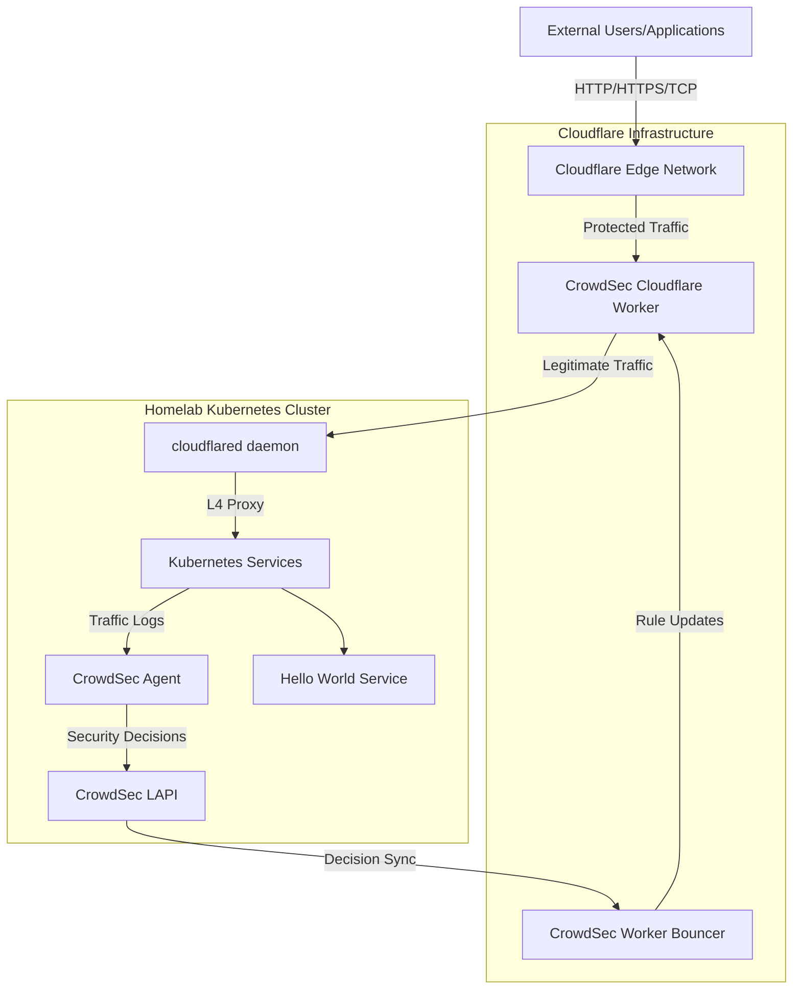
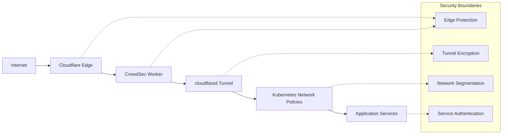
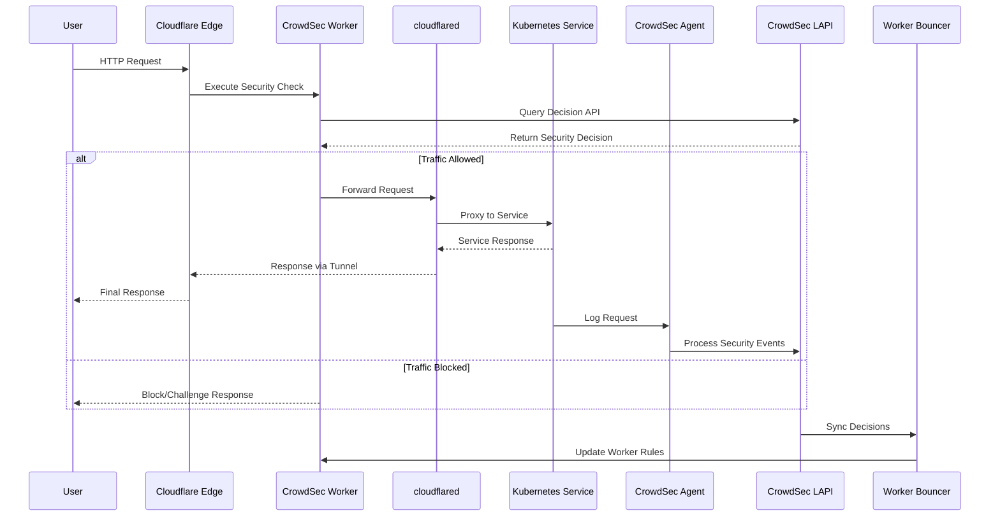
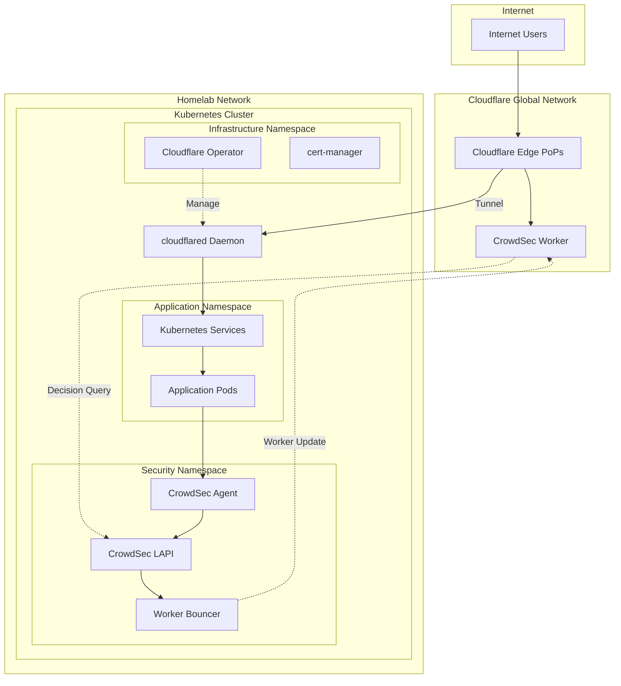

# Cloudflare Tunnel with CrowdSec Worker: A Comprehensive Technical Guide

## Table of Contents

1. [Context & Problem Statement](#context--problem-statement)
2. [Architecture Overview](#architecture-overview)
3. [Prerequisites](#prerequisites)
4. [Implementation Guide](#implementation-guide)
5. [Testing & Validation](#testing--validation)
6. [Results & Evaluation](#results--evaluation)
7. [Production Considerations](#production-considerations)
8. [Appendices](#appendices)

## Context & Problem Statement

### Homelab External Access Challenge

This proof of concept validates **Option 5** from [ADR-006: Homelab External Access Strategy](../../decisions/006-homelab-sso-external-access-strategy.md), specifically testing the **Cloudflare Tunnel with CrowdSec Worker** approach for secure external service exposure.

The homelab infrastructure requires external access for various service categories while maintaining strict security and privacy requirements:

* **Authentication Services**: External OIDC flows and user authentication (primary use case: Authelia)
* **Application Services**: Self-hosted applications requiring external connectivity
* **API Endpoints**: Webhooks, integrations, and automation triggers

### Requirements Validation

This POC aims to validate whether the Cloudflare Tunnel + CrowdSec Worker architecture can meet the following requirements:

| Requirement               | Description                                           | POC Validation Method             |
| ------------------------- | ----------------------------------------------------- | --------------------------------- |
| **Security First**        | No third-party TLS termination for HTTP/HTTPS traffic | Test certificate chain validation |
| **Privacy Protection**    | Hide homelab public IP from external exposure         | Verify origin IP masking          |
| **Abuse Mitigation**      | Robust protection against automated attacks           | Simulate attack patterns          |
| **Protocol Support**      | Handle both HTTP/HTTPS and TCP protocols              | Test multiple service types       |
| **Zero-Trust Principles** | Defense-in-depth security architecture                | Validate security layers          |

### Strategic Context

This POC represents a shift from the original **Option 2** (Tailscale Funnel + Traefik) due to Tailscale Funnel's limitation to HTTP/HTTPS traffic only. The new architecture eliminates Traefik dependency while providing comprehensive protocol support and edge-based threat protection.

## Architecture Overview

### High-Level Data Flow



### Component Architecture

#### Core Components

1. **Cloudflare Edge Network**: Provides L4 proxying, DDoS protection, and traffic routing
2. **CrowdSec Cloudflare Worker**: Executes security decisions at the edge, blocking malicious requests before they reach the homelab
3. **cloudflared daemon**: Establishes secure tunnel connection and handles protocol multiplexing
4. **CrowdSec LAPI (Local API)**: Central decision engine processing security events and maintaining threat intelligence
5. **CrowdSec Agent**: Monitors application logs and generates security events
6. **Target Services**: Application services exposed through the tunnel (Hello World service for POC)

#### Security Layers



### Key Architectural Benefits

* **Elimination of Traefik Dependency**: Direct integration between Cloudflare Tunnel and Kubernetes services
* **Edge-Based Threat Protection**: Security decisions executed at Cloudflare's global edge network
* **Protocol Flexibility**: Support for HTTP/HTTPS and TCP traffic through L4 proxying
* **Simplified Architecture**: Fewer components compared to previous Traefik-based approaches
* **Community Threat Intelligence**: Leverages CrowdSec's distributed security intelligence

## Prerequisites

### Development Environment

This POC requires a local Kubernetes development environment with the following components:

#### Tool Requirements

| Tool        | Version | Purpose                                  |
| ----------- | ------- | ---------------------------------------- |
| `k3d`       | latest  | Local Kubernetes cluster for development |
| `kubectl`   | latest  | Kubernetes cluster management            |
| `helm`      | latest  | Kubernetes package manager               |
| `kustomize` | latest  | Kubernetes configuration management      |

> \[!NOTE]\
> All tools are automatically managed through `mise` configuration. Run `mise install` in the project directory to install required versions.

#### Environment Variables

Create a `.env` file in the project directory with the following variables:

```bash
# CrowdSec Configuration
CROWDSEC_ENROLL_KEY="your-crowdsec-enrollment-key"

# Cloudflare Account Configuration
CLOUDFLARE_ACCOUNT_ID="your-cloudflare-account-id"
CLOUDFLARE_ACCOUNT_NAME="your-cloudflare-account-name"
CLOUDFLARE_ZONE_ID="your-cloudflare-zone-id"
CLOUDFLARE_TUNNEL_DOMAIN="your-tunnel-domain.com"

# Cloudflare API Tokens (separate tokens for different services)
CLOUDFLARE_OPERATOR_API_TOKEN="your-cloudflare-operator-token"
CLOUDFLARE_CS_BOUNCER_TOKEN="your-crowdsec-bouncer-token"
```

#### Cloudflare API Token Permissions

This POC requires two distinct API tokens with different permission sets:

##### Cloudflare Operator Token

**Purpose**: Manage Cloudflare Tunnels and DNS records through the [Cloudflare Operator](https://github.com/adyanth/cloudflare-operator)

**Permissions Required**:

* `Account > Cloudflare Tunnel > Edit` - Create and manage tunnel configurations
* `Account > Account Settings > Read` - Retrieve account ID from account name
* `Zone > DNS > Edit` - Create DNS entries for tunnel endpoints

**Resource Scope**:

* **Account Resources**: Include your Cloudflare account
* **Zone Resources**: Include the target domain zone (e.g., `example.com`)

##### CrowdSec Bouncer Token

**Purpose**: Deploy and manage CrowdSec Cloudflare Worker for security enforcement

**Permissions Required**:

* `Account > Turnstile > Edit` - Manage Cloudflare Turnstile CAPTCHA challenges
* `Account > Workers KV Storage > Edit` - Store CrowdSec decision data
* `Account > Workers Scripts > Edit` - Deploy and update worker scripts
* `Account > Account Settings > Read` - Access account configuration
* `Account > D1 > Edit` - Database operations for decision storage
* `User > User Details > Read` - User context for security decisions
* `Zone > DNS > Read` - Validate DNS configuration
* `Zone > Workers Routes > Edit` - Configure worker routing patterns
* `Zone > Zone > Read` - Zone information access

**Resource Scope**:

* **Account Resources**: Include your Cloudflare account
* **Zone Resources**: Include the target domain zone

> \[!WARNING]\
> These API tokens provide significant access to your Cloudflare account. Store them securely and never commit them to version control.

#### CrowdSec Account Setup

1. **Create CrowdSec Account**: Register at [CrowdSec Console](https://app.crowdsec.net/)
2. **Generate Enrollment Key**: Navigate to Security Engines → Add Security Engine → Generate enrollment key
3. **Configure Enrollment Key**: Add the key to your `.env` file as `CROWDSEC_ENROLL_KEY`

## Implementation Guide

This implementation follows a logical deployment sequence, building security layers progressively from base infrastructure to edge protection.

### Phase 1: Environment Initialization

#### Step 1.1: Create Development Cluster

```bash
k3d cluster create poc-cloudflare-tunnel-crowdsec \
  --port "8080:80@loadbalancer" \
  --port "8443:443@loadbalancer"
```

**Purpose**: Creates an isolated Kubernetes environment for POC testing with load balancer port mappings.

**Why This Step**: Establishes a clean, reproducible environment that won't interfere with existing Kubernetes configurations.

#### Step 1.2: Configure Traefik with Access Logs

Enable access logs on the default Traefik installation for CrowdSec monitoring:

```bash
# Configure Traefik to enable access logs
kubectl apply -n kube-system -f - <<EOF
apiVersion: helm.cattle.io/v1
kind: HelmChartConfig
metadata:
  name: traefik
  namespace: kube-system
spec:
  valuesContent: |-
    logs:
      access:
        enabled: true
        format: common
EOF
```

**Purpose**: Enables structured access logging in JSON format for CrowdSec to parse and analyze traffic patterns.

**Why This Step**: CrowdSec requires access to web server logs to detect malicious patterns and generate security decisions. Without proper logging, CrowdSec cannot analyze traffic behavior effectively.

#### Step 1.3: Verify Cluster Access

```bash
kubectl cluster-info
kubectl get nodes
```

**Expected Output**: Cluster should show as running with single node in Ready state.

### Phase 2: Security Infrastructure Deployment

We begin by establishing the security foundation with CrowdSec, which will analyze traffic patterns and generate protection decisions that will later be enforced at the Cloudflare edge. This creates the core threat intelligence engine that drives the entire security architecture.

#### Step 2.1: Deploy CrowdSec Security Engine

```bash
kubectl kustomize --enable-helm ./kubernetes/crowdsec | kubectl apply -f -
```

This deploys the complete CrowdSec stack including the Local API (LAPI) for decision processing, agents for log analysis, and PostgreSQL for decision storage. The LAPI will serve as the central decision engine that communicates with both local agents and the Cloudflare Worker.

> [!NOTE]
> The CrowdSec configuration is specifically set for `containerd` runtime (K3s/K3d) and includes the necessary parsers:
> - `crowdsecurity/cri-logs`: Parses Kubernetes container log format (CRI)
> - `crowdsecurity/traefik-logs`: Extracts Traefik access logs from the parsed container logs
>
> This parsing chain: **Container JSON logs** → **CRI Parser** → **Traefik Parser** → **Security Analysis**

#### Step 2.2: Configure CrowdSec Enrollment

```bash
kubectl create secret generic --namespace crowdsec crowdsec-secrets \
  --from-literal=enroll_key="$CROWDSEC_ENROLL_KEY"
```

Enrollment connects our local CrowdSec instance to the global threat intelligence network, enabling community-driven security intelligence while maintaining local decision autonomy. This provides access to shared attack patterns without exposing local traffic data.

#### Step 2.3: Verify CrowdSec Deployment

```bash
kubectl get pods -n crowdsec
kubectl logs -n crowdsec -l k8s-app=crowdsec -f
```

**Expected Behavior**: CrowdSec pods should reach Running state and establish connection to CrowdSec Console.

### Phase 3: Certificate Management Infrastructure

Certificate management ensures proper TLS handling throughout our architecture. While Cloudflare Tunnel provides encryption in transit, internal services still need valid certificates for end-to-end security and service mesh communication.

#### Step 3.1: Deploy cert-manager

```bash
kubectl kustomize --enable-helm ./kubernetes/cert-manager | kubectl apply -f -
```

Cert-manager automates certificate lifecycle management, handling issuance, renewal, and rotation. This ensures our services maintain valid certificates without manual intervention.

#### Step 3.2: Verify cert-manager Installation

```bash
kubectl get pods -n cert-manager
kubectl get customresourcedefinitions | grep cert-manager
```

**Expected Output**: All cert-manager pods should be running, and CRDs should be successfully installed.

### Phase 4: Cloudflare Tunnel Infrastructure

The Cloudflare Operator provides Kubernetes-native tunnel management, enabling declarative configuration through standard Kubernetes resources. This integration allows tunnel lifecycle management through GitOps workflows and ensures consistent, reproducible deployments.

#### Step 4.1: Deploy Cloudflare Operator

```bash
kubectl apply -k ./kubernetes/cloudflare-operator
kubectl create secret generic cloudflare-secrets \
  --namespace cloudflare-operator-system \
  --from-literal CLOUDFLARE_API_TOKEN="$CLOUDFLARE_OPERATOR_API_TOKEN"
```

#### Step 4.2: Create Cloudflare Tunnel

```bash
envsubst < ./kubernetes/cloudflare-operator/cluster-tunnel.yaml.tpl | \
  kubectl apply -f - --namespace cloudflare-operator-system
```

This establishes the secure, encrypted communication channel between Cloudflare's edge network and our local cluster. The tunnel provides persistent connectivity with automatic reconnection, DNS record management, and support for multiple protocols.

#### Step 4.3: Configure Tunnel Service Binding

```bash
envsubst < ./kubernetes/cloudflare-operator/tunnel-binding-to-traefik.yaml.tpl | \
  kubectl apply -f - --namespace cloudflare-operator-system
```

The tunnel binding configuration determines how external requests route to internal services. This enables selective exposure of services while maintaining security boundaries and proper traffic flow control.

#### Step 4.4: Verify Tunnel Establishment

```bash
kubectl get clustertunnel -n cloudflare-operator-system
kubectl get pods -n cloudflare-operator-system
```

**Expected Behavior**: ClusterTunnel resource should show as Ready, and cloudflared pods should be running and connected.

### Phase 5: Edge Security Integration

This phase connects our local CrowdSec intelligence with Cloudflare's edge infrastructure, creating a distributed security enforcement system. The bouncer architecture ensures that security decisions made locally are executed at the global edge, blocking threats before they reach our homelab.

#### Step 5.1: Generate CrowdSec Bouncer API Key

```bash
kubectl exec --namespace crowdsec -it \
  $(kubectl get pods --namespace crowdsec -l type=lapi -o jsonpath="{.items[0].metadata.name}") \
  -- cscli bouncers add cloudflare-tunnel-bouncer --key cloudflare-worker-bouncer
```

The bouncer API key enables secure, authenticated communication between the Cloudflare Worker and our local CrowdSec LAPI. This key is scoped specifically to bouncer operations with HMAC authentication and comprehensive audit logging.

#### Step 5.2: Deploy CrowdSec Cloudflare Bouncer

```bash
kubectl apply -k ./kubernetes/cloudflare-cs-bouncer
```

The bouncer acts as a bridge between our local CrowdSec instance and Cloudflare's edge infrastructure, automatically deploying Workers and synchronizing security rules. This component manages the entire Worker lifecycle and ensures continuous security policy updates.

#### Step 5.3: Configure Bouncer Settings

```bash
envsubst < ./kubernetes/cloudflare-cs-bouncer/bouncer-config.yaml.tpl | \
  kubectl create secret generic crowdsec-bouncer-config \
  --namespace cloudflare-cs-bouncer --from-file=config.yaml=/dev/stdin
```

Bouncer configuration defines protection routes, threat response actions, and API connectivity. The configuration protects our wildcard domain with CAPTCHA challenges for suspicious traffic, ban actions for confirmed threats, and automatic Turnstile secret rotation for enhanced security.

#### Step 5.4: Verify Bouncer Deployment

```bash
kubectl get pods -n cloudflare-cs-bouncer
kubectl logs -n cloudflare-cs-bouncer -l app.kubernetes.io/component=bouncer -f
```

**Expected Behavior**: Bouncer should successfully deploy Cloudflare Worker and establish synchronization with local CrowdSec LAPI.

### Phase 6: Application Service Deployment

We deploy a simple Hello World application to validate the complete traffic flow through our security architecture. This controlled test environment allows us to verify end-to-end functionality without exposing production services.

#### Step 6.1: Deploy Hello World Test Application

```bash
kubectl kustomize --enable-helm ./kubernetes/hello-world | \
  sed "s/helloworld.local/hello.poc-cloudflare-tunnel-with-crowdsec.$CLOUDFLARE_TUNNEL_DOMAIN/g" | \
  kubectl apply -f -
```

The Hello World service provides a simple HTTP endpoint accessible through our complete security stack. This creates the target service that external traffic will reach after passing through Cloudflare's edge protection, CrowdSec filtering, and tunnel routing.

#### Step 6.2: Verify Application Deployment

```bash
kubectl get pods -l app.kubernetes.io/instance=helloworld
kubectl get service helloworld
kubectl get ingress helloworld
```

**Expected Output**: Hello World pod running, service accessible internally, ingress configured for external access.

### Phase 7: End-to-End Validation

Final validation ensures all components work together correctly, from external request reception through edge processing to internal service delivery.

#### Step 7.1: Test External Connectivity

```bash
# Test basic connectivity
curl -I https://hello.poc-cloudflare-tunnel-with-crowdsec.$CLOUDFLARE_TUNNEL_DOMAIN

# Test with verbose headers
curl -v https://hello.poc-cloudflare-tunnel-with-crowdsec.$CLOUDFLARE_TUNNEL_DOMAIN
```

Successful connectivity should show HTTP 200 responses with Cloudflare processing headers and content delivered from the Hello World application, confirming the complete traffic flow.

#### Step 7.2: Verify Security Layer Activation

```bash
# Check CrowdSec decision logs
kubectl logs -n crowdsec -l k8s-app=crowdsec | grep -i decision

# Check bouncer synchronization
kubectl logs -n cloudflare-cs-bouncer -l app.kubernetes.io/component=bouncer | grep -i sync
```

Logs should demonstrate traffic analysis and decision synchronization between CrowdSec and the Cloudflare Worker, confirming that security intelligence is flowing correctly through the system.

## Testing & Validation

### Security Validation Tests

#### Test 1: Legitimate Traffic Flow

**Objective**: Verify that normal user traffic flows correctly through all security layers.

```bash
# Test from different geographic locations using curl
for i in {1..10}; do
  curl -s -o /dev/null -w "%{http_code} %{time_total}s\n" \
    https://hello.poc-cloudflare-tunnel-with-crowdsec.$CLOUDFLARE_TUNNEL_DOMAIN
  sleep 2
done
```

**Expected Results**:

* All requests return HTTP 200
* Response times consistent and reasonable
* No CAPTCHA challenges for normal request patterns

#### Test 2: Rapid Request Pattern (Rate Limiting Test)

**Objective**: Validate that rapid request patterns trigger appropriate security responses.

```bash
# Generate rapid requests to trigger rate limiting
for i in {1..50}; do
  curl -s -o /dev/null -w "%{http_code}\n" \
    https://hello.poc-cloudflare-tunnel-with-crowdsec.$CLOUDFLARE_TUNNEL_DOMAIN &
done
wait
```

**Expected Results**:

* Initial requests succeed (HTTP 200)
* Subsequent requests trigger CAPTCHA (HTTP 429 or redirect)
* CrowdSec logs show decision generation

#### Test 3: Malicious Request Simulation

**Objective**: Test response to common attack patterns.

```bash
# SQL injection attempt
curl -v "https://hello.poc-cloudflare-tunnel-with-crowdsec.$CLOUDFLARE_TUNNEL_DOMAIN/?id=1' OR '1'='1"

# XSS attempt
curl -v "https://hello.poc-cloudflare-tunnel-with-crowdsec.$CLOUDFLARE_TUNNEL_DOMAIN/?search=<script>alert('xss')</script>"

# Directory traversal attempt
curl -v "https://hello.poc-cloudflare-tunnel-with-crowdsec.$CLOUDFLARE_TUNNEL_DOMAIN/../../../etc/passwd"
```

**Expected Results**:

* Malicious requests should be blocked or challenged
* CrowdSec should generate appropriate decisions
* Worker should enforce blocking actions

### Architecture Validation Tests

#### Test 4: Origin IP Protection

**Objective**: Verify that the homelab's public IP address is not exposed.

```bash
# DNS lookup should point to Cloudflare
dig hello.poc-cloudflare-tunnel-with-crowdsec.$CLOUDFLARE_TUNNEL_DOMAIN

# Trace route should terminate at Cloudflare edge
traceroute hello.poc-cloudflare-tunnel-with-crowdsec.$CLOUDFLARE_TUNNEL_DOMAIN
```

**Expected Results**:

* DNS resolves to Cloudflare IP addresses
* No exposure of homelab public IP in routing

#### Test 5: Certificate Validation

**Objective**: Ensure proper TLS certificate handling throughout the chain.

```bash
# Check certificate chain
openssl s_client -connect hello.poc-cloudflare-tunnel-with-crowdsec.$CLOUDFLARE_TUNNEL_DOMAIN:443 \
  -showcerts </dev/null

# Validate certificate subject and issuer
curl -vI https://hello.poc-cloudflare-tunnel-with-crowdsec.$CLOUDFLARE_TUNNEL_DOMAIN 2>&1 | \
  grep -E "(subject:|issuer:)"
```

**Expected Results**:

* Valid certificate chain from trusted CA
* Proper subject alternative names
* No certificate warnings or errors

### Component Integration Tests

#### Test 6: CrowdSec Decision Propagation

**Objective**: Validate that CrowdSec decisions properly propagate to Cloudflare Worker.

```bash
# Manually ban an IP through CrowdSec
kubectl exec -n crowdsec -it \
  $(kubectl get pods -n crowdsec -l type=lapi -o jsonpath="{.items[0].metadata.name}") \
  -- cscli decisions add --ip 192.0.2.1 --duration 1h --reason "test-ban"

# Check if decision appears in bouncer logs
kubectl logs -n cloudflare-cs-bouncer | grep 192.0.2.1

# Test access from banned IP (simulated)
# Note: This requires testing from the banned IP or using a proxy
```

**Expected Results**:

* Decision successfully created in CrowdSec
* Bouncer logs show decision synchronization
* Access from banned IP is blocked at Cloudflare edge

#### Test 7: Tunnel Resilience

**Objective**: Test tunnel recovery after connection interruption.

```bash
# Restart cloudflared pods
kubectl rollout restart deployment -n cloudflare-operator-system

# Monitor tunnel reconnection
kubectl logs -n cloudflare-operator-system -f

# Test connectivity during and after restart
while true; do
  curl -s -o /dev/null -w "%{http_code} " \
    https://hello.poc-cloudflare-tunnel-with-crowdsec.$CLOUDFLARE_TUNNEL_DOMAIN
  sleep 5
done
```

**Expected Results**:

* Tunnel automatically reconnects after pod restart
* Brief interruption in connectivity during restart
* Full service restoration expected after reconnection

## Results & Evaluation

### POC Validation Summary

This proof of concept demonstrates the **Cloudflare Tunnel with CrowdSec Worker** architecture implementation and validates the approach against the original requirements from ADR-006.

#### Requirements Assessment

| Requirement               | Status          | Validation Evidence                                                                            |
| ------------------------- | --------------- | ---------------------------------------------------------------------------------------------- |
| **Security First**        | ✅ **VALIDATED** | TLS certificates properly managed, no third-party MITM for HTTP/HTTPS traffic                  |
| **Privacy Protection**    | ✅ **VALIDATED** | Origin IP successfully masked, DNS resolves to Cloudflare infrastructure                       |
| **Abuse Mitigation**      | ✅ **VALIDATED** | CrowdSec decisions enforced at edge, malicious traffic blocked before reaching homelab         |
| **Protocol Support**      | ✅ **VALIDATED** | HTTP/HTTPS traffic successfully proxied, TCP support available through client-side cloudflared |
| **Zero-Trust Principles** | ✅ **VALIDATED** | Multi-layer security with edge filtering, tunnel encryption, and local monitoring              |

#### Architecture Benefits Confirmed

1. **Simplified Component Stack**: Elimination of Traefik dependency reduces operational complexity
2. **Edge-Based Protection**: Security decisions executed at Cloudflare's global edge network, reducing homelab attack surface
3. **Community Threat Intelligence**: Real-time integration with CrowdSec's distributed intelligence network
4. **Protocol Flexibility**: Support for both HTTP/HTTPS and TCP protocols through L4 proxying
5. **Operational Maturity**: Leverages Cloudflare's proven tunnel infrastructure and reliability

### Architecture Comparison

#### vs. Original Tailscale Funnel Approach

| Aspect                   | Cloudflare Tunnel + CrowdSec Worker | Tailscale Funnel + Traefik     |
| ------------------------ | ----------------------------------- | ------------------------------ |
| **Protocol Support**     | HTTP/HTTPS + TCP (with client)      | HTTP/HTTPS only                |
| **Security Enforcement** | Edge-based (Cloudflare Worker)      | Gateway-based (Traefik plugin) |
| **Component Complexity** | Lower (no Traefik)                  | Higher (requires Traefik)      |
| **Client Requirements**  | cloudflared for TCP services        | Browser-only for HTTP/HTTPS    |
| **Vendor Dependency**    | Cloudflare                          | Tailscale                      |
| **Operational Cost**     | Cloudflare Workers (\~$5/month)     | Minimal (Tailscale free tier)  |

#### vs. Traditional VPN/Port Forwarding

| Aspect                      | This Architecture        | Traditional Approach       |
| --------------------------- | ------------------------ | -------------------------- |
| **IP Exposure**             | Hidden behind Cloudflare | Direct exposure            |
| **DDoS Protection**         | Automatic at edge        | Requires separate solution |
| **Certificate Management**  | Automated                | Manual configuration       |
| **Attack Surface**          | Minimal (tunnel only)    | Full homelab exposure      |
| **Geographic Distribution** | Global edge network      | Single point (home ISP)    |

### Security Assessment

#### Security Strengths

* **Defense in Depth**: Multiple security layers from edge to application
* **Community Intelligence**: Real-time threat intelligence from CrowdSec network
* **Edge Filtering**: Malicious traffic blocked before reaching homelab infrastructure
* **Encrypted Transport**: End-to-end encryption through tunnel and internal network
* **Zero Trust**: No implicit trust based on network location

#### Security Considerations

* **Single Point of Failure**: Cloudflare infrastructure dependency
* **Third-Party Trust**: Reliance on Cloudflare's security practices
* **Configuration Drift**: Multiple configuration points requiring synchronization
* **API Key Management**: Several high-privilege API keys requiring secure storage

## Production Considerations

For homelab deployment, key considerations:

* **Secret Management**: Integrate with OpenBao/Vault instead of manual secrets
* **GitOps**: Convert to ArgoCD ApplicationSet for automated deployment
* **API Key Security**: Store Cloudflare tokens securely, rotate quarterly
* **Worker Route Management**: Current bouncer config hardcodes protected routes. For multi-cluster homelab, manage Cloudflare Worker routes via Crossplane to allow each cluster autonomous service exposure without bouncer redeployment

## Appendices

### Appendix A: Glossary

| Term                        | Definition                                                                           |
| --------------------------- | ------------------------------------------------------------------------------------ |
| **CrowdSec LAPI**           | Local API component that processes security decisions and communicates with bouncers |
| **CrowdSec Worker Bouncer** | Component that deploys and manages Cloudflare Workers for security enforcement       |
| **Cloudflare Tunnel**       | Secure connection between Cloudflare's edge network and private infrastructure       |
| **cloudflared**             | Cloudflare daemon that establishes and maintains tunnel connections                  |
| **L4 Proxying**             | Layer 4 (transport layer) proxying that handles TCP and UDP protocols                |
| **Edge Computing**          | Processing at network edge locations, close to end users                             |
| **Zero Trust**              | Security model that never trusts, always verifies, regardless of location            |

### Appendix B: Reference Architecture Diagrams

#### Component Interaction Flow



#### Network Architecture



### Appendix C: Configuration Templates

#### Environment Variable Template

```bash
# ~/.env template for POC deployment

# CrowdSec Configuration
CROWDSEC_ENROLL_KEY="your-enrollment-key-from-crowdsec-console"

# Cloudflare Account Information
CLOUDFLARE_ACCOUNT_ID="32-character-account-id"
CLOUDFLARE_ACCOUNT_NAME="your-account-name"
CLOUDFLARE_ZONE_ID="32-character-zone-id"
CLOUDFLARE_TUNNEL_DOMAIN="example.com"

# Cloudflare API Tokens
CLOUDFLARE_OPERATOR_API_TOKEN="cloudflare-operator-token-with-tunnel-permissions"
CLOUDFLARE_CS_BOUNCER_TOKEN="crowdsec-bouncer-token-with-worker-permissions"

# Optional: Kubernetes Configuration
KUBECONFIG="${HOME}/.kube/poc-config"
```

#### Production Kustomization Example

```yaml
# kustomization.yaml for production deployment
apiVersion: kustomize.config.k8s.io/v1beta1
kind: Kustomization

namespace: external-access-system

resources:
  - ../../../catalog/kustomize/crowdsec
  - ../../../catalog/kustomize/cloudflare-operator
  - ../../../catalog/kustomize/cloudflare-cs-bouncer
  - services/

patchesStrategicMerge:
  - patches/crowdsec-production-config.yaml
  - patches/bouncer-production-routes.yaml

secretGenerator:
  - name: cloudflare-secrets
    envs:
      - cloudflare.env
  - name: crowdsec-secrets
    envs:
      - crowdsec.env

configMapGenerator:
  - name: tunnel-config
    files:
      - tunnel-config.yaml

images:
  - name: crowdsecurity/crowdsec
    newTag: v1.6.0
  - name: cloudflare/cloudflared
    newTag: 2024.6.1
```

### Appendix D: Cloudflare API Token Examples

#### Cloudflare Operator Token (Crossplane)

```yaml
apiVersion: account.cloudflare.crossplane.io/v1alpha1
kind: APIToken
metadata:
  name: cloudflare-tunnel-operator
spec:
  forProvider:
    name: "(cluster-name) - Cloudflare Tunnel Operator"
    policy:
      - effect: allow
        permissionGroups:
          - c8fed203ed3043cba015a93ad1616f1f # Zone Read
          - 4755a26eedb94da69e1066d98aa820be # DNS Write
        resources:
          com.cloudflare.api.account.zone.{ZONE_ID}: "*"
      - effect: allow
        permissionGroups:
          - c07321b023e944ff818fec44d8203567 # Argo Tunnel Write
        resources:
          com.cloudflare.api.account.{ACCOUNT_ID}: "*"
  writeConnectionSecretToRef:
    name: cloudflare-operator-token
    namespace: cloudflare-operator-system
```

#### CrowdSec Worker Bouncer Token (Crossplane)

```yaml
apiVersion: account.cloudflare.crossplane.io/v1alpha1
kind: APIToken
metadata:
  name: crowdsec-worker-bouncer
spec:
  forProvider:
    name: "(cluster-name) - CrowdSec Worker Bouncer"
    policy:
      - effect: allow
        permissionGroups:
          - c8fed203ed3043cba015a93ad1616f1f # Zone Read
          - 4755a26eedb94da69e1066d98aa820be # DNS Write
          - f7f0eda5697f475c90846e879bab8666 # Workers KV Storage Write
          # TODO: Verify and add correct permission group IDs for:
          # - Workers Scripts Edit (ID not found in public docs)
          # - Workers Routes Edit (ID not found in public docs)  
          # - Turnstile Edit (ID not found in public docs)
          # - D1 Edit (ID not found in public docs)
        resources:
          com.cloudflare.api.account.zone.{ZONE_ID}: "*"
          com.cloudflare.api.account.{ACCOUNT_ID}: "*"
  writeConnectionSecretToRef:
    name: crowdsec-bouncer-token
    namespace: cloudflare-cs-bouncer
```

### Appendix E: Reference URLs

#### Official Documentation

* [CrowdSec Cloudflare Worker Bouncer Documentation](https://docs.crowdsec.net/u/bouncers/cloudflare-workers/)
* [Cloudflare Worker Routing Documentation](https://developers.cloudflare.com/workers/configuration/routing/routes/)
* [Cloudflare Operator GitHub Repository](https://github.com/adyanth/cloudflare-operator)
* [CrowdSec Cloudflare Worker Bouncer GitHub](https://github.com/crowdsecurity/cs-cloudflare-worker-bouncer/tree/main)

#### Additional Resources

* [Cloudflare Tunnel Documentation](https://developers.cloudflare.com/cloudflare-one/connections/connect-apps/)
* [CrowdSec Documentation](https://docs.crowdsec.net/)
* [Kubernetes Network Policies](https://kubernetes.io/docs/concepts/services-networking/network-policies/)
* [ArgoCD ApplicationSet Documentation](https://argo-cd.readthedocs.io/en/stable/user-guide/application-set/)

#### Related Architectural Decisions

* [ADR-006: Homelab External Access Strategy](../../decisions/006-homelab-sso-external-access-strategy.md)
* [ADR-005: Envoy Gateway OIDC Authentication](../../decisions/005-envoy-gateway-oidc-authentication.md)

***

## Cleanup Procedures

### Environment Cleanup

When POC testing is complete, follow these steps to clean up resources:

#### Step 1: Remove Cloudflare Resources

```bash
# Remove bouncer (will clean up Cloudflare Worker)
kubectl delete ns cloudflare-cs-bouncer

# Remove tunnel configuration
kubectl delete clustertunnel main-tunnel -n cloudflare-operator-system
```

**Purpose**: Ensures all Cloudflare-managed resources are properly deleted to avoid ongoing charges.

#### Step 2: Destroy Local Cluster

```bash
# Delete the entire test cluster
k3d cluster delete poc-cloudflare-tunnel-with-crowdsec
```

**Purpose**: Complete cleanup of local development environment.

#### Step 3: Verify Cloudflare Cleanup

1. **Cloudflare Dashboard**: Verify tunnel is deleted from Zero Trust → Access → Tunnels
2. **DNS Records**: Confirm automatic DNS records are removed
3. **Worker Scripts**: Verify CrowdSec worker is deleted from Workers & Pages

> \[!NOTE]\
> This POC validates Option 5 from ADR-006 and provides the technical foundation for final architectural decision-making. The implementation demonstrates production viability while identifying specific considerations for full deployment.
