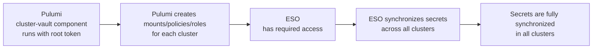

# OpenBao Bootstrap Guide – Kubernetes Integration

> **This document describes the complete OpenBao bootstrap process for a Kubernetes cluster, following the architecture
> and conventions defined in:**
>
> - [ADR-002: Secrets Mount Topology](../../../docs/decisions/002-openbao-secrets-topology.md)
> - [ADR-003: Path and Naming Conventions](../../../docs/decisions/003-openbao-path-naming-conventions.md)
> - [ADR-004: Policy Naming and Scope](../../../docs/decisions/004-openbao-policy-naming-conventions.md)

## 📋 Table of Contents

- [🔧 OpenBao Configuration Principles and Bootstrap](#-openbao-configuration-principles-and-bootstrap)
- [⚙️ Phase 1: Configure the First Kubernetes Auth Backend](#%EF%B8%8F-phase-1-configure-the-first-kubernetes-auth-backend)
  <!-- markdown-link-check-disable-line -->
- [⚙️ Phase 2: Automated Synchronization Workflow](#%EF%B8%8F-phase-2-automated-synchronization-workflow)
  <!-- markdown-link-check-disable-line -->

## 🔧 OpenBao Configuration Principles and Bootstrap

The target OpenBao architecture is designed for automation and declarative management: all configuration should ideally
be managed as code via GitOps tools (Pulumi for policy/secret management, External Secrets Operator for Kubernetes
synchronization).

However, an initial manual bootstrap is required to enable this automation:

- **Configure the first (local) Kubernetes authentication backend** in OpenBao, using the OpenBao client's JWT as the
  reviewer JWT (no need to deploy a dedicated service account).
- **Bootstrap with a root/admin token** so the Pulumi Vault provider can authenticate and take over configuration.
- **From this point, declarative management takes over**: the Pulumi `cluster-vault` component
  (`catalog/pulumi/components/cluster-vault/`) provisions mounts, policies, and auth backends from each cluster's stack
  (`projects/<cluster>/src/infrastructure/pulumi/`), then ESO synchronizes secrets into Kubernetes.

This guide details all these steps, clearly distinguishing what must be done manually and what can/should be automated.

## ⚙️ Phase 1: Configure the First Kubernetes Auth Backend

> \[!NOTE] The Pulumi `cluster-vault` component manages per-cluster Kubernetes auth backends at their own path
> (`<cluster>/`). The **local** backend at the default path `kubernetes/` is the one that must be bootstrapped manually
> so the Pulumi Vault provider itself can authenticate.

**Goal:**\
Enable OpenBao to authenticate Kubernetes service accounts from the amiya.akn cluster (local cluster). With the current
setup, you do not need to provide a reviewer JWT or the Kubernetes CA certificate.

> \[!NOTE] **Prerequisites:**
>
> - OpenBao instance is up and accessible (CLI or API)
> - You have a root/admin token for OpenBao
> - `mise run bao:login` succeeds (sets `VAULT_TOKEN` / `VAULT_ADDR`)

1. **Enable the Kubernetes auth backend for the amiya.akn cluster**

   ```bash
   bao auth enable -path=kubernetes -description="Kubernetes auth backend for amiya.akn cluster (Pulumi provider bootstrap)" kubernetes
   ```

2. **Configure the backend (no reviewer JWT or CA cert required)**

   ```bash
   bao write auth/kubernetes/config \
     kubernetes_host="https://kubernetes.default.svc.cluster.local" \
     disable_local_ca_jwt=false
   ```

> \[!NOTE]
>
> - No need to retrieve or provide a service account JWT or the Kubernetes CA certificate for this step.
> - This configuration only needs to be done once for the amiya.akn cluster.
> - After this step, you can proceed to Pulumi-managed provisioning.

3. **Run the Pulumi cluster-vault component**

   With the local Kubernetes auth backend enabled and a root token available, the Pulumi `cluster-vault` component takes
   over and provisions every mount, policy, auth backend, and role the cluster needs — including the ESO read policy and
   role. No manual policy HCL needs to be written.

   From the cluster's Pulumi stack directory:

   ```bash
   cd projects/amiya.akn/src/infrastructure/pulumi
   mise run pulumi:diff    # preview what the cluster-vault component will create
   mise run pulumi:apply   # apply — provisions mounts/policies/auth-backends/roles
   ```

   > The `pulumi:apply` task (defined in the stack's `.mise.toml`) exports `VAULT_TOKEN` from `bao print token` and runs
   > `pulumi up`. See `projects/<cluster>/src/infrastructure/pulumi/.mise.toml`.

> \[!NOTE] For remote clusters (e.g. `lungmen.akn`), the same component is used with the `remote` variant — supply the
> target cluster's CA certificate and token-reviewer JWT via Pulumi config. See the `cluster-vault` README for details.

## ⚙️ Phase 2: Automated Synchronization Workflow

1. **Pulumi configures OpenBao globally**
   - The `cluster-vault` component creates all mounts, policies, and roles needed for both ESO and Pulumi to operate on
     each cluster.
   - This setup is fully declarative (as code) and applies to every cluster managed by its own Pulumi stack.

2. **ESO synchronizes secrets across clusters**
   - With the correct roles and policies in place, ESO can now read from and write to OpenBao as needed.
   - ESO ensures that secrets are synchronized everywhere they are required, across all clusters.

3. **Secrets propagate automatically**
   - As new secrets are added or updated in OpenBao, ESO propagates them to all relevant clusters.
   - Over time, all secrets become fully synchronized across the entire environment.



> \[!WARNING] **Limitation:** Pulumi authenticates to OpenBao using a token obtained via `bao print token` (see the
> stack's `pulumi:apply` task). For remote clusters, the `cluster-vault` component configures a dedicated Kubernetes
> auth backend per cluster rather than relying on the local `kubernetes/` backend.

---

_This document is generated and maintained according to the latest architectural decisions. For details, see the
referenced ADRs._
