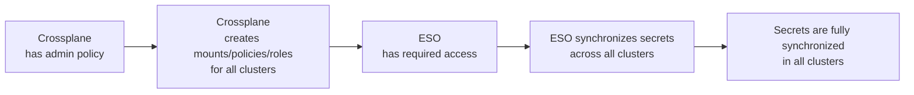

# OpenBao Bootstrap Guide – Kubernetes Integration

> **This document describes the complete OpenBao bootstrap process for a Kubernetes cluster, following the architecture and conventions defined in:**
>
> * [ADR-002: Secrets Mount Topology](../../../../docs/decisions/002-openbao-secrets-topology.md)
> * [ADR-003: Path and Naming Conventions](../../../../docs/decisions/003-openbao-path-naming-conventions.md)
> * [ADR-004: Policy Naming and Scope](../../../../docs/decisions/004-openbao-policy-naming-conventions.md)

## 📋 Table of Contents

* [🔧 OpenBao Configuration Principles and Bootstrap](#-openbao-configuration-principles-and-bootstrap)
* [⚙️ Phase 1: Configure the First Kubernetes Auth Backend](#%EF%B8%8F-phase-1-configure-the-first-kubernetes-auth-backend) <!-- markdown-link-check-disable-line -->
* [⚙️ Phase 2: Automated Synchronization Workflow](#%EF%B8%8F-phase-2-automated-synchronization-workflow) <!-- markdown-link-check-disable-line -->

## 🔧 OpenBao Configuration Principles and Bootstrap

The target OpenBao architecture is designed for automation and declarative management: all configuration should ideally be managed as code via GitOps tools (Crossplane for policy/secret management, External Secrets Operator for Kubernetes synchronization).

However, an initial manual bootstrap is required to enable this automation:

* **Configure the first (local) Kubernetes authentication backend** in OpenBao, using the OpenBao client's JWT as the reviewer JWT (no need to deploy a dedicated service account).
* **Manually create the initial policies** (e.g., Crossplane policy) and associated roles, following the principle of least privilege. These policies must only allow Crossplane to configure OpenBao.
* **From this point, declarative management takes over**: Crossplane manages policy/secret creation and updates then ESO synchronizes secrets into Kubernetes.

This guide details all these steps, clearly distinguishing what must be done manually and what can/should be automated.

## ⚙️ Phase 1: Configure the First Kubernetes Auth Backend

> \[!WARNING]
> **Compatibility Issue:** The Crossplane Vault provider does not allow configuring a custom path for the Kubernetes authentication backend (it expects the default path `kubernetes/`).
> **Consequence:** We must enable the Kubernetes auth backend at the default path `kubernetes/` in OpenBao for the provider to work, even if you manage multiple clusters or want to use custom paths.

**Goal:**\
Enable OpenBao to authenticate Kubernetes service accounts from the amiya.akn cluster (local cluster). With the current setup, you do not need to provide a reviewer JWT or the Kubernetes CA certificate.

> \[!NOTE]
> **Prerequisites:**
>
> * OpenBao instance is up and accessible (CLI or API)
> * You have a root/admin token for OpenBao

1. **Enable the Kubernetes auth backend for the amiya.akn cluster**

   ```bash
   bao auth enable -path=kubernetes -description="Kubernetes auth backend for amiya.akn cluster (crossplane provider only)" kubernetes
   ```

2. **Configure the backend (no reviewer JWT or CA cert required)**

   ```bash
   bao write auth/kubernetes/config \
     kubernetes_host="https://kubernetes.default.svc.cluster.local" \
     disable_local_ca_jwt=false
   ```

> \[!NOTE]
>
> * No need to retrieve or provide a service account JWT or the Kubernetes CA certificate for this step.
> * This configuration only needs to be done once for the amiya.akn cluster.
> * After this step, you can proceed to policy creation and automation.

## ⚙️ Phase 2: Automated Synchronization Workflow

1. **Crossplane configures OpenBao globally**
   * Once Crossplane has the required permissions, it creates all mounts, policies, and roles needed for both ESO and Crossplane to operate on all clusters.
   * This setup is fully declarative (as code) and applies to every cluster managed.

2. **ESO synchronizes secrets across clusters**
   * With the correct roles and policies in place, ESO can now read from and write to OpenBao as needed.
   * ESO ensures that secrets are synchronized everywhere they are required, across all clusters.

3. **Secrets propagate automatically**
   * As new secrets are added or updated in OpenBao, ESO propagates them to all relevant clusters.
   * Over time, all secrets become fully synchronized across the entire environment.



> \[!WARNING]
> **Limitation:**
> As long as Crossplane runs only on the same cluster as the OpenBao instance, it does not require the system:auth-delegator role on its pods. This permission is only needed in a multi-cluster scenario where Crossplane must delegate authentication to the Kubernetes clusters hosting OpenBao instances.

***

*This document is generated and maintained according to the latest architectural decisions. For details, see the referenced ADRs.*
