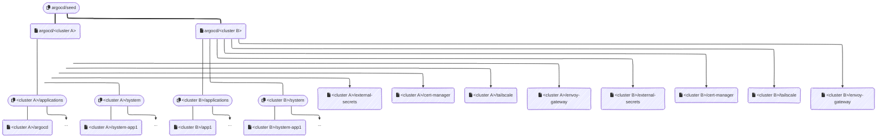

<div align="center">
  
</div>

<h4 align="center">chezmoi.sh - ArgoCD Documentation</h4>

***

> \[!NOTE]
> **Why is ArgoCD in `apps` folder and not the `infrastructure` one?**
>
> The main reason is that ArgoCD is used in this project as a deployment tool, similar to Adguard as a DNS server. Although it is crucial for the proper functioning of the infrastructure, it is not considered an integral part of it.

## 🐙 But ... what is ArgoCD?

[ArgoCD](https://argo-cd.readthedocs.io/en/stable/) is a continuous deployment tool for Kubernetes. It allows managing Kubernetes applications using declarative configuration files, making it easier to handle versioning and deploying applications in Kubernetes environments.

For more information, please refer to the [official documentation](https://argo-cd.readthedocs.io/en/stable/).

## ℹ️ About this folder

This folder is a special folder that requires particular attention. In fact, it is part of the bootstrap folders that need to be initiated manually and, like other folder prefixed by `*`, must not be managed in `autosync` mode.

It consists of two distinct parts:

* The deployment of ArgoCD itself ([in this folder](.))
* The deployment of ArgoCD `ApplicationSets`, managed by the `seed` `Application`, that will be deployed on all configured clusters. These `ApplicationSets` are located in the [`seed.applicationsets`](seed.apps) folder.

## 🔄 Deployment Flow

The deployment follows a hierarchical structure:

1. **Root Application** (`seed.application.yaml`)
   * Manages the initial deployment
   * Deploys content from `seed.apps` folder
   * Configured in `argocd` namespace under `seed` project

2. **Main ApplicationSet** (`shoot.applicationset.yaml`)
   * Automatically generated for each detected cluster
   * Deploys configurations in cluster-specific namespaces
   * Creates two additional ApplicationSets:
     * `system.applicationset.yaml`
     * `apps.applicationset.yaml`

3. **System Applications** (in `shoot.apps/`)
   * Core applications deployed on every cluster:
     * `cert-manager.application.yaml`
     * `external-secrets.application.yaml`
     * `envoy-gateway.application.yaml`

4. **Secondary ApplicationSets** (in `shoot.apps/`)
   * `system.applicationset.yaml`: Manages system applications
   * `apps.applicationset.yaml`: Manages business applications

Here is a visual representation of the deployment hierarchy:



## 🔑 Critical Applications

The following applications are considered critical and are always deployed on every cluster:

* `external-secrets`: Manages secrets from external sources
* `cert-manager`: Manages TLS certificates
* `tailscale`: Handles network connectivity and security
* `envoy-gateway`: Manages ingress and routing

These applications are deployed with cluster-specific configurations:

* Custom Helm values based on cluster name
* Kustomize components specific to each cluster
* Annotations and labels based on cluster metadata (especially Tailscale information)

## 🚀 ArgoCD Bootstrap

The ArgoCD bootstrap is a process that initializes the ArgoCD cluster. It is used to create the initial ArgoCD deployment that will be used to deploy the rest of the infrastructure.

TODO: create a Github App to manage ArgoCD access to private repositories.

```bash
kubectl create --namespace argocd secret generic argocd-repo-creds-github.chezmoi-sh \
  --from-literal=url=https://github.com/chezmoidotsh \
  --from-literal=githubAppID=<app-id> \
  --from-literal=githubAppInstallationID=<installation-id> \
  --from-file=githubAppPrivateKey=<private-key-file>
kubectl label --namespace argocd secret argocd-repo-creds-github.chezmoi-sh argocd.argoproj.io/secret-type=repo-creds
```

TODO: explain SOPS and KSOPS and AGE

```bash
kubectl create --namespace argocd secret generic argocd-sops-age-key \
  --from-file=age-key=<path/to/age-key>
```

> \[!WARNING]
> Folders prefixed with '\*' are special folders that should not be automated under any circumstances. They must be manually synchronized to ensure no unwanted changes are made.
