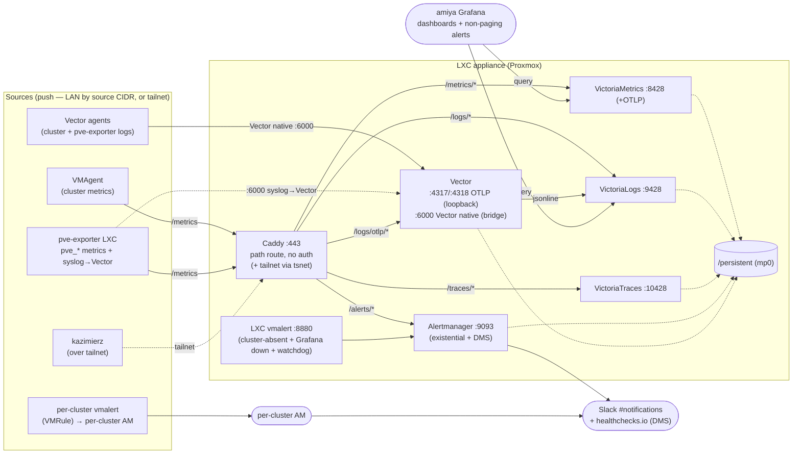

# `o11y.chezmoi.sh` — VictoriaMetrics observability LXC (Proxmox)

Standalone Proxmox LXC running NixOS + the VictoriaMetrics stack. Serves `https://o11y.chezmoi.sh` as the homelab's
central, cluster-independent observability appliance: metrics, logs, traces, and _existential_ alerting.

It deliberately lives **outside** every Kubernetes cluster's failure domain. When a cluster (or its node) goes down, the
appliance keeps collecting and keeps the existential alerts (cluster/Grafana down) firing — closing the "we had no
signal" gap that drove every recent post-mortem (see [#1013][], [#1018][]). Same NixOS-as-code, GPG-signed,
single-purpose-appliance philosophy as the `lxc-oci-registry`.

> **Status** — implements the metrics + logs ingest and existential alerting of \#1018 (ADR-013). Per-cluster alerting +
> recording rules live in each cluster's own vmalert (`VMRule`/`PrometheusRule`); Grafana on `amiya` holds dashboards.
> Cluster-side resources are tracked separately (see [Known gaps](#known-gaps--follow-ups)).

## Table of contents

1. [Architecture](#architecture)
2. [What's in this directory](#whats-in-this-directory)
3. [Prerequisites](#prerequisites)
4. [Secrets](#secrets)
5. [Build & deploy](#build--deploy)
6. [Proxmox LXC creation](#proxmox-lxc-creation)
7. [Proxmox host firewall](#proxmox-host-firewall)
8. [Cluster-side integration](#cluster-side-integration)
9. [Hardening reference](#hardening-reference)
10. [Operations](#operations)
11. [Troubleshooting](#troubleshooting)
12. [Known gaps / follow-ups](#known-gaps--follow-ups)

## Architecture



The LXC vmalert evaluates only the existential page-tier (cluster absent, Grafana down, watchdog/DMS). Per-cluster
`vmalert` evaluates that cluster's `VMRule`/`PrometheusRule` (records + page-worthy alerts) against the central VM and
notifies the cluster's **own Alertmanager**; non-paging alerts are routed by Grafana. The LXC Alertmanager handles only
existential alerts and the healthchecks.io DMS heartbeat — Grafana is not in the DMS path. Access control is the
**Proxmox host firewall by source CIDR** (LAN) plus the **tailnet** (off-LAN).

> **Logs ingest** — three entry points:
>
> - **Vector native `:6000`** (exposed directly on the bridge network, **not** behind Caddy) — cluster and pve-exporter
>   agents pushing pre-formatted OTLP-style events. This is the intended primary log path (ADR-013).
> - **OTLP HTTP via Caddy `/logs/otlp/*`** → Vector `:4318` (loopback). OTLP gRPC `:4317` is loopback-only.
> - **ES-compatible via Caddy `/logs/*`** → VictoriaLogs `:9428` (queries and direct ES insert — bypasses the appliance
>   Vector pipeline).
>
> The appliance no longer runs a syslog listener: the [`pve-exporter`](../pve-exporter/README.md) LXC owns syslog
> ingest, parses RFC 5424 into the OTLP-style format, and forwards it here over Vector native. The appliance's Vector
> pipeline (Vector native + OTLP sources) runs SemConv validation and loki-like conversion before pushing to
> VictoriaLogs.

Architecture diagram source: [`architecture.d2`](./architecture.d2).

### Design decisions (the short version — full rationale in ADR-013)

- **VictoriaMetrics, not ClickHouse** — Prometheus-compatible, resource-light, native `ServiceMonitor` support via the
  cluster-side VM Operator.
- **Centralized LXC, not per-cluster** — one store, multi-cluster correlation for free, independent of the failure
  domains it observes. Adding a cluster = deploying collection agents pointed here.
- **Single-node VM + `cluster` label, not multi-tenancy** — every series carries a `cluster` external label from the
  sender; one flat store, trivial correlation.
- **No ingest/query auth — Proxmox firewall by source CIDR.** For a single-owner homelab the subnet boundary is
  sufficient; the write/read separation of an auth proxy is not worth its operational weight. Re-introducing
  per-credential auth later is a drop-in `vmauth` in front of the backends. _(Trade-off: any host on the allow-listed
  subnet can read and write.)_
- **Clean, versioned, signal-typed paths** — no auth proxy; Caddy routes by a `/<signal>/*` scheme: `/metrics/*` →
  VictoriaMetrics, `/logs/*` → VictoriaLogs, `/traces/*` → VictoriaTraces, `/alerts/*` → Alertmanager. VM/VLogs/VTraces
  prefixes are stripped; Alertmanager keeps its prefix.
- **Proxmox host and guest metrics via the `pve-exporter` LXC** — prometheus-pve-exporter scrapes the PVE API for
  `pve_*` metrics and remote-writes them to the appliance (`cluster=pve`). Proxmox OTEL push is not yet active.
- **Routing rule: page → AM (two tiers); else → Grafana.** Each cluster has its **own Alertmanager** for
  cluster-specific page alerts. The **LXC Alertmanager** handles only what requires the central vantage point: cluster
  absent, Grafana down, watchdog/DMS. Non-paging alerts are routed by Grafana. Grafana is not in the DMS path.
- **Recording rules + page-tier cluster alerts → per-cluster vmalert + per-cluster AM.** Each cluster runs a vmalert
  (VictoriaMetrics Operator, reading `VMRule` / `PrometheusRule`) that evaluates that cluster's **recording rules**
  (Grafana cannot persist these) and any **page-worthy** alerts against the central VM, writes records back, and
  notifies its **own Alertmanager**. Rules live in the cluster's ArgoCD repo — no LXC rebuild. Edge cardinality
  reduction is `vmagent` stream aggregation. The LXC keeps a _minimal_ set of **existential, cluster-independent** page
  rules so paging survives even an amiya outage.
- **Two Alertmanager tiers: per-cluster AM + LXC AM** — per-cluster AM handles cluster-specific alerts; LXC AM handles
  existential alerts and the DMS heartbeat to healthchecks.io. LXC AM exposed under `/alerts` (CIDR-restricted) for
  loopback access from the LXC vmalert. Grafana never gates paging.
- **Tailscale membership via caddy-tailscale** — Tailscale is embedded directly in Caddy using
  [caddy-tailscale](https://github.com/tailscale/caddy-tailscale) (tsnet, userspace networking). No separate
  `tailscaled` daemon and no kernel `/dev/net/tun` device required. Off-LAN sources (the `kazimierz.akn` VPS) reach the
  appliance at `observability.<tailnet>.ts.net`; TLS for that hostname is issued automatically by Tailscale's ACME. The
  loopback backends remain unreachable over the tailnet — the tsnet listener runs inside the Caddy process, not via a
  kernel interface.
- **Dead-Man's-Switch: LXC AM → healthchecks.io** — the Watchdog alert always fires; the LXC Alertmanager pings
  healthchecks.io every minute. Appliance death stops the heartbeat and healthchecks.io pages. Grafana is not involved
  in the DMS path. URL: `ALERTMANAGER_DEADMAN_URL` in `observability.sops.env`.

### Ports

| Service             | Bind              | Exposed?                                                                               |
| ------------------- | ----------------- | -------------------------------------------------------------------------------------- |
| Caddy               | `:80`, `:443`     | **Yes** — the only public surface (HTTP/S)                                             |
| VictoriaMetrics     | `127.0.0.1:8428`  | No (behind Caddy; also OTLP ingest)                                                    |
| VictoriaLogs (HTTP) | `127.0.0.1:9428`  | No (behind Caddy)                                                                      |
| Vector (native)     | `:6000`           | **Yes** — Vector-native log ingest from cluster + pve-exporter agents (bridge/tailnet) |
| VictoriaTraces      | `127.0.0.1:10428` | No (behind Caddy; OTLP/Jaeger ingest)                                                  |
| vmalert             | `127.0.0.1:8880`  | No (self-scrape only)                                                                  |
| Alertmanager        | `127.0.0.1:9093`  | Via Caddy `/alerts/*` (LXC loopback only); egress for Slack + healthchecks.io DMS      |

## What's in this directory

```text
.
├── README.md              ← you are here
├── architecture.d2        ← diagram source (→ assets/architecture.svg)
├── flake.nix              ← LXC image build (nixos-generators) + image version
├── flake.lock             ← pinned inputs
├── configuration.nix      ← site identity, shared `o11y` user, console toolbox
├── config/
│   └── vector/            ← Vector pipeline config (baked into image at build time)
│       ├── sinks.victorialogs.yaml       ← VictoriaLogs sink
│       ├── sinks.victoriametrics.yaml    ← VictoriaMetrics self-scrape sink
│       ├── sources.internal_metrics.yaml ← Vector self-metrics source
│       ├── sources.otlp.yaml             ← OTLP HTTP + gRPC ingest (loopback)
│       ├── sources.vector.yaml           ← Vector protocol :6000 (cluster + pve-exporter agents)
│       └── transforms.validate.yaml      ← SemConv validation + error records
├── modules/
│   ├── default.nix            ← module aggregator
│   ├── victoriametrics.nix    ← metrics TSDB (+ OTLP) + self-scrape
│   ├── victorialogs.nix       ← log store
│   ├── victoriatraces.nix     ← tracing store (OTLP/Jaeger)
│   ├── vmalert.nix            ← existential rule evaluation
│   ├── alertmanager.nix       ← page-tier alerts + deadman switch
│   ├── caddy.nix              ← TLS termination + path routing + caddy-tailscale tsnet
│   ├── caddy.statics/         ← static files served at / (signal navigation landing page)
│   │   └── index.html
│   ├── vector.nix             ← log processing middleware (multi-source ingest → VictoriaLogs)
│   ├── o11y.nix               ← self-observability (scrape local services + forward journal)
│   ├── o11y.extraTransforms/  ← per-source VRL transforms injected by catalog.lxcAgent
│   │   ├── transforms.alertmanager.yaml
│   │   ├── transforms.caddy.yaml
│   │   ├── transforms.route.yaml
│   │   └── transforms.victoria.yaml
│   └── hardening.nix          ← sysctl, firewall, login surface, journald
├── alerts/                ← LXC vmalert rule groups (baked; existential-only)
│   ├── watchdog.rules.yaml             ← Dead-Man's-Switch
│   ├── self.rules.yaml                 ← appliance self-monitoring
│   ├── cluster-availability.rules.yaml ← cluster absent + Grafana down
│   ├── disk.rules.yaml                 ← disk space / inodes
│   ├── oci-registry.rules.yaml         ← OCI registry health
│   └── pve.rules.yaml                  ← Proxmox host health
│                                          (node/disk/PVC/crash-loop → per-cluster VMRule)
├── .mise.toml             ← mise tasks (secrets / build / vector:validate / vector:test)
├── .mise/tasks/lxc/       ← build / push / upgrade scripts
└── secrets/
    ├── caddy.sops.env          ← SOPS: CLOUDFLARE_API_TOKEN, TAILSCALE_OAUTH_KEY
    └── observability.sops.env  ← SOPS: SLACK_WEBHOOK_URL, ALERTMANAGER_DEADMAN_URL
```

## Prerequisites

- `mise` with the repo's `.mise.toml` trusted (`mise trust`).
- Docker (used by `nix:build:lxc` to wrap the Nix build).
- `sops` with the repo age key loaded (`SOPS_AGE_KEY_FILE` already set by mise).
- Pulumi CLI logged into the chezmoi.sh stack (see `src/infrastructure/pulumi/.mise.toml`); run `pulumi up` first (only
  for `lxc:secrets:sync`).
- SSH key-based root access to the Proxmox node you push to.

## Secrets

Two SOPS/age-encrypted dotenv files, both baked into the image at build time and matched by the `.sops.yaml` rule for
`proxmox/*/secrets/*.sops.env`. **No ingest/query credentials** — access control is the host firewall.

| File                             | Keys                                            | Source   |
| -------------------------------- | ----------------------------------------------- | -------- |
| `secrets/caddy.sops.env`         | `CLOUDFLARE_API_TOKEN`, `TAILSCALE_OAUTH_KEY`   | Pulumi   |
| `secrets/observability.sops.env` | `SLACK_WEBHOOK_URL`, `ALERTMANAGER_DEADMAN_URL` | operator |

Both tokens in `caddy.sops.env` are Pulumi-provisioned and consumed exclusively by the Caddy process —
`CLOUDFLARE_API_TOKEN` for DNS-01 ACME and `TAILSCALE_OAUTH_KEY` for caddy-tailscale's tsnet node (tag `tag:o11y`).
`SLACK_WEBHOOK_URL` is the Slack incoming webhook for the `#notifications` channel (page-tier alerts).

### First-time setup

```sh
# 1. Fill in the Slack webhook and heartbeat URL.
sops secrets/observability.sops.env
#    → SLACK_WEBHOOK_URL       (Slack incoming webhook — https://hooks.slack.com/services/…)
#    → ALERTMANAGER_DEADMAN_URL (e.g. https://hc-ping.com/<uuid>)

# 2. Cloudflare DNS-01 token + Tailscale OAuth key.
#    Path A — Pulumi stack already applied (steady state / rebuilds):
mise run lxc:secrets:sync
```

> **Cloudflare/Tailscale tokens — bootstrap ordering matters (same as omni).** The `lxc:secrets:sync` task pulls both
> tokens from Pulumi stack outputs (`pulumi stack output --show-secrets`). Run `pulumi up` in
> `projects/chezmoi.sh/src/infrastructure/pulumi` first so the outputs exist.
>
> **Path B — Pulumi not applied yet (initial bootstrap):** mint the Cloudflare DNS-01 token (Cloudflare dashboard → API
> Tokens → _Edit zone DNS_ on `chezmoi.sh`, scope **Zone → DNS → Edit** + **Zone → Zone → Read**) and a Tailscale OAuth
> client (tag `tag:o11y`), then SOPS-encrypt them straight into the file — plaintext never hits disk:
>
> ```sh
> printf 'CLOUDFLARE_API_TOKEN=<token>\nTAILSCALE_OAUTH_KEY=<key>\n' | \
>   sops -e --input-type dotenv --output-type dotenv /dev/stdin > secrets/caddy.sops.env
> ```
>
> Once the Pulumi stack is applied, switch to Path A (`lxc:secrets:sync`) on the next rebuild so both tokens are managed
> declaratively, and rotate the hand-made ones out.

> **Migrating from `ALERTMANAGER_NOTIFY_URL`**: if you already have an `observability.sops.env` with the old key, run
> `sops secrets/observability.sops.env`, rename `ALERTMANAGER_NOTIFY_URL` to `SLACK_WEBHOOK_URL` (paste the Slack
> webhook URL), and re-save.

## Build & deploy

### Versioning

The appliance uses **CalVer** (`YYYY.MM.DD`). The version is a static string in `flake.nix` — bump it to today's date
before every `lxc:build`. Append `-N` for multiple builds on the same calendar day (`2026.06.05-2`).

```nix
# flake.nix — bump before each build
version = "2026.06.05";
```

The version only names the Proxmox template tarball (`observability.2026.06.05-amd64.tar.xz`). Component versions
(VictoriaMetrics, Caddy, …) are pinned by the nixpkgs flake lock — CalVer tracks _when the image was built_, not what
changed inside it.

```sh
mise run lxc:build              # build the tarball with secrets baked in
mise run lxc:push -- pve.lan    # upload to /var/lib/vz/template/cache/
```

## Proxmox LXC creation

The build emits `observability.<version>-amd64.tar.xz`. Unlike the stateless oci-registry, **this appliance is
stateful** — the `mp0` volume holds the TSDB, logs, and Alertmanager state, so it needs a real data volume and backups.

```sh
VMID="<vmid>"   # pick an unused id — `pct list` shows used ones.
TEMPLATE=observability.<version>-amd64.tar.xz
NODE=pve.lan

# 1. Create the container — do NOT start yet.
ssh root@${NODE} pct create ${VMID} local:vztmpl/${TEMPLATE} \
    --hostname     observability \
    --description  "Observability appliance (VictoriaMetrics) — managed by chezmoidotsh/arcane" \
    --ostype       nixos \
    --arch         amd64 \
    --unprivileged 1 \
    --features     nesting=0,keyctl=0 \
    --cores        2 \
    --memory       4096 \
    --swap         0 \
    --rootfs       local-zfs:4 \
    --mp0          local-zfs:64,mp=/persistent \
    --net0         name=eth0,bridge=vmbr1,ip=10.0.0.22/22,gw=10.0.0.1,firewall=1,tag=5 \
    --onboot       1

# 2. Wire up the console device for `pct console <vmid>`.
#    caddy-tailscale uses tsnet (userspace) — no /dev/net/tun passthrough needed.
ssh root@${NODE} "cat >> /etc/pve/lxc/${VMID}.conf <<'EOF'
lxc.console.path: /dev/console
EOF"
```

> **Before starting — fix mp0 ownership (unprivileged LXC).** Proxmox creates the volume as host uid 0 (`nobody` inside
> the container). The shared `victoria` user is uid 980 → host uid `100000 + 980 = 100980`.
>
> ```sh
> VMID="<vmid>"
> # Verify mapping: grep ^root /etc/subuid  (expect root:100000:65536)
> pct mount ${VMID}
> chown -R 100980:100980 /var/lib/lxc/${VMID}/rootfs/persistent
> pct unmount ${VMID}
> ```

```sh
# 3. Start.
ssh root@${NODE} pct start ${VMID}
```

### Resource sizing — starting values

| Workload            | Recommended                                   |
| ------------------- | --------------------------------------------- |
| CPU                 | 2 vCPU                                        |
| Memory              | 4 GiB (VM `-memory.allowedPercent=60`)        |
| Root disk (OS only) | 4 GiB (stateless, rebuilt from flake)         |
| Data volume (`mp0`) | 64 GiB at `/persistent` (raise per retention) |
| Swap                | 0                                             |

Retention defaults: metrics **18 months**, logs **30 days**, traces **2 days**.

## Proxmox host firewall

This is the access control for the **LAN** path, so it carries real weight. :443 is opened to the homelab subnet only
(not the world); every backend binds loopback behind Caddy. Off-LAN sources (kazimierz) arrive over the **tailnet**, not
eth0 — that path is gated by Tailscale ACLs and the `tailscale0` trusted interface, not by these PVE rules.

```sh
VMID="<vmid>"
cat <<'EOF' >/etc/pve/firewall/${VMID}.fw
[OPTIONS]
enable: 1
policy_in: DROP
policy_out: ACCEPT
ndp: 1
dhcp: 1
log_level_in: nolog
log_level_out: nolog

[RULES]
# HTTPS ingest + query from the LAN — restrict source to the homelab subnet.
IN ACCEPT -p tcp -dport 443   -source 10.0.0.0/8  -log nolog # homelab (tighten to node subnet)
IN ACCEPT -p tcp -dport 80                         -log nolog # HTTP → HTTPS redirect
IN ACCEPT -p udp -dport 41641                      -log nolog # Tailscale direct connections
# Vector native log ingest from cluster + pve-exporter agents on the bridge network.
IN ACCEPT -p tcp -dport 6000  -source 10.0.0.0/8  -log nolog # Vector native (cluster + pve-exporter)
IN ACCEPT -p icmp                                  -log nolog # liveness
EOF
pve-firewall restart
```

> Syslog is no longer ingested here — the [`pve-exporter`](../pve-exporter/README.md) LXC owns the `:5140` listener and
> forwards parsed events over Vector native (`:6000`). Open `:5140` on that LXC's firewall, not this one.

> Tighten the homelab CIDR to the actual cluster-node subnet if you can — on the LAN path this rule _is_ the security
> boundary. Tailnet traffic is handled entirely by caddy-tailscale's tsnet (userspace WireGuard inside the Caddy
> process) — there is no `tailscale0` kernel interface and no `100.64.0.0/10` eth0 rule needed. UDP 41641 enables direct
> peer connections; tsnet falls back to DERP relays if closed. `policy_out: ACCEPT` is required for Alertmanager
> notifications, the deadman heartbeat, ACME, and Tailscale control-plane + DERP egress.

## Cluster-side integration

The appliance only **receives**. Each source pushes to it. These resources are NOT in this directory — they live in each
cluster's project. Snippets below are the contract. No credentials: reachability is gated by the host firewall.

Install the VictoriaMetrics Operator on each cluster, then deploy a **VMAgent** (collection, no local storage) and a
**VMAlert** (rule evaluation). Rules are ordinary `VMRule` / `PrometheusRule` CRDs in the cluster's ArgoCD-managed repo
— adding or changing one is a normal GitOps commit, **no LXC rebuild**.

### Kubernetes clusters — metrics (VMAgent, with optional edge aggregation)

```yaml
apiVersion: operator.victoriametrics.com/v1beta1
kind: VMAgent
metadata: { name: o11y-shipper }
spec:
  selectAllByDefault: true # pick up every ServiceMonitor/PodMonitor
  externalLabels:
    cluster: lungmen # ← the label everything routes on
  remoteWrite:
    - url: https://o11y.chezmoi.sh/metrics/api/v1/write
  # Optional: stream aggregation — reduce cardinality at the edge BEFORE
  # remote_write (windowed total/increase/rate/histogram/dedup). This is the
  # "agent does aggregations" path; it is NOT PromQL recording rules (those are
  # VMRule, evaluated by VMAlert below).
  # streamAggrConfig:
  #   rules:
  #     - match: '{__name__=~"container_.*"}'
  #       interval: 1m
  #       outputs: [total]
  #       by: [cluster, namespace, pod]
```

### Kubernetes clusters — rules (VMAlert + VMRule)

```yaml
apiVersion: operator.victoriametrics.com/v1beta1
kind: VMAlert
metadata: { name: o11y-rules }
spec:
  evaluationInterval: 30s
  datasource: { url: https://o11y.chezmoi.sh/metrics } # query central VM
  remoteWrite: { url: https://o11y.chezmoi.sh/metrics/api/v1/write } # recording-rule results
  remoteRead: { url: https://o11y.chezmoi.sh/metrics } # restore alert state
  notifiers:
    - url: http://alertmanager.monitoring.svc:9093 # per-cluster AM
---
apiVersion: operator.victoriametrics.com/v1beta1
kind: VMRule
metadata: { name: lungmen-app-rules }
spec:
  groups:
    - name: app-records # recording rules ("records") — stored centrally
      rules:
        - record: cluster_namespace:pod_cpu:rate5m
          expr: sum by (cluster, namespace) (rate(container_cpu_usage_seconds_total[5m]))
    - name: app-alerts # page-worthy alerts (→ Alertmanager); the node/disk/PVC
      rules: # and crash-loop guards now live here, per cluster
        - alert: PodCrashLooping
          expr:
            max by (cluster, namespace, pod, container)
            (kube_pod_container_status_waiting_reason{reason="CrashLoopBackOff"}) == 1
          for: 5m
          labels: { severity: page }
        - alert: DiskSpaceCritical # the #1013 guard — now a per-cluster VMRule
          expr:
            (1 - node_filesystem_avail_bytes{fstype!~"tmpfs|overlay"} /
            node_filesystem_size_bytes{fstype!~"tmpfs|overlay"}) > 0.85
          for: 10m
          labels: { severity: page }
        - alert: NodeDown
          expr: up{job=~".*node.*"} == 0
          for: 5m
          labels: { severity: page }
```

> The VM Operator also converts `PrometheusRule` CRDs when prometheus-conversion is enabled, so community mixin rule
> sets work unchanged.

### Kubernetes clusters — logs (Vector DaemonSet)

**Recommended — Vector native `:6000`** (goes through the appliance Vector pipeline: SemConv validation + loki-like
conversion):

```toml
[sinks.o11y_vector]
type = "vector"
inputs = ["kubernetes_logs"]            # add a transform to set cluster=<name>
address = "o11y.chezmoi.sh:6000"
mode = "grpc"
```

Events must arrive in the OTLP-like internal format (body, timestamp, resources, attributes …) — see the pipeline
contract in [`config/vector/README.md`](./config/vector/README.md). Invalid events become queryable error records
instead of being dropped silently.

**Alternative — ES-compatible via Caddy** (simpler, but **bypasses** the appliance Vector pipeline — no SemConv
validation):

```toml
[sinks.victorialogs]
type = "elasticsearch"                # VictoriaLogs ES-compatible ingest
inputs = ["kubernetes_logs"]
endpoints = ["https://o11y.chezmoi.sh/logs/insert/elasticsearch"]
[sinks.victorialogs.query]
_msg_field = "message"
_stream_fields = "cluster,namespace,pod,container"   # set cluster=<name> in a transform
```

### Kubernetes clusters — traces (OTLP)

Point any OTLP trace exporter (Vector `opentelemetry` sink, an OTEL collector, or an app's OTLP SDK) at the
VictoriaTraces ingest path:

```text
https://o11y.chezmoi.sh/traces/insert/opentelemetry/v1/traces
```

Set a `cluster=<name>` resource attribute for correlation. Query from Grafana via the Jaeger/VictoriaTraces datasource
at `https://o11y.chezmoi.sh/traces`.

### Proxmox host — metrics (pve-exporter LXC)

PVE host and guest metrics (`pve_*`) are collected by the [`pve-exporter`](../pve-exporter/README.md) LXC, which scrapes
the PVE API via prometheus-pve-exporter and remote-writes to the appliance at
`https://o11y.chezmoi.sh/metrics/api/v1/write` with `cluster=pve`. No configuration is needed on the appliance side. See
the pve-exporter README for the scrape config and the required PVE API token.

> Proxmox OTEL push (`/metrics/opentelemetry/v1/metrics`) is not yet active; VictoriaMetrics already exposes that
> endpoint if it is enabled later.

### Proxmox host — logs (rsyslog → pve-exporter)

The appliance no longer listens on syslog. The PVE host forwards its syslog to the
[`pve-exporter`](../pve-exporter/README.md) LXC (`:5140`), which parses RFC 5424 into the OTLP-style format and forwards
it here over Vector native. The rsyslog `omfwd` config and the `target` (the pve-exporter LXC IP, not o11y) live in that
LXC's README under [Proxmox host — syslog forwarding](../pve-exporter/README.md#proxmox-host--syslog-forwarding).

Parsed logs arrive here via Vector native (`:6000`) already in SemConv form (`log.source=syslog`, `host.name`,
`service.name`, severity/facility, …). Query them at `https://o11y.chezmoi.sh/logs` (LogsQL: `attr.log.source:syslog`).

### kazimierz (VPS, Docker) — over Tailscale

The appliance joins the tailnet as `observability` (tag `tag:o11y`) via caddy-tailscale, so kazimierz's vmagent + Vector
(Docker, Ansible-managed) reach it over the encrypted tailnet — `externalLabels: { cluster: kazimierz }`. Point them at
`https://observability.<tailnet>.ts.net` directly; TLS is valid for that MagicDNS name without any split-DNS override.

### Grafana (amiya) — dashboards

Two datasources (no auth): Prometheus-type → `https://o11y.chezmoi.sh/metrics`, VictoriaLogs-type →
`https://o11y.chezmoi.sh/logs` _(verify the query path for the installed VictoriaLogs version — see Known gaps)_.
Grafana is for **dashboards** and **non-paging alert routing** — page-tier alerting/recording rules live in VMRule per
cluster (above). Grafana is not wired to the DMS heartbeat; the LXC Alertmanager owns that path entirely.

## Hardening reference

Identical model to the oci-registry (`modules/hardening.nix`, always active): no SSH, no autologin, kernel sysctls,
avahi/cups/polkit/udisks2 disabled, volatile journald (RAM-only, 64 MiB), NixOS firewall default-deny (only 80/443/6000,
plus UDP 41641 for Tailscale direct connections — no `tailscale0` kernel interface since caddy-tailscale uses tsnet),
timesyncd on. All stack daemons run as the unprivileged `o11y` user with the LXC-safe systemd hardening subset
(mount-namespace options omitted — they fail in an unprivileged LXC). Compensations: loopback-only binding for every
backend, and the layered PVE + NixOS firewalls + Tailscale ACLs as the access boundary.

## Operations

### Inspecting components (from the Proxmox host)

```sh
ssh root@pve.lan pct exec <vmid> -- systemctl status \
  victoriametrics victorialogs vmalert alertmanager caddy
ssh root@pve.lan pct exec <vmid> -- journalctl -u vmalert -f
```

### Checking ingest / alerting health

```sh
# From an allow-listed homelab client (no auth):
curl -sSf 'https://o11y.chezmoi.sh/metrics/api/v1/query?query=up' | jq .

# Existential alerts (over loopback, from inside the LXC):
ssh root@pve.lan pct exec <vmid> -- curl -s 127.0.0.1:8880/api/alerts | jq .
ssh root@pve.lan pct exec <vmid> -- curl -s 127.0.0.1:9093/alerts/api/v2/alerts | jq .
```

### Vector pipeline (validate + test)

The Vector config lives in `config/vector/` and is baked into the image at build time. Two mise tasks work against the
local config without a running LXC:

```sh
mise run vector:validate   # syntax-check all YAML files + graph connectivity
mise run vector:test       # run all inline unit tests (transforms + e2e pipeline)
```

Run both before bumping the image version and rebuilding — they catch VRL type errors and transform regressions without
a full Nix build.

### Editing alert rules

- **Existential rules** (this LXC): edit a `*.yaml` in [`alerts/`](./alerts/), bump the image `version` in `flake.nix`,
  then build/push/upgrade. Baked into the image on purpose (rare, signed, must survive an amiya outage).
- **Everything else** (per-cluster alerting + recording rules): edit the `VMRule` / `PrometheusRule` CRDs in that
  cluster's repo — ArgoCD deploys, the VM Operator reloads the cluster's vmalert, no LXC rebuild.

### Backups

- **Image / OS** — stateless: recreate from the flake for an identical config.
- **Data** (`/persistent`) — **stateful, back it up.** Daily Proxmox snapshot of the `mp0` dataset minimum. Losing it
  loses history (alerting recovers on restart).
- **Secrets** — age-encrypted in git.

### Upgrading

#### Volume architecture

Each LXC has two Proxmox LVM thin volumes:

| Volume                            | Size   | Content                                | On upgrade                                                |
| --------------------------------- | ------ | -------------------------------------- | --------------------------------------------------------- |
| `rootfs` (`disk-0`)               | 8 GiB  | NixOS system files                     | **replaced** — new template written to a fresh LVM volume |
| `mp0` (`disk-1`) at `/persistent` | 64 GiB | TSDB, logs, traces, Alertmanager state | **reattached** — same LVM volume, zero data copy          |

The upgrade script creates a new rootfs from the template and rewrites the container config so the new CT inherits the
existing `mp0` volume. No `pvesm copy`, no rsync — the LVM volume just moves from one CT config to the other.

Both containers must not run simultaneously against the same `mp0`; stop the old CT before (or immediately after) the
new one is verified.

#### Procedure

```sh
# 1. Bump flake.nix version to today's date, then:
mise run lxc:build
mise run lxc:push -- pve.lan
mise run lxc:upgrade -- pve.lan <source_id> <target_id>
# verify, then: ssh root@pve.lan pct stop <source_id>
```

## Troubleshooting

| Symptom                                     | Likely cause                                     | Fix                                                                      |
| ------------------------------------------- | ------------------------------------------------ | ------------------------------------------------------------------------ |
| Caddy `unauthorized` from Cloudflare        | Token expired/rotated                            | `lxc:secrets:sync` + rebuild + redeploy                                  |
| remote_write / query refused (timeout)      | Source IP not in the PVE firewall allowlist      | Add the source CIDR to `/etc/pve/firewall/<vmid>.fw`                     |
| Component `Permission denied` on start      | `mp0` not chowned to `100980` before start       | `pct mount` → `chown -R 100980:100980 …/persistent` → unmount            |
| Existential alerts never fire               | `ALERTMANAGER_NOTIFY_URL` empty at build         | Set it in `observability.sops.env`, rebuild                              |
| External heartbeat keeps paging             | Watchdog not reaching `ALERTMANAGER_DEADMAN_URL` | Check egress (`policy_out: ACCEPT`) and the URL                          |
| Tailnet clients can't reach appliance       | tsnet auth failed or TS_AUTHKEY missing          | Check Caddy logs (`journalctl -u caddy`); verify `TS_AUTHKEY` in secrets |
| `victoria-logs: command not found` (build)  | `pkgs.victorialogs` attr name differs            | See Known gaps — adjust `victorialogs.nix` ExecStart                     |
| `victoria-traces: command not found`(build) | `pkgs.victoriatraces` attr name / port differs   | See Known gaps — adjust `victoriatraces.nix` ExecStart                   |

## Known gaps / follow-ups

1. **nixpkgs package-name verification.** Assumes `pkgs.victoriametrics` ships `victoria-metrics` / `vmalert`,
   `pkgs.victorialogs` ships `victoria-logs`, `pkgs.victoriatraces` ships `victoria-traces`, and
   `pkgs.prometheus-alertmanager` ships `alertmanager` on the pinned `nixos-26.05`. Verify
   (`nix eval nixpkgs#victoriatraces.version`) before the first build; adjust ExecStart paths (and the `:10428`
   VictoriaTraces port) if they differ. If `victoriatraces` is absent from the channel, package the upstream release
   binary with autoPatchelfHook (same pattern as the zot LXC).

2. **Pulumi tokens — provisioned.** The Cloudflare DNS-01 token and the Tailscale OAuth key are Pulumi stack outputs in
   `projects/chezmoi.sh/src/infrastructure/pulumi/`. After `pulumi up`, `lxc:secrets:sync` fetches both into
   `caddy.sops.env` automatically. tsnet state is stored at `/persistent/caddy/tsnet` (the mp0 data volume) and survives
   image rebuilds — the OAuth key does not need to be non-ephemeral.

2c. **Cert validity over the tailnet — resolved.** caddy-tailscale serves the tailnet listener at
`observability.<tailnet>.ts.net` with TLS issued automatically by Tailscale's ACME for `*.ts.net`. No split-DNS override
or extra cert SAN needed for tailnet clients — they connect to the MagicDNS name directly.

3. **VictoriaLogs query path may drift.** Validate the Grafana VictoriaLogs datasource path (`/logs/select/logsql/*`)
   against the installed version.

4. **Cluster-side resources not included.** VMAgent (+ optional streamAggr), VMAlert + VMRule/PrometheusRule, Vector
   (logs + optional trace export), the Proxmox OTEL push, and Grafana (datasources for metrics/logs/traces +
   dashboards + non-paging alert routing) live in their own projects and are tracked as separate phases of [#1018][].

5. **No HA.** Single LXC, single Proxmox node. If the node dies, the LXC deadman stops and the external monitor pages;
   collection halts until the LXC is brought up elsewhere. Agents buffer on disk and backfill on reconnect.

6. **No NixOS smoke test.** A `pkgs.testers.runNixOSTest` booting the image and asserting every unit is `active` would
   catch module regressions pre-Proxmox.

7. **`assets/architecture.svg` not yet rendered.** Generate with
   `mise exec -- d2 architecture.d2 assets/architecture.svg`.

8. **No auth is a deliberate trade-off.** Any host on the allow-listed subnet can read and write all data. If the
   appliance is ever exposed beyond the trusted LAN/Tailnet, re-introduce `vmauth` (write/read credentials) in front of
   the backends before doing so.

<!-- Issue reference links -->

[#1013]: https://github.com/chezmoidotsh/arcane/issues/1013
[#1018]: https://github.com/chezmoidotsh/arcane/issues/1018
