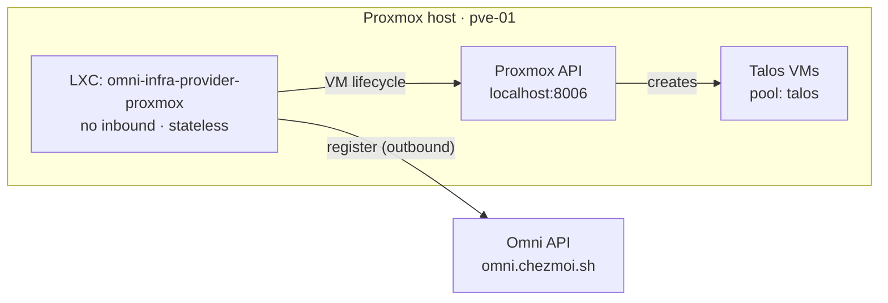

# `omni-infra-provider-proxmox` — Omni Infrastructure Provider LXC (Proxmox)

Standalone Proxmox LXC running NixOS + `omni-infra-provider-proxmox`. Registers
with the Omni instance at `omni.chezmoi.sh` and enables provisioning of Talos VMs
directly from the Omni UI — select a machine class, Omni calls this provider, the
provider creates a VM on Proxmox and boots it with a Talos image.

## Table of contents

1. [Architecture](#architecture)
2. [Prerequisites](#prerequisites)
3. [Proxmox user and role setup](#proxmox-user-and-role-setup)
4. [Secrets — two-phase setup](#secrets--two-phase-setup)
5. [Build & deploy](#build--deploy)
6. [Proxmox LXC creation](#proxmox-lxc-creation)
7. [Machine classes](#machine-classes)
8. [Operations](#operations)
9. [Troubleshooting](#troubleshooting)
10. [References](#references)

## Architecture



* **No inbound ports** — the provider connects out to Omni and Proxmox only.
  No Caddy, no TLS termination, no firewall rules needed.
* **Stateless** — no persistent volume. Upgrades replace the rootfs entirely.
* **No TUN/WireGuard** — unlike the Omni LXC, no special kernel or device
  prerequisites are needed.
* **Proxmox user** — authenticates as `omni` (bare username, realm `pve`
  passed separately) with VM lifecycle permissions scoped to the `talos`
  resource pool (see [Proxmox user and role setup](#proxmox-user-and-role-setup)).

## Prerequisites

* `mise` with the repo's `.mise.toml` trusted (`mise trust`).
* `sops` with the repo age key loaded (`SOPS_AGE_KEY_FILE` set by mise).
* SSH key-based root access to the Proxmox node.
* The `omni` LXC must be running and reachable at `omni.chezmoi.sh`.

## Proxmox user and role setup

The infra provider authenticates with Proxmox using a dedicated `omni@pve`
user, **scoped to the `talos` resource pool**. The provider can create,
modify, and delete VMs only inside that pool — it has no permission on
anything else running on the host, in particular the LXCs (`omni`,
`oci-registry`, itself).

Create the pool, user, and role on the Proxmox host before first deployment:

```sh
# On the Proxmox node (pve-01.pve.chezmoi.sh):

# 1. Create the resource pool that will hold every Omni-managed Talos VM,
#    and add the storages the provider needs: VM disks (nvme-lvm) and
#    Talos ISO images (local). Pool ACLs propagate to member storages.
pveum pool add talos --comment "Omni-managed Talos VMs"
pveum pool modify talos --storage local,nvme-lvm

# 2. Create a PVE realm user
pveum user add omni@pve

# 3. Create a role with the minimum permissions for VM lifecycle.
#    VM.Config.CDROM is required to attach the Talos ISO to VMs.
#    VM.Config.HWType is required for controller/BIOS settings.
#    Datastore.AllocateTemplate is required to upload Talos ISOs
#    (storage download-url API).
#    Pool.Allocate + Pool.Audit are required because the provider calls
#    GET /pools to verify the pool exists; Proxmox filters the response
#    by effective permissions and excludes pools the user cannot audit.
#    Note: VM.Monitor was removed in PVE 9 and is no longer a valid privilege.
pveum role add OmniProvider -privs \
  "VM.Allocate VM.Audit VM.Clone VM.Config.CDROM VM.Config.CPU VM.Config.Disk \
   VM.Config.HWType VM.Config.Memory VM.Config.Network VM.Config.Options \
   VM.PowerMgmt VM.Console \
   Datastore.AllocateSpace Datastore.AllocateTemplate Datastore.Audit \
   Pool.Allocate Pool.Audit"

# 4. Scope the role to the pool — NOT '/'. The provider only sees and
#    manages pool members (Talos VMs + the two storages added above).
pveum acl modify /pool/talos --users omni@pve --roles OmniProvider

# 5. Downloading Talos ISOs through the download-url API requires network
#    access from the node: Sys.AccessNetwork (PVE 8.1+). Sys.Audit lets
#    the provider read node status for VM scheduling.
pveum role add OmniProviderNode -privs "Sys.Audit Sys.AccessNetwork"
pveum acl modify /nodes/pve-01 --users omni@pve --roles OmniProviderNode

# 6. Attaching VM NICs to a bridge requires SDN.Use on that bridge
#    (PVE 8+). PVESDNUser is the built-in role with that privilege.
pveum acl modify /sdn/zones/localnetwork/vmbr1 --users omni@pve --roles PVESDNUser

# 7. Set a password for the user (this is the PROXMOX_PASSWORD secret)
pveum passwd omni@pve

# 8. (Optional) Create an API token for non-interactive use
pveum user token add omni@pve provider --privsep 0
# Record the full token ID (omni@pve!provider) and secret for automation.
```

> **Machine classes must target the pool.** With the ACL scoped to
> `/pool/talos`, VM creation is only authorized when the VM lands in the
> pool — every Omni machine class for this provider must set `pool: talos`
> in its provider data:
>
> ```yaml
> pool: talos
> cores: 4
> memory: 8192
> disk_size: 32
> network_bridge: vmbr1
> storage_selector: 'name == "nvme-lvm"'
> ```
>
> A machine class without `pool: talos` fails provisioning with a Proxmox
> 403\. Conversely, never add an LXC to the `talos` pool — pool membership
> is exactly what grants the provider access.

### Proxmox permissions reference

\| Privilege                    | ACL path                        | Why needed                                                       |
\| `VM.Allocate`                | `/pool/talos`                   | Create / delete VMs inside the pool.                                   |
\| `VM.Audit`                   | `/pool/talos`                   | Read VM status and config.                                             |
\| `VM.Clone`                   | `/pool/talos`                   | Clone VM templates (if using a base image).                            |
\| `VM.Config.CDROM`            | `/pool/talos`                   | Attach the Talos ISO to VMs.                                           |
\| `VM.Config.CPU`              | `/pool/talos`                   | CPU settings.                                                            |
\| `VM.Config.Disk`             | `/pool/talos`                   | Disk settings.                                                           |
\| `VM.Config.HWType`           | `/pool/talos`                   | Controller / BIOS settings.                                              |
\| `VM.Config.Memory`           | `/pool/talos`                   | Memory settings.                                                         |
\| `VM.Config.Network`          | `/pool/talos`                   | NIC settings.                                                            |
\| `VM.Config.Options`          | `/pool/talos`                   | Boot-order and other options.                                            |
\| `VM.PowerMgmt`               | `/pool/talos`                   | Start, stop, reset VMs.                                                  |
\| `VM.Console`                 | `/pool/talos`                   | Access VNC/terminal for debugging.                                      |
\| `Pool.Allocate`              | `/pool/talos`                   | Assign VMs to the pool on creation.                                     |
\| `Pool.Audit`                 | `/pool/talos`                   | List pools via `GET /pools` — Proxmox filters the response by effective permissions; without this the provider cannot verify the pool exists. |
\| `Datastore.AllocateSpace`    | pool storages                   | Create VM disks (`nvme-lvm`).                                            |
\| `Datastore.AllocateTemplate` | pool storages                   | Upload Talos ISOs (`download-url` API).                                 |
\| `Datastore.Audit`            | pool storages                   | List storages for `storage_selector` matching.                           |
\| `Sys.Audit`                  | `/nodes/pve-01`                 | Read node status for VM scheduling.                                     |
\| `Sys.AccessNetwork`          | `/nodes/pve-01`                 | Fetch Talos ISOs via `download-url` (8.1+).                             |
\| `SDN.Use`                    | `/sdn/zones/localnetwork/vmbr1` | Attach VM NICs to the bridge.                                            |

> **What this blocks.** There is no ACL on `/`, `/vms`, or the LXC VMIDs —
> the provider cannot list, modify, stop, or delete the LXCs or any VM
> outside the `talos` pool.

### Configuration mapping

The Proxmox user configured above maps to these options in `configuration.nix`:

```nix
services.omniInfraProviderProxmox = {
  id = "pve-01.pve.chezmoi.sh";
  omniApiEndpoint = "https://omni.chezmoi.sh/";

  proxmox = {
    url = "https://pve-01.pve.chezmoi.sh:8006/api2/json";
    # Username WITHOUT realm suffix — realm is passed separately.
    # Appending @pve here (username=omni@pve&realm=pve) causes a
    # double-realm authentication failure; only username=omni + realm=pve
    # succeeds.
    username = "omni";
    realm    = "pve";
    # Proxmox API TLS cert is self-signed.
    insecureSkipVerify = true;
  };
};
```

The password is stored in `secrets/proxmox.sops.env` and baked into the image at
build time.

## Secrets — two-phase setup

The provider needs credentials from two sources. They are collected in two
separate SOPS env files and baked into the image at build time.

\| File                       | Variable                   | When available          |
\| `secrets/proxmox.sops.env` | `PROXMOX_PASSWORD`         | Before first build      |
\| `secrets/omni.sops.env`    | `OMNI_SERVICE_ACCOUNT_KEY` | After Omni registration |

### Phase 1 — Proxmox credentials

```sh
mise run lxc:secrets:proxmox
```

Prompts for the Proxmox API password for the user configured in
`configuration.nix` (`services.omniInfraProviderProxmox.proxmox.username`).

### Phase 2 — Omni infrastructure provider key

1. Deploy the phase-1 image (provider starts but cannot connect to Omni).
2. In the Omni UI: **Settings → Infrastructure Providers → Create**.
   Copy the generated key.
3. Run:
   ```sh
   mise run lxc:secrets:omni
   ```
4. Rebuild and redeploy.

### Key rotation

* **Proxmox password** — re-run `lxc:secrets:proxmox`, rebuild, redeploy.
* **Omni key** — delete the provider in Omni UI, re-register, re-run
  `lxc:secrets:omni`, rebuild, redeploy.

## Build & deploy

```sh
# 1. Build the LXC tarball with secrets baked in
mise run lxc:build

# 2. Upload to Proxmox
mise run lxc:push -- pve-01.pve.chezmoi.sh
```

The template name is `omni-infra-provider-proxmox.<CalVer>-amd64.tar.xz`.
Bump the `version` in `flake.nix` before each build.

### Task reference

\| Task                                          | What it does                                     |
\| `mise run lxc:secrets:proxmox`                | Proxmox password → `secrets/proxmox.sops.env`    |
\| `mise run lxc:secrets:omni`                   | Omni provider key → `secrets/omni.sops.env`      |
\| `mise run lxc:build`                          | Build LXC tarball with both secrets baked in     |
\| `mise run lxc:push -- <pve-host>`             | Upload template to Proxmox                       |
\| `mise run lxc:upgrade -- <pve-host> <src_id>` | Rootfs-swap upgrade (stateless — no volume swap) |

## Proxmox LXC creation

After `lxc:push` uploads the template:

```sh
VMID="<vmid>"
TEMPLATE=omni-infra-provider-proxmox.<version>-amd64.tar.xz
NODE=pve-01.pve.chezmoi.sh

ssh root@${NODE} pct create ${VMID} local:vztmpl/${TEMPLATE} \
    --hostname     omni-infra-provider-proxmox \
    --description  "$(cat <<'EOF'
# Omni infrastructure provider for Proxmox
Provisions and deletes Talos VMs in the talos pool when a machine class is triggered from the Omni UI. No inbound ports — connects outbound to Omni and the Proxmox API only.
EOF
)" \
    --ostype       nixos \
    --arch         amd64 \
    --unprivileged 1 \
    --features     nesting=1 \
    --cores        1 \
    --memory       512 \
    --swap         0 \
    --rootfs       nvme-lvm:4 \
    --net0         name=eth0,bridge=vmbr1,ip=dhcp,firewall=1,tag=5 \
    --pool         core \
    --cmode        console \
    --onboot       1

# Start
ssh root@${NODE} pct start ${VMID}
```

No persistent volume, no TUN device, no WireGuard — simpler than `omni`.

### Resource sizing

\| Workload  | Recommended |
\| CPU       | 1 vCPU      |
\| Memory    | 512 MiB     |
\| Root disk | 4 GiB       |
\| Swap      | 0           |

## Machine classes

Machine classes are created in the Omni UI under **Machine Classes → Create**
— select the `pve-01.pve.chezmoi.sh` provider, then paste the YAML below as
the provider data. The full schema ships with the provider at
`cmd/omni-infra-provider-proxmox/data/schema.json`; the required fields are
`cores`, `memory`, `disk_size`, and `storage_selector`.

### Field reference

\| Field              | Value to use           | Why                                                                                                                             |
\| `pool`             | `talos`                | Mandatory. The `omni@pve` ACL only authorizes VM creation inside `/pool/talos`; omitting it yields a 403.                       |
\| `storage_selector` | `'name == "nvme-lvm"'` | CEL expression over `name`, `node`, `storageType`, `availableSpace`. `nvme-lvm` is the only image-capable storage on this host. |
\| `network_bridge`   | `vmbr1`                | The VLAN-aware guest bridge.                                                                                                    |
\| `vlan`             | `2`                    | Talos VMs live on VLAN 2 (same as the existing `tal01`); rendered as `tag=2` on `net0`. Platform LXCs use VLAN 5.               |
\| `cpu_type`         | `x86-64-v3`            | Matches the existing Talos VM. The provider default is `x86-64-v2-AES` (more conservative).                                     |
\| `disk_ssd`         | `true`                 | NVMe-backed lvmthin — enables SSD emulation inside the guest.                                                                   |
\| `disk_discard`     | `true`                 | Passes TRIM commands through to the thin pool, keeping it lean.                                                                 |
\| `disk_iothread`    | `true`                 | Dedicated I/O thread per disk (`tal01` already uses `iothread=1`).                                                              |
\| `disk_aio`         | `io_uring`             | Best async I/O mode for modern kernels and NVMe.                                                                                |
\| `disk_cache`       | `none`                 | Disable host-side page-cache for NVMe (write-back adds latency, not throughput here).                                           |

### Recommended classes

The host has 32 threads and 125 GiB RAM and already runs a 16-core / 32 GiB
Talos VM (`tal01`), so size new classes accordingly.

**Control plane** (suggested name: `talos-cp`) — etcd + API server; 3 of
these fit comfortably alongside worker nodes:

```yaml
pool: talos
cores: 4
memory: 8192    # MB — etcd wants headroom; 4 GiB is the floor, 8 GiB is comfortable
disk_size: 48   # GB — etcd history + Talos system partitions
storage_selector: 'name == "nvme-lvm"'
network_bridge: vmbr1
vlan: 2
cpu_type: x86-64-v3
disk_ssd: true
disk_discard: true
disk_iothread: true
disk_aio: io_uring
disk_cache: none
```

**Worker** (suggested name: `talos-worker`) — general-purpose app node:

```yaml
pool: talos
cores: 8
memory: 16384   # MB
disk_size: 80   # GB — matches the existing tal01 sizing
storage_selector: 'name == "nvme-lvm"'
network_bridge: vmbr1
vlan: 2
cpu_type: x86-64-v3
disk_ssd: true
disk_discard: true
disk_iothread: true
disk_aio: io_uring
disk_cache: none
```

> **Do not set `node`.** The cluster is single-node today; leaving `node`
> unset keeps the class portable if a second Proxmox node is added later.
>
> **Advanced fields** (`sockets`, `numa`, `hugepages`, `balloon`,
> `pci_devices`, `additional_disks`, `additional_nics`) are available in the
> schema for special cases such as GPU passthrough or dedicated storage
> networks. Keep them out of the base classes.

## Operations

### Check provider status

```sh
# Service status
ssh root@pve-01.pve.chezmoi.sh pct exec <vmid> -- journalctl -u omni-infra-provider-proxmox -f

# Is it connected to Omni?
# → Check Omni UI: Settings → Infrastructure Providers
#   The provider should show as "connected".
```

### Update configuration

1. Edit `configuration.nix` (e.g. change `proxmox.url` or `proxmox.username`).
2. `mise run lxc:build && mise run lxc:push -- pve-01.pve.chezmoi.sh`
3. `mise run lxc:upgrade -- pve-01.pve.chezmoi.sh <source_id>`

### Upgrade provider version

1. Bump `services.omniInfraProviderProxmox.version` and `hashes` in
   `catalog/nix/siderolabs/omni/infra-provider/proxmox.nix` (Renovate proposes this).
2. Bump `version` in `flake.nix`.
3. Build, push, upgrade.

## Troubleshooting

### Provider not appearing in Omni UI

Check that `omniApiEndpoint` in `configuration.nix` matches the running Omni
URL exactly (including trailing slash). Verify connectivity:

```sh
ssh root@pve-01.pve.chezmoi.sh pct exec <vmid> -- \
  curl -sSf https://omni.chezmoi.sh/healthz
```

### VM provisioning fails with a Proxmox 403

The `omni@pve` ACL is scoped to `/pool/talos` — a machine class whose
provider data does not set `pool: talos` is denied `VM.Allocate`. Add the
field (see [Proxmox user and role setup](#proxmox-user-and-role-setup)) and
retry. If the 403 happens on ISO upload instead, check the
`OmniProviderNode` ACL on `/nodes/pve-01` (`Sys.AccessNetwork`, PVE 8.1+)
and that the ISO storage (`local`) is a member of the `talos` pool.

### Authentication failure to Proxmox

Verify the password in `secrets/proxmox.sops.env` and the username in
`configuration.nix`. The username must be the bare login (`omni`) with the
realm set separately via `proxmox.realm = "pve"`. Appending `@pve` to
`username` (e.g. `"omni@pve"`) causes a double-realm auth failure
(`username=omni@pve&realm=pve`) — the Proxmox API rejects it. Also verify
that `insecureSkipVerify = true` is set, as the Proxmox API TLS cert is
self-signed.

### VM provisioning fails: "proxmox pool does not exist"

The provider calls `GET /pools` to verify the pool before creating a VM.
Proxmox filters this response by the caller's effective permissions — if the
`OmniProvider` role lacks `Pool.Audit`, the pool is excluded from the list
and the provider reports it as missing.

**Fix:** ensure the `OmniProvider` role includes `Pool.Allocate` and
`Pool.Audit`:

```sh
pveum role modify OmniProvider -privs \
  "VM.Allocate VM.Audit VM.Clone VM.Config.CDROM VM.Config.CPU VM.Config.Disk \
   VM.Config.HWType VM.Config.Memory VM.Config.Network VM.Config.Options \
   VM.PowerMgmt VM.Console \
   Datastore.AllocateSpace Datastore.AllocateTemplate Datastore.Audit \
   Pool.Allocate Pool.Audit"
```

### Phase-1 deploy — provider logs "empty key"

Expected — the `OMNI_SERVICE_ACCOUNT_KEY` is not set yet. Complete phase 2
(register in Omni UI, run `lxc:secrets:omni`, rebuild).

## References

* [omni-infra-provider-proxmox GitHub](https://github.com/siderolabs/omni-infra-provider-proxmox)
* [Omni documentation](https://omni.siderolabs.com)
* [Omni infrastructure providers docs](https://omni.siderolabs.com/docs/how-to-guides/infrastructure-providers/)
* [Proxmox VE user management](https://pve.proxmox.com/pve-docs/pveum.1.html)
* [Catalog NixOS module](../../../../../../../catalog/nix/siderolabs/omni/infra-provider/proxmox.nix)
* [Companion LXC — Omni](../omni/)
