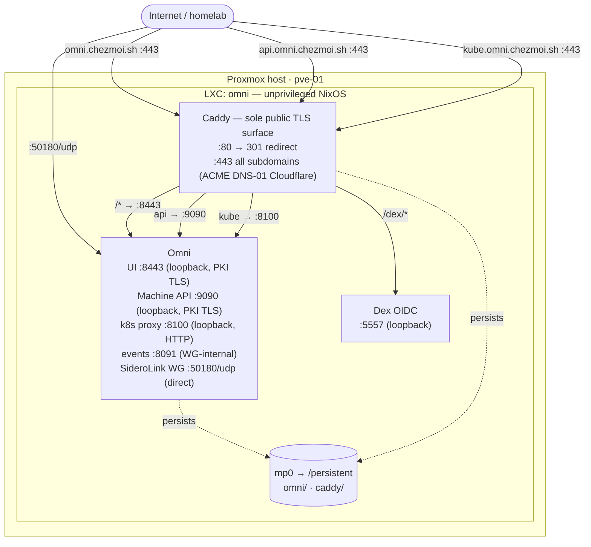

# `omni.chezmoi.sh` — Omni Talos Management LXC (Proxmox)

Standalone Proxmox LXC running NixOS + Omni + Dex + Caddy. Serves
`https://omni.chezmoi.sh` as the homelab's Talos cluster manager
(SideroLink + Kubernetes proxy + UI), with a co-located Dex OIDC provider
exposed under the `/dex` sub-path on the same hostname.

## Table of contents

1. [Architecture](#architecture)
2. [What's in this directory](#whats-in-this-directory)
3. [Prerequisites](#prerequisites)
4. [Proxmox user and role setup](#proxmox-user-and-role-setup)
5. [Secrets](#secrets)
6. [Build & deploy](#build--deploy)
7. [Proxmox LXC creation](#proxmox-lxc-creation)
8. [Proxmox host firewall](#proxmox-host-firewall)
9. [Hardening reference](#hardening-reference)
10. [Operations](#operations)
11. [Troubleshooting](#troubleshooting)
12. [Known limitations](#known-limitations)

## Architecture



### URL map

| Subdomain              | Port      | Service                           | Internal target                    |
| ---------------------- | --------- | --------------------------------- | ---------------------------------- |
| `omni.chezmoi.sh`      | 443       | Omni UI/API + Dex OIDC (`/dex/*`) | `:8443` (PKI TLS) + `:5557` (HTTP) |
| `api.omni.chezmoi.sh`  | 443       | SideroLink Machine API (gRPC)     | `:9090` (PKI TLS)                  |
| `kube.omni.chezmoi.sh` | 443       | Kubernetes API proxy              | `:8100` (HTTP)                     |
| —                      | 50180/UDP | SideroLink WireGuard              | direct                             |

> All TCP services run on port **443** only. No non-standard TCP ports are
> exposed externally. The event sink (`:8091`) is only reachable from
> WireGuard-connected Talos machines (internal VPN, not internet-facing).

* **Caddy** is the sole public TCP surface. It terminates TLS for all
  three subdomains using DNS-01 ACME via Cloudflare (no inbound `:80`
  challenge required). All subdomains share the same LE certificate.
* **Machine API** (`api.omni.chezmoi.sh`) — Caddy terminates TLS with
  the DNS-01 Let's Encrypt cert and proxies to Omni's loopback
  `127.0.0.1:9090` (PKI TLS, `tls_insecure_skip_verify`). Talos machines
  trust the public LE cert without importing Omni's self-signed PKI CA.
* **Kubernetes proxy** (`kube.omni.chezmoi.sh`) — Caddy terminates TLS
  and proxies to Omni's loopback `127.0.0.1:8100` (plain HTTP). `omnictl`
  and `kubectl` connect via the HTTPS subdomain.
* **Omni UI/API** binds on `127.0.0.1:8443` (loopback, PKI TLS).
  **Dex** binds on `127.0.0.1:5557` (loopback, plain HTTP). Both are only
  reachable through Caddy.
* **No SSH.** Console access goes through `pct enter <vmid>` on the
  Proxmox host.

### Host kernel prerequisites — WireGuard + TUN device

Omni's SideroLink runs a **WireGuard server inside the LXC**. WireGuard
is a kernel module, and an unprivileged container cannot `modprobe`. The
operator must load it on the Proxmox host once:

```sh
# On the Proxmox node:
echo wireguard > /etc/modules-load.d/omni-lxc.conf
modprobe wireguard
lsmod | grep -E '^wireguard'
```

The Omni `systemd` unit already sets `AmbientCapabilities = [
"CAP_NET_ADMIN" ]`, which is sufficient to create the WireGuard
interface inside the unprivileged container.

Omni also requires `/dev/net/tun` inside the LXC (for SideroLink's TUN
interface). In an unprivileged container Proxmox does **not** bind-mount
it automatically — add these two lines to `/etc/pve/lxc/<vmid>.conf`
after creating the container:

```sh
echo 'lxc.cgroup2.devices.allow: c 10:200 rwm' >> /etc/pve/lxc/${VMID}.conf
echo 'lxc.mount.entry: /dev/net/tun dev/net/tun none bind,create=file' >> /etc/pve/lxc/${VMID}.conf
```

These settings survive container restarts and upgrades (they live in the
PVE host config, not inside the container rootfs).

> **Note on `boot.kernelModules = [ "wireguard" "tun" ]` in the catalog
> module.** That line is harmless in the LXC — `systemd-modules-load`
> tries to load the modules at boot and fails silently (the container
> has no permission). The modules must be loaded **on the host**; the
> in-LXC attempt is a no-op. If the failed unit becomes noisy, override
> in `configuration.nix`:
>
> ```nix
> boot.kernelModules = lib.mkForce [ ];
> ```

## What's in this directory

```text
.
├── README.md              ← you are here
├── flake.nix              ← LXC image build (nixos-generators)
├── flake.lock             ← pinned inputs
├── configuration.nix      ← site identity, Omni / Dex options, fixed uid
├── .mise.toml             ← mise tasks (build / push / secrets)
├── .mise/tasks/lxc/       ← file-based build/push/upgrade scripts
├── modules/
│   ├── default.nix        ← imports catalog/nix/siderolabs/omni + locals
│   ├── caddy.nix          ← HTTPS + path routing (/dex/* → Dex, / → Omni)
│   ├── hardening.nix      ← sysctl, firewall, login surface, journald
│   └── secrets.nix        ← writes /etc/omni/secrets at build time
└── secrets/
    ├── omni.sops.env      ← SOPS-encrypted DEX_ADMIN_PASSWORD_HASH
    └── caddy.sops.env     ← SOPS-encrypted CLOUDFLARE_API_TOKEN
```

## Prerequisites

* `mise` with the repo's `.mise.toml` trusted (`mise trust`).
* Docker (used by `nix:build:lxc` to wrap the Nix build).
* `kubectl` configured for `amiya.akn` (only for the initial token sync).
* `sops` with the repo age key loaded (`SOPS_AGE_KEY_FILE` already set by mise).
* `htpasswd` (apache2-utils / httpd-tools) for `lxc:secrets:rotate`.
* SSH key-based root access to the Proxmox node you intend to push to.

## Proxmox user and role setup

The Omni LXC itself does not authenticate with Proxmox — it serves Talos
machines via SideroLink and exposes the management UI. However, the
**companion infra-provider LXC** (`../omni-infra-provider-proxmox/`) needs a
Proxmox API user with VM lifecycle permissions, scoped to the `talos`
resource pool so it can never touch the LXCs running on the same host.

The full `pveum` setup (user, role, `talos` pool, ACLs, permission
reference) lives in the companion README:
[Proxmox user and role setup](../omni-infra-provider-proxmox/README.md#proxmox-user-and-role-setup).

## Secrets

Two files, both SOPS / age-encrypted, both baked into the image at build
time. The plaintext values never touch disk.

\| File                     | Variable                  | Source                                    |
\| `secrets/omni.sops.env`  | `DEX_ADMIN_PASSWORD_HASH` | Operator (`htpasswd -bnBC 12 "" '<pw>'`). |
\| `secrets/caddy.sops.env` | `CLOUDFLARE_API_TOKEN`    | Crossplane (`cloudflare.iam.omni.yaml`), or manual (bootstrap). |

### First-time setup

```sh
# 1. Generate the Dex admin password hash (interactive)
mise run lxc:secrets:rotate

# 2. Provide the Cloudflare DNS-01 token (pick ONE of the two paths below)
```

**Cloudflare token — bootstrap ordering matters.** The `lxc:secrets:sync`
task pulls the token from a Kubernetes secret that Crossplane writes. But
Crossplane runs on a Talos cluster that Omni itself manages — so on a
first bootstrap, **Omni comes up before Crossplane exists**, and the token
cannot be synced from the cluster yet. There is no automation for this
chicken-and-egg case; create the token by hand.

* **Path A — Crossplane is already running** (steady state / rebuilds):

  ```sh
  mise run lxc:secrets:sync
  ```

  Reads the Kubernetes secret `chezmoi.sh-cloudflare-token-caddy-dns01-omni`
  from the `crossplane-secrets` namespace, written by the Crossplane
  `APIToken` resource `chezmoi-sh-caddy-dns01-omni`
  (`cloudflare.iam.omni.yaml`).

* **Path B — Crossplane not up yet** (initial bootstrap): mint the token
  manually in the Cloudflare dashboard, then SOPS-encrypt it straight into
  the secret file.

  1. Cloudflare dashboard → **My Profile → API Tokens → Create Token**.
  2. Use the **Edit zone DNS** template, or a custom token with these
     permissions (same scope as `cloudflare.iam.omni.yaml`):
     * **Zone → DNS → Edit**
     * **Zone → Zone → Read**
  3. **Zone Resources → Include → Specific zone → `chezmoi.sh`**.
  4. Create the token and copy it.
  5. Encrypt it into `secrets/caddy.sops.env` (plaintext never hits disk):

     ```sh
     printf 'CLOUDFLARE_API_TOKEN=%s\n' '<token>' \
       | sops -e --input-type dotenv --output-type dotenv /dev/stdin \
       > secrets/caddy.sops.env
     ```

  Once Crossplane is online, switch to Path A on the next rebuild so the
  token is managed declaratively (and rotate the hand-made one out).

### Rotation

* **Dex admin password** — re-run `mise run lxc:secrets:rotate`, rebuild,
  redeploy.
* **Cloudflare token** — delete the Crossplane `APIToken`
  `chezmoi-sh-caddy-dns01-omni` so it gets recreated, wait for `Ready`,
  then re-run `mise run lxc:secrets:sync`, rebuild, redeploy.

## Build & deploy

```sh
# 1. Build the LXC tarball with both secrets baked in
mise run lxc:build

# 2. Upload to Proxmox (creates /var/lib/vz/template/cache/omni.<v>-amd64.tar.xz)
mise run lxc:push -- pve-01.pve.chezmoi.sh
```

The template name is derived from the **CalVer** version declared in
`flake.nix` (e.g. `omni.2026.06.10-amd64.tar.xz`). Bump the `version =
"YYYY.MM.DD"` string in `flake.nix` before each build; append `-N` for
multiple builds the same day.

### Task reference

\| Task                                                              | What it does                                                                                                                     |
\| `mise run lxc:secrets:rotate`                                     | Generate the Dex admin bcrypt hash → `secrets/omni.sops.env`                                                                     |
\| `mise run lxc:secrets:sync`                                       | Fetch Cloudflare token from Crossplane → `secrets/caddy.sops.env`                                                                   |
\| `mise run lxc:build`                                              | Build with both secrets baked in (requires the two `.sops.env`)                                                                  |
\| `mise run lxc:push -- <pve-host>`                                 | `scp` the tarball to Proxmox (`local` storage, hardcoded)                                                                        |
\| `mise run lxc:upgrade -- <pve-host> <source_id> [-t <target_id>]` | Rootfs-swap upgrade of a running LXC; preserves the `mp0` volume. `--target-id` auto-picks the first free VMID ≥ 100 if omitted. |

## Proxmox LXC creation

The build emits `omni.<version>-amd64.tar.xz`. After `lxc:push` uploads
it to `/var/lib/vz/template/cache/`, create the container with:

```sh
# Pick an unused VMID (`pct list` shows used ones).
VMID="<vmid>"
TEMPLATE=omni.<version>-amd64.tar.xz
NODE=pve-01.pve.chezmoi.sh

# 1. Create the container — do NOT start yet (console + pre-chown come next).
ssh root@${NODE} pct create ${VMID} local:vztmpl/${TEMPLATE} \
    --hostname     omni \
    --description  "$(cat <<'EOF'
# Omni Talos cluster manager
Manages all Talos clusters: SideroLink machine enrollment (WireGuard), cluster lifecycle, and Kubernetes API proxy. Co-hosts a Dex OIDC provider at /dex.

https://omni.chezmoi.sh
EOF
)" \
    --ostype       nixos \
    --arch         amd64 \
    --unprivileged 1 \
    --features     nesting=1,keyctl=0 \
    --cores        2 \
    --memory       2048 \
    --swap         0 \
    --rootfs       nvme-lvm:4 \
    --mp0          nvme-lvm:20,mp=/persistent,backup=1 \
    --net0         name=eth0,bridge=vmbr1,ip=10.0.0.21/22,gw=10.0.0.1,firewall=1,tag=5 \
    --cmode        console \
    --onboot       1

# 2. Wire up the TUN device (required for SideroLink).
#    Do NOT add 'lxc.console.path: /dev/console' — it redirects the console
#    away from the pty and breaks `pct console` ("Denied access to tty").
ssh root@${NODE} "echo 'lxc.cgroup2.devices.allow: c 10:200 rwm' >> /etc/pve/lxc/${VMID}.conf"
ssh root@${NODE} "echo 'lxc.mount.entry: /dev/net/tun dev/net/tun none bind,create=file' >> /etc/pve/lxc/${VMID}.conf"

# 3. Start the container.
ssh root@${NODE} pct start ${VMID}
```

> **Before step 3 — pre-create + chown the persistent subdirs (unprivileged LXC).**
> Proxmox creates `mp0` owned by host uid 0, which falls outside the
> container's uid map and appears as `nobody` (65534) inside the LXC.
> The container then can't even write `/persistent/{omni,caddy}` to let the
> NixOS tmpfiles take over.
>
> Run the following **on the Proxmox node** (`ssh root@${NODE}`):
>
> ```sh
> VMID="<vmid>"  # from `pct create` above
> # Fixed uids in configuration.nix:
> #   omni  → uid 980 → host uid 100000 + 980 = 100980
> #   caddy → uid 997 → host uid 100000 + 997 = 100997
> pct mount ${VMID}
> mkdir -p /var/lib/lxc/${VMID}/rootfs/persistent/{omni,caddy}
> chown 100980:100980 /var/lib/lxc/${VMID}/rootfs/persistent/omni
> chown 100997:100997 /var/lib/lxc/${VMID}/rootfs/persistent/caddy
> pct unmount ${VMID}
> ```
>
> Skipping this step makes `omni-pki-init`, `omni-gpg-init`, and `caddy`
> fail with `Permission denied` on their data directories at first boot.

> **`services.omni.advertiseHost`** defaults to `omni.chezmoi.sh` (DNS).
> The catalog `omni-pki-init` detects IP vs DNS and emits the right cert
> SAN; SideroLink WireGuard uses the same value as its advertised
> endpoint. Make sure DNS resolves to an IP that Talos machines can reach
> on UDP `50180` (LAN IP for homelab, public IP if Talos is off-site).

### `pct.conf` features explained

* `unprivileged 1` — root-in-LXC is mapped to a high uid on the host.
  Mandatory; do not relax.
* `nesting=1` — required for stage-2 NixOS activation
  (`systemd-nspawn`-style mounts during boot).
* `keyctl=0` — neither Omni nor Dex use the kernel keyring.
* `cmode=console` — `pct console` attaches to `/dev/console`, where
  journald forwards boot and runtime logs. The image runs no getty, so
  the default `tty` mode fails with `Denied access to tty`. The console
  is a read-only log view; for a shell use `pct enter <vmid>`.
* `firewall=1` on the NIC — enables the Proxmox per-VM firewall (rules
  in the next section).
* `--mp0 storage:20,mp=/persistent` — dedicated 20 GiB volume holding
  Omni's PKI, GPG key, and SQLite store (`/persistent/omni`) plus
  Caddy's ACME state (`/persistent/caddy`). Size is comfortable for a
  homelab fleet; bump it if you onboard hundreds of Talos nodes.

### Resource sizing — starting values

\| Workload            | Recommended                                                                         |
\| CPU                 | 2 vCPU                                                                              |
\| Memory              | 2 GiB                                                                               |
\| Root disk (OS only) | 4 GiB                                                                               |
\| Persistent volume   | 20 GiB (mounted at `/persistent`, holds `/persistent/omni` and `/persistent/caddy`) |
\| Swap                | 0 (let OOM kill on overrun)                                                         |

## Proxmox host firewall

The Proxmox firewall layers in front of the in-LXC `iptables` rules from
`hardening.nix`. Settings live in `/etc/pve/firewall/<vmid>.fw` on the
Proxmox host.

All Omni services are routed through Caddy on port **443** via subdomains;
no non-standard TCP ports need to be exposed externally.

```sh
VMID="<vmid>"
cat <<'EOF' >/etc/pve/firewall/${VMID}.fw
[OPTIONS]
enable: 1
policy_in: DROP
policy_out: ACCEPT
ndp: 1
dhcp: 1
log_level_in: nolog
log_level_out: nolog

[RULES]
# Caddy — all Omni services via subdomains on standard HTTPS
IN ACCEPT -p tcp -dport 80  -log nolog # HTTP → HTTPS redirect
IN ACCEPT -p tcp -dport 443 -log nolog # HTTPS: omni / api.omni / kube.omni

# SideroLink WireGuard (UDP, cannot be proxied over TCP)
IN ACCEPT -p udp -dport 50180 -log nolog

IN ACCEPT -p icmp -log nolog
EOF
pve-firewall restart
```

> **Migration note** — if upgrading from a previous setup that opened
> ports 8090/8091/8100, those rules can be removed: Machine API now
> routes through `api.omni.chezmoi.sh:443` and the Kubernetes proxy
> through `kube.omni.chezmoi.sh:443`. The event sink (8091) is only
> reachable from WireGuard-connected Talos machines (inside the VPN).

> **DNS prerequisite** — create A/CNAME records for `api.omni.chezmoi.sh`
> and `kube.omni.chezmoi.sh` pointing to the same IP as `omni.chezmoi.sh`
> before deploying. Caddy will obtain separate LE certificates for each
> subdomain via DNS-01 (Cloudflare).

## Hardening reference

`modules/hardening.nix` is always active — same shape as the OCI
registry LXC:

\| Layer                | What we change                                                                                                                                       |
\| **Login surface**    | No `sshd`, no autologin getty.                                                                                                                       |
\| **Kernel sysctls**   | IP forwarding off, source-routing off, ICMP redirects off, SYN cookies on, rp\_filter on, ptrace YAMA, SUID coredumps off.                           |
\| **Services**         | Avahi, CUPS, Polkit, UDisks2 disabled with `mkForce`.                                                                                                |
\| **Docs**             | man-db / info / nixos-docs disabled.                                                                                                                 |
\| **Journald**         | `Storage=volatile`, `RuntimeMaxUse=64M`, `ForwardToConsole=yes`.                                                                                     |
\| **Firewall (NixOS)** | Default-deny inbound; ports opened by `caddy.nix` (80/443) and `catalog/.../omni.nix` (8091 event sink + WG UDP). Machine API + k8s proxy route via Caddy on 443. |
\| **Firewall (PVE)**   | Layered on top — only 80/443 TCP + 50180/UDP open externally. See previous section.                                                                  |
\| **Caddy systemd**    | Same `ProtectHome`/`ProtectKernelLogs`/`ProtectClock`/`RestrictSUIDSGID`/`LockPersonality` flags as the OCI registry LXC.                            |
\| **Omni systemd**     | `AmbientCapabilities = [ CAP_NET_ADMIN ]` (required for WireGuard); `NoNewPrivileges`, `RestrictSUIDSGID`, `LockPersonality`, `LimitNOFILE = 65536`. |

### What we explicitly do **not** harden

Same caveats as `oci-registry`: mount-namespace options
(`PrivateTmp`, `ProtectSystem`, …) fail in unprivileged LXC with "step
NAMESPACE … Permission denied" and are intentionally omitted. The
layered firewall + loopback bindings (UI, Dex, Machine API) compensate.

## Operations

### Inspecting live logs

```sh
ssh root@pve-01.pve.chezmoi.sh pct exec <vmid> -- journalctl -u omni  -f
ssh root@pve-01.pve.chezmoi.sh pct exec <vmid> -- journalctl -u dex   -f
ssh root@pve-01.pve.chezmoi.sh pct exec <vmid> -- journalctl -u caddy -f
```

### Backups (mandatory — losing them = losing the cluster)

\| File                                     | What happens if lost                                 |
\| `/persistent/omni/omni.asc` (GPG key)    | All Omni state is unrecoverable. **Back this up.**   |
\| `/persistent/omni/pki/ca.pem` (Talos CA) | Talos machines can no longer verify the Machine API. |
\| `/persistent/omni/db/omni.db`            | Cluster inventory + machine assignments lost.        |

A weekly snapshot of the `mp0` volume from the Proxmox side covers all
three. Pull `/persistent/omni/omni.asc` to a separate secure location.

### Upgrading to a new Omni version

1. Bump `services.omni.version` (and its `hashes`) in
   `catalog/nix/siderolabs/omni/omni.nix`. Renovate proposes the bump.
2. Rebuild and upload the LXC template:
   ```sh
   mise run lxc:build
   mise run lxc:push -- pve-01.pve.chezmoi.sh
   ```
3. Upgrade in place — preserves the `mp0` data volume:
   ```sh
   # Auto-picks the first free VMID ≥ 100 for the target.
   mise run lxc:upgrade -- pve-01.pve.chezmoi.sh <source_id>

   # Or specify an explicit target VMID:
   mise run lxc:upgrade -- pve-01.pve.chezmoi.sh <source_id> -t <target_id>
   ```

The upgrade script follows the rootfs-swap pattern: a fresh CT is
created with the new template, smoke-tested, then the `mp0` volume is
detached from the source and re-attached to the target before the
cut-over. A prompt at the end lets you decommission the source CT or
roll back.

## Troubleshooting

### Caddy fails to obtain a certificate

```sh
ssh root@pve-01.pve.chezmoi.sh pct exec <vmid> -- journalctl -u caddy --since '5 minutes ago' | grep -Ei 'acme|cert|cloudflare'
```

Same root causes as the OCI registry LXC (expired token, no egress,
DNS, clock drift). Re-run `lxc:secrets:sync` after rotating the token.

### Omni fails the OIDC discovery handshake

Symptom: `omni.service` logs `failed to fetch openid configuration` at
startup.

Check:

```sh
ssh root@pve-01.pve.chezmoi.sh pct exec <vmid> -- \
  curl -sSf https://omni.chezmoi.sh/dex/.well-known/openid-configuration | jq .
```

If this 404s, Caddy is up but the `/dex/*` matcher is not catching the
request — verify `modules/caddy.nix` matches `/dex/*` **before** the
catch-all `handle` block.

If it 502s, Dex is down or bound to a different port than
`services.omni.dex.bindAddr` in `configuration.nix`.

### SideroLink machines cannot connect

Symptom: Talos machines never reach `connected` state in the Omni UI.

* Check that the WireGuard module is loaded on the Proxmox **host**:
  `lsmod | grep -E '^wireguard'`. If empty, run the `modprobe` from the
  [Host kernel prerequisites — WireGuard + TUN device](#host-kernel-prerequisites--wireguard--tun-device) section.
* Confirm UDP `50180` is open in `/etc/pve/firewall/<vmid>.fw` and on
  whatever upstream firewall sits in front of the Proxmox host.
* Verify `services.omni.advertiseHost` in `configuration.nix` (currently
  `omni.chezmoi.sh`) resolves to an IP the Talos machines can actually
  reach (it is the SideroLink WireGuard endpoint advertised by Omni).

### `pct console` fails with `lxc_cmd_get_tty_fd: … Denied access to tty`

A raw `lxc.console.path: /dev/console` line in `/etc/pve/lxc/<vmid>.conf`
redirects the console away from the pty that `lxc-console` attaches to.
Remove it and rely on `cmode: console` (set at creation):

```sh
ssh root@pve-01.pve.chezmoi.sh "sed -i '/^lxc.console.path:/d' /etc/pve/lxc/<vmid>.conf"
ssh root@pve-01.pve.chezmoi.sh pct set <vmid> --cmode console
ssh root@pve-01.pve.chezmoi.sh pct reboot <vmid>
```

`pct console` then shows boot + journal output (read-only — the image runs
no getty and root is locked). For a shell, use `pct enter <vmid>`.

### `pct exec <vmid> -- <cmd>` fails with `command not found`

`pct exec` (lxc-attach) bypasses bash, so the `shellInit` PATH setup never
runs and the PATH is the FHS default (`/sbin:/bin:/usr/sbin:/usr/bin`).
Images built before the `/usr/sbin → /run/current-system/sw/bin` tmpfiles
symlink need either absolute paths (`/run/current-system/sw/bin/<cmd>`) or
a one-off fix on the live CT:

```sh
ssh root@pve-01.pve.chezmoi.sh pct exec <vmid> -- /bin/sh -c \
  '/run/current-system/sw/bin/ln -sfn /run/current-system/sw/bin /usr/sbin'
```

### `omni-pki-init` or `omni-gpg-init` fails

Almost always the mp0 pre-create + chown was not done before first start.
Fix from the Proxmox host:

```sh
VMID="<vmid>"
pct stop ${VMID}
pct mount ${VMID}
mkdir -p /var/lib/lxc/${VMID}/rootfs/persistent/{omni,caddy}
chown -R 100980:100980 /var/lib/lxc/${VMID}/rootfs/persistent/omni
chown -R 100997:100997 /var/lib/lxc/${VMID}/rootfs/persistent/caddy
pct unmount ${VMID}
pct start ${VMID}
```

## Known limitations

1. **`boot.kernelModules` in the catalog module.** The line is
   inherited from the VM build and is a no-op (failed silently) under
   LXC. If you want clean `systemctl status`, gate it with
   `lib.mkIf (!config.boot.isContainer)` in `catalog/nix/siderolabs/omni/omni.nix`
   — that change benefits the OCI registry LXC too.
2. **No automated NixOS test.** A `pkgs.testers.runNixOSTest` that boots
   the LXC and asserts the Dex discovery doc and Omni `/healthz` would
   catch regressions in the catalog modules before they reach Proxmox.
3. **No alert on certificate expiry.** Caddy renews silently; if ACME
   breaks, the cert expires unnoticed. A blackbox-exporter probe from a
   future observability stack would close this gap.
4. **Single-LXC, single-node.** Acceptable trade-off for a homelab; HA
   would require an external etcd and pairs of Omni instances behind a
   load-balancer (out of scope).

## References

* [Omni documentation](https://omni.siderolabs.com)
* [Omni GitHub — siderolabs/omni](https://github.com/siderolabs/omni)
* [Talos Linux](https://www.talos.dev)
* [Dex OIDC provider](https://github.com/dexidp/dex)
* [Catalog NixOS modules](../../../../../../../catalog/nix/siderolabs/omni/) — `omni.nix`, `dex.nix`, `infra-provider/proxmox.nix`
* [Companion LXC — infra-provider-proxmox](../omni-infra-provider-proxmox/)
