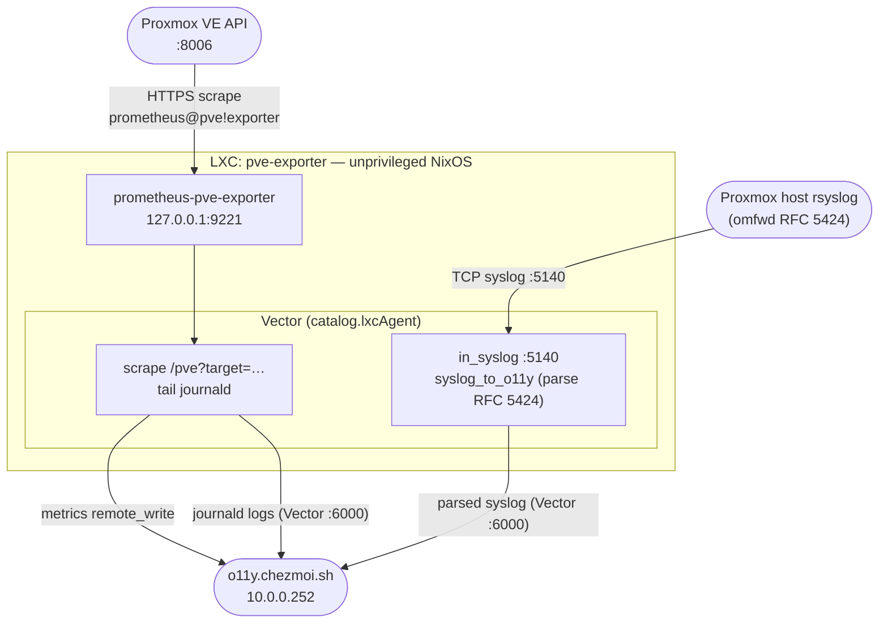

# `pve-exporter` — Proxmox VE Metrics Exporter LXC (Proxmox)

Standalone Proxmox LXC running NixOS + prometheus-pve-exporter + Vector. A lightweight monitoring sidecar that scrapes
the Proxmox VE API and ships host-level metrics and logs to the central observability appliance (`o11y.chezmoi.sh`).

It also owns **PVE syslog ingest**: the Proxmox host forwards its syslog here (not to o11y directly), and this LXC
parses RFC 5424 into the OTLP-style internal format before forwarding to o11y. The o11y appliance no longer listens on
syslog — it only ingests already-structured events and runs validation. Concentrating the syslog parser next to the host
that produces the logs keeps the appliance's Vector pipeline focused on validation + storage.

This container holds **no persistent data** — it pushes outbound (metrics via remote_write, logs via the Vector
protocol) and can be rebuilt and replaced at any time without data loss. Its only inbound port is the syslog listener
(`:5140`).

## Table of contents

1. [Architecture](#architecture)
2. [What's in this directory](#whats-in-this-directory)
3. [Prerequisites](#prerequisites)
4. [Proxmox user and API token setup](#proxmox-user-and-api-token-setup)
5. [Secrets](#secrets)
6. [Build & deploy](#build--deploy)
7. [Proxmox LXC creation](#proxmox-lxc-creation)
8. [Proxmox host firewall](#proxmox-host-firewall)
9. [Proxmox host — syslog forwarding](#proxmox-host--syslog-forwarding)
10. [Hardening reference](#hardening-reference)
11. [Operations](#operations)
12. [Known gaps / follow-ups](#known-gaps--follow-ups)

## Architecture



- **prometheus-pve-exporter** binds to `127.0.0.1:9221`. It authenticates against the PVE API with the
  `prometheus@pve!exporter` token (read-only) and exposes metrics on demand via the multi-target `/pve` endpoint.
- **Vector** (via `catalog.lxcAgent`) does three things: scrapes the exporter with
  `?target=<pve-host>&cluster=1&node=1`, tails systemd-journal entries, and runs a syslog TCP listener on `:5140`.
  Metrics go to o11y via remote_write; journald and parsed syslog go to o11y over the Vector native protocol (`:6000`).
- **Syslog ingest + parsing** lives here, not on o11y. The `in_syslog` source + `syslog_to_o11y` transform
  (`modules/o11y.extraTransforms/sources.syslog.yaml`) map RFC 5424 fields into the OTLP-style internal format with
  `log.source=syslog`, so the appliance receives already-structured events. The journald passthrough
  (`transforms.journald.yaml`) is re-added explicitly because a non-empty `logs.extraTransforms` disables
  `catalog.lxcAgent`'s automatic one.
- **Only inbound port is `:5140`** (syslog). The exporter binds loopback; metrics and logs are push-only. There is no
  Caddy, no TLS termination, no public surface.
- **`hostsOverride`** in `modules/o11y.nix` resolves `o11y.chezmoi.sh` to the Proxmox bridge IP (`10.0.0.252`) inside
  the LXC, bypassing public DNS for the push paths.
- **No SSH.** Console access goes through `pct enter <vmid>` on the Proxmox host.

## What's in this directory

```text
.
├── README.md              ← you are here
├── flake.nix              ← LXC image build (nixos-generators)
├── flake.lock             ← pinned inputs
├── configuration.nix      ← site identity, locale, console toolbox
├── .mise.toml             ← mise tasks (secrets / build)
├── .mise/tasks/lxc/       ← build / push / upgrade scripts
├── modules/
│   ├── default.nix        ← module aggregator
│   ├── pve-exporter.nix   ← prometheus-pve-exporter service (nixpkgs)
│   ├── o11y.nix           ← catalog.lxcAgent (metrics scrape + journald + syslog → o11y)
│   ├── o11y.extraTransforms/  ← Vector fragments injected into catalog.lxcAgent
│   │   ├── sources.syslog.yaml      ← syslog :5140 source + syslog_to_o11y (parse + tests)
│   │   └── transforms.journald.yaml ← journald_to_o11y passthrough (re-added)
│   └── hardening.nix      ← sysctl, firewall (only :5140), login surface, journald
└── secrets/
    └── pve-exporter.sops.env  ← SOPS: PVE_HOST, PVE_TOKEN_VALUE (operator-provided)
```

## Prerequisites

- `mise` with the repo's `.mise.toml` trusted (`mise trust`).
- Docker (used by `nix:build:lxc` to wrap the Nix build).
- `sops` with the repo age key loaded (`SOPS_AGE_KEY_FILE` already set by mise).
- SSH key-based root access to the Proxmox node you push to.

## Proxmox user and API token setup

The exporter authenticates against the PVE API with a dedicated read-only token. Set this up once on the Proxmox host
before the first build.

```sh
# On the Proxmox node (ssh root@pve.lan):

# 1. Create the monitoring user in the PVE realm.
pveum user add prometheus@pve --comment "prometheus-pve-exporter monitoring"

# 2. Create a role with the minimum required permissions.
pveum role add Exporter --privs "Datastore.Audit Sys.Audit VM.Audit Pool.Audit"

# 3. Grant the role at the root level (read-only access to all nodes and VMs).
pveum aclmod / -user prometheus@pve -role Exporter

# 4. Create the API token (omit --privsep to inherit the user's role directly).
pveum user token add prometheus@pve exporter --comment "pve-exporter scrape token" --privsep 0
# → Prints: token ID  prometheus@pve!exporter
#            value     xxxxxxxx-xxxx-xxxx-xxxx-xxxxxxxxxxxx
#   Copy the value — it is displayed only once.
```

> **`--privsep 0`** disables privilege separation so the token inherits the `Exporter` role from the user, without a
> separate ACL grant on the token itself. With privilege separation on (the default), the token would need its own ACL.

### Verifying the token

```sh
# From any host that can reach the PVE API:
curl -sk -H "Authorization: PVEAPIToken=prometheus@pve!exporter=<token-value>" \
  https://<pve-host>:8006/api2/json/nodes | jq '.data[].node'
# → should list the Proxmox node name(s)
```

## Secrets

One SOPS/age-encrypted dotenv file, baked into the image at build time. The plaintext values never touch disk.

\| File | Keys | Source | \| `secrets/pve-exporter.sops.env` | `PVE_HOST` | Operator — PVE API host address (IP or FQDN)
| \| | `PVE_TOKEN_VALUE` | Operator — token value from `pveum user token add` |

Both values are operator-provided and not managed by Pulumi either.

### First-time setup

```sh
# Interactively set the PVE host + token and write the encrypted secrets file.
# (The plaintext token is read with `read -rs` and never touches disk.)
mise run lxc:secrets:rotate
# → prompts for PVE API host (e.g. 10.0.0.11) and the token value from pveum above,
#   then writes secrets/pve-exporter.sops.env (SOPS/age-encrypted).
```

`mise run lxc:secrets:sync` is also available — it only creates an _empty_ encrypted placeholder (useful in CI to make
the file exist); `lxc:secrets:rotate` is the task that actually sets the values.

### Rotation

On the Proxmox node, delete and recreate the token:

```sh
pveum user token remove prometheus@pve exporter
pveum user token add prometheus@pve exporter --privsep 0
```

Then set the new value with the rotation task, rebuild, and redeploy:

```sh
mise run lxc:secrets:rotate          # prompts for the new token (keeps the existing host)
mise run lxc:build
mise run lxc:push -- pve.lan
mise run lxc:upgrade -- pve.lan <source_id> <target_id>
```

## Build & deploy

### Versioning

The appliance uses **CalVer** (`YYYY.MM.DD`). The version is a static string in `flake.nix` — bump it to today's date
before every `lxc:build`. Append `-N` for multiple builds on the same calendar day.

```nix
# flake.nix — bump before each build
version = "2026.06.07";
```

```sh
mise run lxc:build           # build with PVE_HOST + PVE_TOKEN_VALUE baked in
mise run lxc:push -- pve.lan # upload to /var/lib/vz/template/cache/
```

### Task reference

\| Task | What it does | \| `mise run lxc:secrets:rotate` | Interactively set/rotate `PVE_HOST` + `PVE_TOKEN_VALUE`
(encrypted) | \| `mise run lxc:secrets:sync` | Create an empty `secrets/pve-exporter.sops.env` placeholder | \|
`mise run lxc:build` | Build LXC tarball with `PVE_HOST` and `PVE_TOKEN_VALUE` baked in | \|
`mise run lxc:push -- <pve-host>` | `scp` the tarball to Proxmox (`local` storage) | \|
`mise run lxc:upgrade -- <pve-host> <source_id> <target_id>` | Rootfs-swap upgrade of a running LXC |

## Proxmox LXC creation

The build emits `pve-exporter.<version>-amd64.tar.xz`. This LXC is **stateless** — no persistent data volume and no
pre-chown step needed.

```sh
VMID="<vmid>"   # pick an unused id — `pct list` shows used ones.
TEMPLATE=pve-exporter.<version>-amd64.tar.xz
NODE=pve.lan

ssh root@${NODE} pct create ${VMID} local:vztmpl/${TEMPLATE} \
    --hostname     pve-exporter \
    --description  "$(cat <<'EOF'
# Proxmox VE metrics exporter
Scrapes the PVE API and ships host-level metrics and logs to o11y.chezmoi.sh. Also ingests Proxmox host syslog (RFC 5424) and forwards parsed events to o11y. No inbound ports except :5140 (syslog TCP).
EOF
)" \
    --ostype       nixos \
    --arch         amd64 \
    --unprivileged 1 \
    --features     nesting=0,keyctl=0 \
    --cores        1 \
    --memory       256 \
    --swap         0 \
    --rootfs       nvme-lvm:2 \
    --net0         name=eth0,bridge=vmbr1,ip=10.0.0.24/22,gw=10.0.0.1,firewall=1,tag=5 \
    --onboot       1

# Wire the console device so `pct console <vmid>` works.
ssh root@${NODE} "echo 'lxc.console.path: /dev/console' >> /etc/pve/lxc/${VMID}.conf"

ssh root@${NODE} pct start ${VMID}
```

There is no data volume (`mp0`) and no service-owned directory outside the rootfs, so no pre-start chown step is needed.

### Resource sizing — starting values

\| Workload | Recommended | \| CPU | 1 vCPU | \| Memory | 256 MiB | \| Root disk (OS only) | 2 GiB (stateless, rebuilt
from flake) | \| Data volume | None | \| Swap | 0 (let OOM kill on overrun) |

The root disk holds the NixOS closure for prometheus-pve-exporter. Keep 2 GiB; if a future rebuild exceeds it bump with
`pct resize <vmid> rootfs +2G` before rebuilding.

## Proxmox host firewall

The only inbound port is `:5140` (syslog TCP), restricted to the homelab subnet.

```sh
VMID="<vmid>"
cat <<'EOF' >/etc/pve/firewall/${VMID}.fw
[OPTIONS]
enable: 1
policy_in: DROP
policy_out: ACCEPT
ndp: 1
dhcp: 1
log_level_in: nolog
log_level_out: nolog

[RULES]
# Syslog TCP ingest from the PVE host / LXCs on the bridge network.
IN ACCEPT -p tcp -dport 5140 -source 10.0.0.0/8 -log nolog # rsyslog omfwd (RFC 5424)
IN ACCEPT -p icmp -log nolog
EOF
pve-firewall restart
```

> Tighten `10.0.0.0/8` to the actual PVE host / bridge subnet if you can. The in-LXC NixOS firewall also opens `:5140`
> (`hardening.nix`) — both layers must allow it for syslog to reach Vector.

`policy_out: ACCEPT` is required for:

- The PVE API scrape (HTTPS to `<pve-host>:8006`)
- The remote_write push to `o11y.chezmoi.sh`
- The Vector protocol push to `o11y.chezmoi.sh:6000`
- DNS, NTP

## Proxmox host — syslog forwarding

Point the Proxmox host's rsyslog at this LXC (not at o11y). Create `/etc/rsyslog.d/50-pve-exporter.conf` on the PVE
host:

```text
# Forward Proxmox host logs to the pve-exporter LXC (syslog TCP RFC 5424)
*.* action(
  type="omfwd"
  target="<pve-exporter-lxc-ip>"
  port="5140"
  protocol="tcp"
  template="RSYSLOG_SyslogProtocol23Format"
  queue.type="LinkedList"
  queue.size="5000"
  queue.saveOnShutdown="on"
  action.resumeRetryCount="-1"
)
```

Then validate and restart:

```sh
rsyslogd -N1 && systemctl restart rsyslog
```

Vector parses each RFC 5424 record into the OTLP-style format (`log.source=syslog`, `host.name`, `service.name`,
severity/facility, …) and forwards it to o11y. Query in VictoriaLogs at `https://o11y.chezmoi.sh/logs` (LogsQL:
`attr.log.source:syslog`).

## Hardening reference

`modules/hardening.nix` is always active — same model as the OCI registry LXC:

\| Layer | What we change | \| **Login surface** | No `sshd`, no autologin getty. | \| **Kernel sysctls** | IP
forwarding off, source-routing off, ICMP redirects off, SYN cookies on, rp_filter on, ptrace YAMA, SUID coredumps off. |
\| **Services** | Avahi, CUPS, Polkit, UDisks2 disabled with `mkForce`. | \| **Docs** | man-db / info / nixos-docs
disabled. | \| **Journald** | `Storage=volatile`, `RuntimeMaxUse=64M`, `ForwardToConsole=yes`. | \| **Firewall (NixOS)**
| Default-deny; only TCP `:5140` (syslog) open. Set at normal priority, not `mkDefault` (nixos-generators sets `[]` at
normal priority and would beat `mkDefault`). | \| **Firewall (PVE)** | Layered on top — `policy_in: DROP`, only TCP
`:5140` from the bridge subnet. | \| **pve-exporter** | `NoNewPrivileges`, `RestrictSUIDSGID`, `RestrictRealtime`,
`LockPersonality`, `SystemCallArchitectures=native`, `LimitNOFILE=65536`. |

### What we explicitly do **not** harden

Same caveats as `oci-registry`: mount-namespace options (`PrivateTmp`, `ProtectSystem`, …) fail in unprivileged LXC with
"step NAMESPACE … Permission denied" and are intentionally omitted. The layered NixOS + PVE firewalls and the
loopback-only exporter binding compensate.

## Operations

### Inspecting live logs

```sh
ssh root@pve.lan pct exec <vmid> -- journalctl -u pve-exporter -f
ssh root@pve.lan pct exec <vmid> -- journalctl -u lxc-agent -f   # Vector (catalog.lxcAgent)
```

> The Vector unit is named `lxc-agent` (it is owned by `catalog.lxcAgent`), not `vector`.

### Verifying syslog ingest

```sh
# Confirm Vector is listening on :5140 inside the LXC:
ssh root@pve.lan pct exec <vmid> -- ss -tlnp | grep 5140

# After the PVE host rsyslog is configured, query forwarded logs in VictoriaLogs:
curl -sSf 'https://o11y.chezmoi.sh/logs/select/logsql/query' \
  --data-urlencode 'query=attr.log.source:syslog' | head
```

### Checking the exporter manually

```sh
# From inside the LXC (via pct enter or pct exec):
curl -s "http://127.0.0.1:9221/pve?target=<pve-host>&cluster=1&node=1" | head -30
# → Prometheus text format; expect lines starting with pve_*
```

### Verifying metrics reach the o11y appliance

```sh
# From an allow-listed homelab client:
curl -sSf 'https://o11y.chezmoi.sh/metrics/api/v1/query?query=pve_up' | jq .
# → should return a non-empty result set
```

### Upgrading

The LXC is stateless — no data volume to preserve. Rebuild and swap the rootfs.

```sh
mise run lxc:build
mise run lxc:push -- pve.lan
mise run lxc:upgrade -- pve.lan <source_id> <target_id>
```

The upgrade script does a rootfs-swap and copies the PVE firewall config from the source CT. No `mp0` transfer needed.

### Backups

- **Image** — stateless: delete and recreate from the same flake for an identical result.
- **Secrets** — `secrets/pve-exporter.sops.env` is age-encrypted and committed to git. If the token value is lost,
  rotate it on the Proxmox host with `pveum`.

## Known gaps / follow-ups

1. **`flake.lock` is seeded from the observability sibling.** This LXC shares the exact input set
   (`nixpkgs/nixos-26.05`, `nixos-generators`, `arcane-catalog`) with `../observability`, so its lock was copied from
   there to give a valid pin. Run `nix flake lock` here to refresh it independently when bumping inputs.

2. **PVE token baked into image.** Rotating `prometheus@pve!exporter` requires a rebuild and redeploy. There is no
   runtime secret injection. For a homelab this is acceptable; a production system would use OpenBao + a sidecar to
   inject the token at runtime without rebuilding.

3. **No alert if the exporter goes silent.** If the LXC dies or the token is revoked, the o11y appliance stops receiving
   PVE metrics without notification. Adding `up{job="pve_exporter"} == 0` to
   [`../observability/alerts/pve.rules.yaml`](../observability/alerts/pve.rules.yaml) would close this gap.

4. **Syslog parsing tests are not auto-run.** The `syslog_to_o11y` unit tests live in
   `modules/o11y.extraTransforms/sources.syslog.yaml`, but `catalog.lxcAgent` only runs `vector validate` (not
   `vector test`) at build time, and the fragment isn't testable standalone (the journald passthrough references the
   catalog's `journald_to_semconv` source). The VRL is identical to the previously-tested o11y transform. A future
   `vector test` harness over the assembled config would restore coverage.

5. **No NixOS smoke test.** A `pkgs.testers.runNixOSTest` that boots the LXC, asserts `pve-exporter.service` is active,
   and curls `127.0.0.1:9221/metrics` would catch module regressions before they reach Proxmox.
