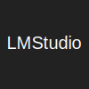

<h1 align="center">
  <picture>
    <source media="(prefers-color-scheme: dark)" srcset="./assets/logo.dark.svg">
      
  </picture>
</h1>

<h4 align="center">Endfield Industries — Mac Studio local AI inference</h4>

<!-- trunk-ignore-begin(markdown-link-check) -->

[About](#ℹ️-about) · [Infrastructure](#🏗️-infrastructure) · [Roadmap](#🗺️-roadmap)

<!-- trunk-ignore-end(markdown-link-check) -->

***

## ℹ️ About

This project configures **Yvonne**, a Mac Studio M1 Max dedicated exclusively to local AI inference (LLMs, TTS, STT). It runs bare-metal macOS and is managed via `nix-darwin`.

> \[!NOTE]
> Yvonne is named after the flamboyant and unpredictable scientist from Arknights: Endfield. Much like her namesake, this machine focuses on bleeding-edge research and raw computational power.

### Architecture Choice: Delegation

Unlike other clusters in the Arcane homelab, Yvonne **does not run Kubernetes**. The higher-level AI Platform abstractions (LiteLLM, OpenWebUI, LibreChat, ToolHive) and their associated shared databases (PostgreSQL, Redis) belong conceptually to the AI stack but are **deployed on the `lungmen.akn` cluster** for cost and resource efficiency. The applications on `lungmen.akn` communicate securely back to Yvonne's exposed APIs over the Tailnet.

## Services Overview

***

### [LM Studio](https://lmstudio.ai/)

Local LLM inference server running bare-metal on Apple Silicon.

***Why this choice**: Utilizes Mac Studio's GPU and Neural Engine for high-performance inference, explicitly isolated from the K8s cluster.*

  

### [Kokoro FastAPI](https://github.com/remsky/Kokoro-FastAPI)

Fast, local text-to-speech synthesis API running via nix-darwin.

***Why this choice**: High-quality TTS engine that exposes an OpenAI-compatible audio generation endpoint.*

  

### [Caddy](https://caddyserver.com/)

Reverse proxy exposing LM Studio and Kokoro securely on the network.

***Why this choice**: Proxies traffic to internal localhost endpoints and enforces TLS optionally for internal `llm.chezmoi.sh` traffic.*

***

### Delegated Components (Lungmen.akn)

### [OpenWebUI](https://github.com/open-webui/open-webui)

Extensible, feature-rich, and user-friendly self-hosted WebUI for LLMs.

***Why this choice**: Provides the main chat interface, connecting to LiteLLM for routing queries to Yvonne's inference engines.*

  

### [LiteLLM](https://github.com/BerriAI/litellm)

API proxy that aggregates local and remote LLM providers.

***Why this choice**: Running on the Kubernetes cluster, it standardizes access and routes heavy inference tasks over the VPN back to Yvonne.*

***

## 🏗️ Infrastructure

The infrastructure configuration (nix-darwin) is located in [src/infrastructure/nix](src/infrastructure/nix/README.md).

### Machine Specifications (Yvonne)

* **Model:** Mac Studio M1 Max (2022)
* **CPU:** 10-core
* **GPU:** 32-core
* **Neural Engine:** 16-core (11 TOPS)
* **Memory:** 64GB Unified Memory (400 GB/s bandwidth)
* **Network:** 10GbE

## 🗺️ Roadmap

* [x] Configure Mac Studio with `nix-darwin`.
* [x] Expose LM Studio capabilities.
* [x] Expose Kokoro TTS capabilities.
* [ ] Implement local STT (Speech-to-Text) capabilities.
* [ ] Configure AI Platform services on Kubernetes (pointing from `lungmen.akn` to Yvonne).
* [ ] Backup and Security implementations.
* [ ] General Documentation (Disaster Recovery Plan, operations guides).
