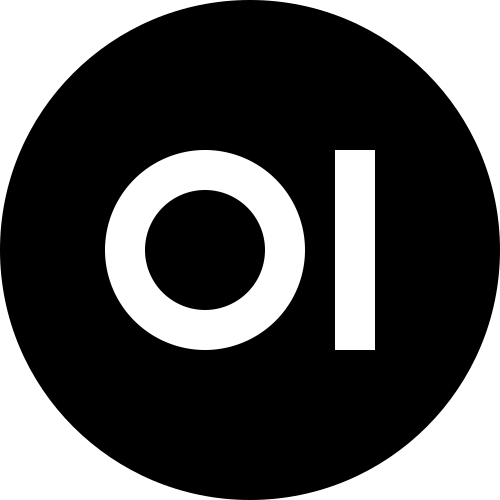
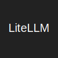
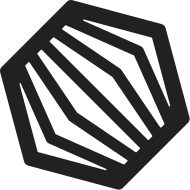
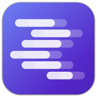
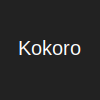
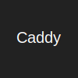

<h1 align="center">
  <picture>
    <source media="(prefers-color-scheme: dark)" srcset="./assets/logo.dark.svg">
      
  </picture>
</h1>

<h4 align="center">Endfield Industries — Mac Studio local AI inference</h4>

<div align="center">

[](LICENSE)

<!-- trunk-ignore-begin(markdown-link-check) -->

[About](#ℹ️-about) · [Services](#⚙️-services-overview) · [Access URLs](#🌐-access-urls) · [Infrastructure](#🏗️-infrastructure) · [Setup](#🚀-setup) · [Roadmap](#🗺️-roadmap)

<!-- trunk-ignore-end(markdown-link-check) -->

</div>

***

## ℹ️ About

The **Endfield Industries** project provides a complete, modern stack for local AI (including LLMs, TTS, STT, MCPs, and Chat interfaces). While this repository notably includes the configuration for **Yvonne** (a Mac Studio M1 Max dedicated to raw inference power), the project itself is designed to accommodate other AI-focused machines as part of the broader Endfield stack.

> \[!WARNING]
>
> ### Architecture Choice: Delegation
>
> Unlike other clusters in the Arcane homelab, the `endfield.akn` inference nodes (like Yvonne) **do not run Kubernetes**. The higher-level AI Platform abstractions (LiteLLM, OpenWebUI, LibreChat, ToolHive) and their associated shared databases (PostgreSQL, Redis) belong conceptually to the broader AI stack but are **delegated and deployed on the `lungmen.akn` cluster** for cost and resource efficiency.
>
> The applications residing on `lungmen.akn` communicate back to the exposed APIs of the Endfield stack **exclusively over the local network** (there is no Tailnet or external VPN involved in this routing).

## ⚙️ Services Overview


***

### Delegated Components (Lungmen.akn)

<div align="center" style="max-width: 1000px; margin: 0 auto;">
<div align="left">


#### [OpenWebUI](https://github.com/open-webui/open-webui)

Extensible, feature-rich, and user-friendly self-hosted WebUI for LLMs.

***Why this choice**: Provides the main chat interface, connecting to LiteLLM for routing queries to Endfield's inference engines.*

</div>
</div>

<br/><br/>

<div align="center" style="max-width: 1000px; margin: 0 auto;">
<div align="left">


#### [LiteLLM](https://github.com/BerriAI/litellm)

API proxy that aggregates local and remote LLM providers.

***Why this choice**: Running on the Kubernetes cluster, it standardizes access and routes heavy inference tasks over the local network back to Endfield's nodes.*

</div>
</div>

<br/><br/>

<div align="center" style="max-width: 1000px; margin: 0 auto;">
<div align="left">


#### [ToolHive](https://github.com/stacklok/toolhive)

Kubernetes operator for managing AI capabilities, tools and Virtual MCP servers.

***Why this choice**: Exposes specialized tools dynamically to our AI models inside the cluster, functioning as the hub for all local automation workflows.*

</div>
</div>

<br/><br/>

<div align="center" style="max-width: 1000px; margin: 0 auto;">
<div align="left">


#### [Firecrawl](https://github.com/mendableai/firecrawl)

Web scraping and crawling API optimized for LLMs.

***Why this choice**: Acts as the primary mechanism for giving agents internet access and transforming raw web data into clean markdown for ingestion.*

</div>
</div>

***

## 🌐 Access URLs

Both endpoints are exposed by Caddy. Add the following entries to your `/etc/hosts` or local DNS to resolve them on the LAN (replace `<yvonne-ip>` with the machine's IP address):

| Service                | URL                                 | Backend          |
| :--------------------- | :---------------------------------- | :--------------- |
| LM Studio (OpenAI API) | `http://studio.llm.chezmoi.sh:1234` | `127.0.0.1:8234` |
| Kokoro TTS             | `http://kokoro.llm.chezmoi.sh:1234` | `127.0.0.1:8880` |

***

## 🏗️ Infrastructure

The infrastructure configuration uses **Nix** over Ansible for deep macOS integration via `nix-darwin`, declarative state, reproducibility, and atomic upgrades. Details are located in [src/infrastructure/nix](src/infrastructure/nix/README.md).

### Why Nix instead of Ansible?

The previous iteration of this infrastructure used Ansible. Nix replaces it for three structural reasons:

* **Deep macOS integration via nix-darwin.** Manages Homebrew, launchd agents, system settings, and XDG directories through a single declarative layer.
* **Declarative state, not imperative actions.** The derivation graph ensures reproducibility: the same flake on any machine produces the same result. Rolling back is `darwin-rebuild switch --rollback`.
* **Atomic upgrades and garbage collection.** Nix applies changes atomically — the system either switches to the new generation or stays on the old one. Unused packages are collected with `nix-collect-garbage`.

### Yvonne - Mac Studio M1 Max 32GB

> \[!NOTE]
> **Yvonne** is named after an operator from *Arknights: Endfield*. A chic and unconventional scientist of Endfield Industries' Specialist Tech Division, Yvonne researches Æther and Blight-related devices. Despite everyone expecting her to join a prestigious research institute after her early graduation, she chose Endfield — and never explained why. Her rebellious style hides a mind that produces real results outside conventional paths. The machine mirrors that: running open-weight models that the mainstream AI industry ignores, on hardware that does not need a data center.

| Field             | Spec                                      |
| :---------------- | :---------------------------------------- |
| **Model**         | Apple Mac Studio (2022)                   |
| **Chip**          | Apple M1 Max                              |
| **CPU**           | 10-core (8 performance + 2 efficiency)    |
| **GPU**           | 24-core                                   |
| **Neural Engine** | 16-core — **11 TOPS**                     |
| **Media Engine**  | Hardware H.264, HEVC, ProRes, ProRes RAW  |
| **Memory**        | 32 GB Unified Memory (400 GB/s bandwidth) |
| **Storage**       | 512 GB SSD                                |
| **OS**            | macOS (managed by nix-darwin)             |

> \[!INFO]
> The M1 Max Neural Engine delivers 11 trillion operations per second (TOPS). The M1 Max remains strong for local inference because most of the workload goes through the 24-core GPU and the 400 GB/s unified memory bandwidth — not just the Neural Engine.

<details>
<summary><b>🛠️ Installation & Setup</b></summary>
<br>

> \[!NOTE]
> Run all commands from the repository root (e.g., the root of the `arcane` repository) unless stated otherwise.

1. **Install Lix** (the Nix implementation used here):
   ```bash
   curl -sSf -L https://install.lix.systems/lix | sh -s -- install
   ```

2. **Apply the configuration** (first run installs nix-darwin if absent):
   ```bash
   sudo nix --extra-experimental-features "nix-command flakes" run nix-darwin -- switch --flake ./projects/endfield.akn/src/infrastructure/nix#yvonne
   ```

3. **Reconnect** (open a new shell or log out/in) to pick up the new environment and start the user-level launchd agents (Caddy, Kokoro).

4. **Start LM Studio manually** (or from Spotlight/Launchpad) and enable the local server in its settings on port `8234`.

#### XDG Paths

| Purpose | Path                 |
| :------ | :------------------- |
| Config  | `~/.config`          |
| Data    | `~/.local/share`     |
| Logs    | `~/.local/state/log` |

</details>

<details>
<summary><b>💻 Development & Linting</b></summary>
<br>

**Build & Apply**

```bash
# Build only (no system changes)
nix build ./projects/endfield.akn/src/infrastructure/nix#darwinConfigurations.yvonne.system

# Apply to the system
nix run nix-darwin -- switch --flake ./projects/endfield.akn/src/infrastructure/nix#yvonne
```

**Lint & Format**

```bash
nix run nixpkgs#statix   -- check projects/endfield.akn/src/infrastructure/nix
nix run nixpkgs#deadnix  -- projects/endfield.akn/src/infrastructure/nix
nix run nixpkgs#alejandra -- --check projects/endfield.akn/src/infrastructure/nix

# Auto-format
nix run nixpkgs#alejandra -- projects/endfield.akn/src/infrastructure/nix
```

</details>

#### Hosted Services (nix-darwin)

<div align="center" style="max-width: 1000px; margin: 0 auto;">
<div align="left">


##### [LM Studio](https://lmstudio.ai/)

Local LLM inference server running bare-metal on Apple Silicon. Runs open-weight models (Llama, Mistral, Qwen…) via Metal.

***Why this choice**: Utilizes Mac Studio's GPU and unified memory for high-performance inference, explicitly isolated from the K8s cluster.*<br/>
*Managed via **Homebrew cask** (`lm-studio`). Exposes an OpenAI-compatible API on `127.0.0.1:8234`.*

</div>
</div>

<br/><br/>

<div align="center" style="max-width: 1000px; margin: 0 auto;">
<div align="left">


##### [Kokoro FastAPI](https://github.com/remsky/Kokoro-FastAPI)

Fast, local text-to-speech synthesis served as a REST API.

***Why this choice**: High-quality TTS engine that exposes an OpenAI-compatible audio generation endpoint.*<br/>
*Managed via **nix-darwin** as a user-level launchd agent. Exposes API on `127.0.0.1:8880`.*

</div>
</div>

<br/><br/>

<div align="center" style="max-width: 1000px; margin: 0 auto;">
<div align="left">


##### [Caddy](https://caddyserver.com/)

Reverse proxy exposing LM Studio and Kokoro securely on the network.

***Why this choice**: Proxies traffic to internal localhost endpoints and enforces TLS optionally for internal `llm.chezmoi.sh` traffic.*<br/>
*Managed via **nix-darwin** as a user-level launchd agent.*

</div>
</div>

***

## 🗺️ Roadmap

* [x] Configure Mac Studio with `nix-darwin`.
* [x] Expose LM Studio capabilities.
* [x] Expose Kokoro TTS capabilities.
* [ ] Implement local STT (Speech-to-Text) capabilities.
* [ ] Configure AI Platform services on Kubernetes (pointing from `lungmen.akn` to Yvonne).
* [ ] Backup and Security implementations.
* [ ] General Documentation (Disaster Recovery Plan, operations guides).
