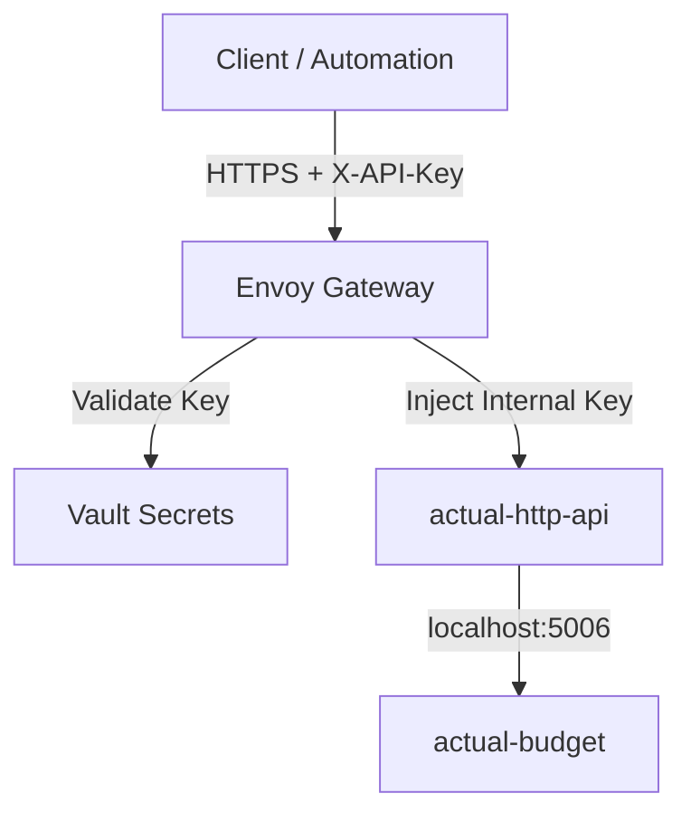

# Actual Budget Architecture

This directory contains the deployment configuration for Actual Budget, a local-first personal finance system.

## Architecture Overview

The deployment consists of a StatefulSet running two containers:

1. **actual-budget**: The main application server.
2. **actual-http-api**: A sidecar container providing a REST API wrapper around the main application.

### Authentication & Security

The architecture implements a split authentication model:

1. **User Access (Web UI)**:
   * Handled by `actual-budget` container.
   * Protected by OIDC (via Envoy Gateway) or internal password.
   * Accessible at `https://budget.chezmoi.sh`.

2. **API Access (Programmatic)**:
   * Handled by `actual-http-api` sidecar.
   * Exposed via Envoy Gateway at `https://budget.chezmoi.sh/api`.
   * **External Authentication**: Envoy Gateway validates incoming requests using API keys stored in Vault.
   * **Internal Authentication**: Envoy Gateway injects a static internal API key (`X-API-Key`) into valid requests.
   * The sidecar validates this internal key and authenticates with the main application using the admin password.

### Secret Management

Secrets are managed via OpenBao (Vault) and synced using External Secrets Operator:

| Secret Name                     | Vault Path                                      | Description                                       |
| ------------------------------- | ----------------------------------------------- | ------------------------------------------------- |
| `actual-budget-configuration`   | `lungmen.akn/actual-budget/auth/oidc-client`    | OIDC configuration for the main app               |
| `actual-budget-admin-password`  | `lungmen.akn/actual-budget/auth/admin-password` | Admin password for the main app (used by sidecar) |
| `actual-budget-api-client-keys` | `lungmen.akn/actual-budget/auth/api-keys`       | Valid API keys for external clients               |

## Network Flow

