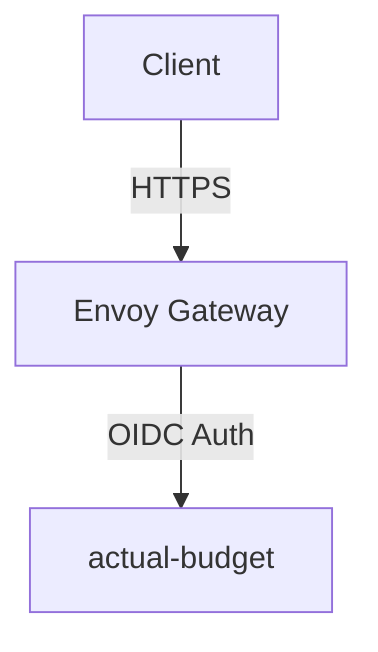

# Actual Budget Architecture

This directory contains the deployment configuration for Actual Budget, a local-first personal finance system.

## Architecture Overview

The deployment consists of a StatefulSet running a single container:

1. **actual-budget**: The main application server.

### Authentication & Security

The application is protected by OIDC (via Envoy Gateway) and accessible at `https://budget.chezmoi.sh`.

### Secret Management

Secrets are managed via OpenBao (Vault) and synced using External Secrets Operator:

| Secret Name                   | Vault Path                                   | Description                         |
| ----------------------------- | -------------------------------------------- | ----------------------------------- |
| `actual-budget-configuration` | `lungmen.akn/actual-budget/auth/oidc-client` | OIDC configuration for the main app |

## Network Flow

