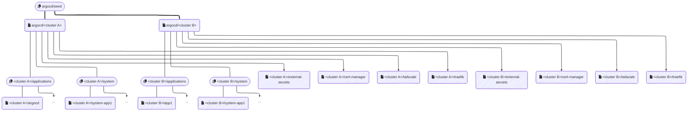

<!-- markdownlint-disable MD033 -->

  

<h4 align="center">chezmoi.sh - ArgoCD Documentation</h4>

***

> \[!NOTE]
> **Why is ArgoCD in `apps` folder and not the `infrastructure` one?**
>
> The main reason is that ArgoCD is used in this project as a deployment tool, similar to Adguard as a DNS server. Although it is crucial for the proper functioning of the infrastructure, it is not considered an integral part of it.

## 🐙 But ... what is ArgoCD?

[ArgoCD](https://argo-cd.readthedocs.io/en/stable/) is a continuous deployment tool for Kubernetes. It allows managing Kubernetes applications using declarative configuration files, making it easier to handle versioning and deploying applications in Kubernetes environments.

For more information, please refer to the [official documentation](https://argo-cd.readthedocs.io/en/stable/).

## ℹ️ About this folder

This folder is a special folder that requires particular attention. In fact, it is part of the bootstrap folders that need to be initiated manually and, like other folder prefixed by `*`, must not be managed in `autosync` mode.

It consists of two distinct parts:

* The deployment of ArgoCD itself ([in this folder](.))
* The deployment of ArgoCD `ApplicationSets`, managed by the `seed` `Application`, that will be deployed on all configured clusters. These `ApplicationSets` are located in the [`seed.applicationsets`](seed.apps) folder.

Here is a brief overview of the "apps of apps" that I chose to use:

> \[!NOTE]
> The hierarchy described in the diagram uses ArgoCD and ApplicationSets to manage the deployment of applications across multiple Kubernetes clusters.
>
> At the top of this hierarchy is the ApplicationSet `argocd/seed`. It serves as a base template to generate an ArgoCD Application for each cluster.
>
> Next, each cluster Application has its own ApplicationSets:
>
> * One for all applications defined in `projects/<cluster>/src/apps` (iteration over all folders).
> * One for applications necessary for the cluster's operation (ingress, CSI, monitoring, etc.) (iteration over all folders in `projects/<cluster>/src/infrastructure/kubernetes`).
>
> For all *critical* applications (such as `external-secrets`, `cert-manager`, `tailscale`, and `traefik`), dedicated Applications are created automatically. This is done to ensure that
> these applications are **ALWAYS** deployed in the cluster, regardless of the type of cluster.
>
> The current list of critical applications includes:
>
> * `external-secrets`: For managing secrets from external sources
> * `cert-manager`: For managing TLS certificates
> * `tailscale`: For network connectivity and security
> * `traefik`: For ingress and routing
>
> This structure allows all resources necessary for the proper functioning of a cluster to be gathered in one place, thus facilitating management and resource cleanup.
>
> **Note:** Folders prefixed with '\*' are folders that should not be automated under any circumstances. They must be manually synchronized to ensure no unwanted changes are made.
