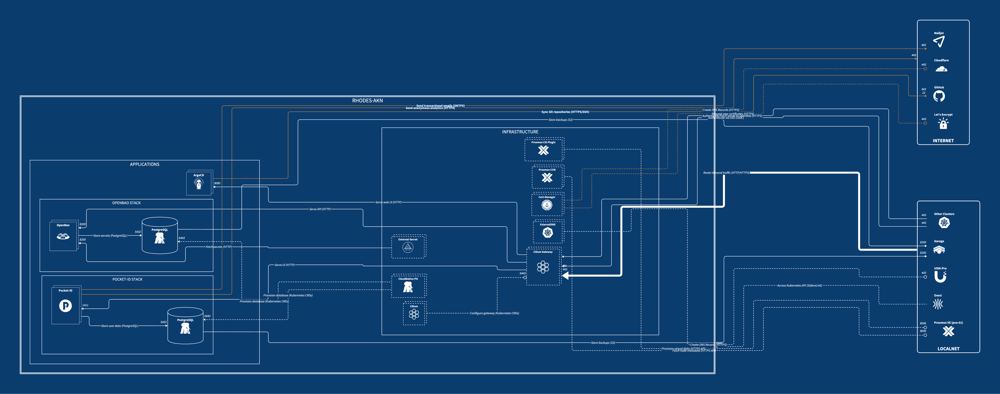

<h1 align="center">
  <picture>
    <source media="(prefers-color-scheme: dark)" srcset="./docs/assets/logo.dark.svg">
      
  </picture>
</h1>

<h4 align="center">Rhodes·AKN - Mission-critical services</h4>

<em>The foundation everything else in the homelab stands on.</em>

<!-- trunk-ignore-begin(markdown-link-check/404) -->

<a href="#about">About</a> · <a href="#services-overview">Services</a> · <a href="#disaster-recovery">Recovery</a> ·
<a href="#references">References</a>

<!-- trunk-ignore-end(markdown-link-check/404) -->

---

> [!NOTE]
>
> **Why Rhodes?**
>
> In Arknights lore, Rhodes Island is a pharmaceutical outfit fighting a losing war on its own terms — self-sufficient,
> mission-driven, the base every other operation launches from. Same job here: this cluster is what the rest of the
> homelab depends on being up.

## About

Rhodes·AKN is the homelab's core-platform cluster: Talos Linux on Proxmox VE, provisioned via Omni
(`src/infrastructure/omni/rhodes.clustertemplate.yaml`). It integrates the essential components that let other projects
be deployed and managed securely, without[^1] the need of third-party services.

## Services Overview

---

### Applications

### [ArgoCD](https://argoproj.github.io/cd/)

GitOps-based deployment tool for Kubernetes.

**Why this choice**: It's what turns "I pushed a commit" into "the cluster now matches it" — every application and every
piece of infrastructure across every cluster in the homelab is deployed and kept in sync this way, with no manual
`kubectl apply` and no drift left unnoticed. Bootstrapped **last** in the disaster-recovery chain — it adopts whatever's
already running instead of being a dependency of it.

  

### [OpenBao](https://openbao.org/)

Centralized secret management platform.

**Why this choice**: It's the one place every service in the homelab — not just this cluster — gets its secrets from:
database passwords, API tokens, TLS material, all pulled at runtime instead of being copy-pasted between clusters or
committed per-app. Backed by a PostgreSQL database managed by CloudNative-PG with automated backups to
[Garage](https://garagehq.deuxfleurs.fr/), so losing this cluster doesn't mean losing every secret behind it.

  

### [Pocket-Id](https://github.com/pocket-id/pocket-id)

Centralized identity management service with passkey support only.

**Why this choice**: One identity, one passkey, no passwords — it's what I log into every OIDC-capable app in the
homelab with (the ArgoCD UI among others), instead of juggling a separate account and password per service. Same
PostgreSQL-on-CNPG/Garage backup pattern as OpenBao.

---

## 💀 Disaster Recovery

Recovery is provision-order-dependent: Omni brings the cluster back up, then every component is restored in an order
where each step only depends on what's already running — OpenBao, ESO, cert-manager/ExternalDNS, and Pocket-Id are all
applied by hand before ArgoCD exists. ArgoCD is bootstrapped **last** precisely because of this: it adopts everything
already running instead of being a dependency those earlier steps would otherwise have to work around. See
[docs/disaster-recovery/README.md](./docs/disaster-recovery/README.md) for the full, step-by-step procedure.

## 📚 References

**This project**:

- [`src/infrastructure/omni/rhodes.clustertemplate.yaml`](./src/infrastructure/omni/rhodes.clustertemplate.yaml) — this
  cluster's Omni template
- [`docs/disaster-recovery/README.md`](./docs/disaster-recovery/README.md) — full cluster disaster-recovery procedure
- [`src/argocd/README.md`](./src/argocd/README.md) — how the ApplicationSets discover and sync apps
- [`src/infrastructure/pulumi/`](./src/infrastructure/pulumi/) — cloud resources managed out-of-cluster (Cloudflare
  DNS-01 tokens, Vault KV secrets, database credentials)
- [`architecture.d2`](./architecture.d2) — source for the diagram above

[^1]:
    Except for SMTP services, which are used for external communication. However, this service is optional and
    everything _should_ work without it. No Tailscale for now.
