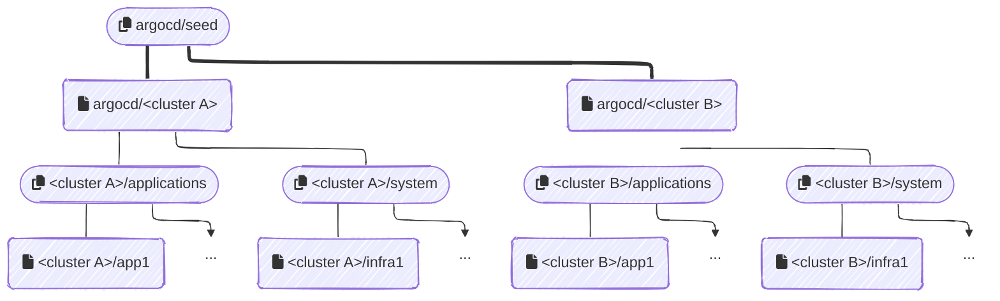

<div align="center">
  
</div>

<h4 align="center">chezmoi.sh - ArgoCD Documentation</h4>

---

> \[!NOTE] **Why is ArgoCD in `apps` folder and not the `infrastructure` one?**
>
> The main reason is that ArgoCD is used in this project as a deployment tool, similar to Adguard as a DNS server.
> Although it is crucial for the proper functioning of the infrastructure, it is not considered an integral part of it.

## 🐙 But ... what is ArgoCD?

[ArgoCD](https://argo-cd.readthedocs.io/en/stable/) is a continuous deployment tool for Kubernetes. It allows managing
Kubernetes applications using declarative configuration files, making it easier to handle versioning and deploying
applications in Kubernetes environments.

For more information, please refer to the [official documentation](https://argo-cd.readthedocs.io/en/stable/).

## ℹ️ About this folder

ArgoCD self-hosts on `rhodes.akn` (the hub pattern) and, like every other bootstrap-order component on this cluster
(Cilium, OpenBao, ESO, cert-manager, Pocket-Id), it can't depend on ArgoCD to exist yet — see
[docs/disaster-recovery/README.md](../../docs/disaster-recovery/README.md). It's applied by hand as the last step of
that chain, not synced automatically like a regular app:

```sh
kubectl apply -f projects/rhodes.akn/dist/argocd/
kustomize build --enable-alpha-plugins --enable-exec projects/rhodes.akn/src/argocd/sops \
  | kubectl apply -f -
kubectl apply -f projects/rhodes.akn/src/bootstrap.applications.yaml
```

[`bootstrap.applications.yaml`](../bootstrap.applications.yaml) is what makes ArgoCD **adopt** itself and its own
bootstrapping chain afterward: it defines an `argocd` `Application` (sources `dist/argocd/` and `src/argocd/sops/` —
this folder) and a `seed` `Application` (sources [`seed.apps/`](seed.apps)). From that point on, ArgoCD reconciles
itself through the normal GitOps loop instead of needing further manual `kubectl apply`.

It consists of two distinct parts:

- The deployment of ArgoCD itself ([in this folder](.))
- The deployment of ArgoCD `ApplicationSets`, managed by the `seed` `Application`, that will be deployed on all
  configured clusters. These `ApplicationSets` are located in the [`seed.apps`](seed.apps) folder.

## 🔄 Deployment Flow

The deployment follows a hierarchical structure:

1. **`seed` Application** ([`bootstrap.applications.yaml`](../bootstrap.applications.yaml))
   - Deploys content from [`seed.apps/`](seed.apps)
   - Configured in `argocd` namespace under the `seed` `AppProject`

2. **Main ApplicationSet** ([`seed.apps/shoot.applicationset.yaml`](seed.apps/shoot.applicationset.yaml))
   - Automatically generated for each detected cluster
   - Deploys configurations in cluster-specific namespaces
   - Creates two additional ApplicationSets per cluster:
     - [`shoot.apps/system.applicationset.yaml`](shoot.apps/system.applicationset.yaml)
     - [`shoot.apps/applications.applicationset.yaml`](shoot.apps/applications.applicationset.yaml)

3. **System Applications** — discovered by `system.applicationset.yaml` from every
   `projects/<cluster>/src/infrastructure/kubernetes/*` directory that has a `kustomization.yaml`.

4. **Business Applications** — discovered by `applications.applicationset.yaml` from every
   `projects/<cluster>/src/apps/*` directory that has a `kustomization.yaml`.

Here is a visual representation of the deployment hierarchy:



## 🔑 Sync Policy

Individual apps and infrastructure components control their own ArgoCD sync policy via a per-directory
`.application.patch` file (manual vs. automated sync — see
[ADR-007](../../../../docs/decisions/007-project-structure-and-naming-conventions.md)), not a folder naming convention.

## 🚀 ArgoCD Bootstrap

Bootstrap secrets are SOPS-committed in [`sops/`](sops), applied via the
`kustomize build --enable-alpha-plugins --enable-exec` step above:

- [`sops/github-credentials.secret.yaml`](sops/github-credentials.secret.yaml) — GitHub App credentials
  (`argocd-repo-creds-github.chezmoi-sh`) for private repository access.
- [`sops/age-key.secret.yaml`](sops/age-key.secret.yaml) — the age private key (`argocd-sops-age-key`) ArgoCD's own
  KSOPS plugin uses to decrypt SOPS-committed secrets across every cluster it manages.
